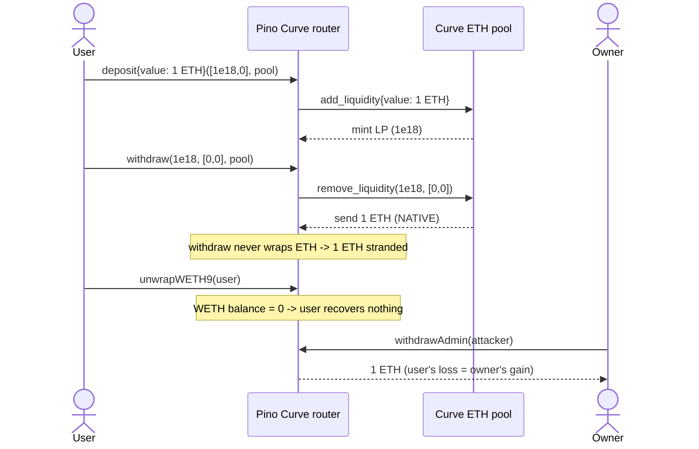

<!-- source-auditvault: 27249-c-01-calling-curvewithdraw-will-likely-result-in-users-losin -->
# Pino C-01 — `Curve::withdraw` strands users' native ETH

Calling the Pino router's `Curve.withdraw` to remove liquidity from a Curve pool that pays out **native ETH** leaves that ETH permanently stuck in the router. The withdrawn ETH becomes recoverable only by the contract `owner`, so the withdrawing user loses the ETH value of their position.

## Real source

- Repo: [`nitolabs/pino-contract`](https://github.com/nitolabs/pino-contract) (private today; the audited tree survives in [`matinkaboli/pino-contract-v1`](https://github.com/matinkaboli/pino-contract-v1) and as Etherscan-verified deployments).
- Audited commit: `e11214c8eb52fd967d496888999b0327a8f28a93` (Pashov review commit).
- Vulnerable file: `contracts/protocols/v2/Curve.sol` — `Curve.withdraw(uint256,uint256[2],ICurvePool)`.
- Report: [Pashov 2023-09-01 Pino](https://github.com/solodit/solodit_content/blob/main/reports/Pashov/2023-09-01-Pino.md), [AuditVault #27249](https://github.com/Auditware/AuditVault/blob/main/findings/27249-c-01-calling-curvewithdraw-will-likely-result-in-users-losin.md).

The real `Curve.sol`, `BaseProtocolProxy.sol`, `Multicall.sol`, `Permit.sol`, and the `ICurve`/`ICurvePool`/`IWETH9`/`IPermit2` interfaces are vendored unmodified under `src/pino/` and deployed in the PoC. The only mock is `src/mocks/MockVenue.sol` — a minimal Curve-style ETH pool (the opaque external venue) plus a minimal WETH9 and a stETH-like ERC20.

## Root cause

`Curve.withdraw` simply forwards to `remove_liquidity`:

```solidity
function withdraw(uint256 _amount, uint256[2] calldata _minAmounts, ICurvePool _pool) external payable {
    _pool.remove_liquidity(_amount, _minAmounts);   // returns NATIVE ETH to this router for ETH pools
    emit Withdraw(msg.sender, address(_pool));       // ... but the ETH is never wrapped or forwarded
}
```

For a Curve pool that holds ETH (e.g. the stETH pool), `remove_liquidity` sends **native ETH** to the caller — the Pino router. `withdraw` never wraps it to WETH and never forwards it to the user. The router's only user-facing exits are:

- `sweepToken(IERC20,address)` — moves an **ERC20** balance, not native ETH;
- `unwrapWETH9(address)` — unwraps the router's **WETH** balance, which is `0` here.

There is no `sweepETH`. So the ETH sits as the router's raw balance, retrievable only by the owner via `withdrawAdmin(address)`. The sibling functions `withdrawOneCoinI/U` handle this correctly — they wrap the received ETH (`weth.deposit{value: balanceAfter - balanceBefore}()`), which is exactly the fix the report recommends for `withdraw`.

## Exploit walkthrough (concrete numbers)

1. A user supplies `1 ETH` of liquidity through the real router (`deposit` -> `pool.add_liquidity{value: 1 ETH}`); the pool mints LP to the router — the withdrawal precondition.
2. The user calls `withdraw(1e18, [0,0], pool)`. `remove_liquidity` returns `1 ETH` **natively** to the router. `withdraw` does not wrap it -> the router's ETH balance is `1 ETH`, its WETH balance is `0`.
3. The user calls `unwrapWETH9(user)` — the router holds `0` WETH, so nothing is sent. The user has no other ETH exit.
4. The `owner` calls `withdrawAdmin(attacker)` and pockets the stranded `1 ETH`.

Net settlement: the user deposited `1 ETH`, recovered `0`, and the owner/attacker captured `1 ETH`. The contrast test proves the same pool ETH is fully recoverable through `withdrawOneCoinU` (it wraps to WETH, then `unwrapWETH9` returns the full `1 ETH`).



## Reproduce

```
_shared/run-poc/run_poc.sh 27249-c-01-calling-curvewithdraw-will-likely-result-in-users-losin_exp -vvvvv
```

Both tests pass: `test_27249_withdraw_strands_user_eth` (the loss) and `test_27249_withdrawOneCoin_wraps_and_is_recoverable` (the contrast).

## Fix

Wrap the returned ETH to WETH inside `withdraw`, mirroring `withdrawOneCoinI/U`, so the user can `unwrapWETH9` (or otherwise sweep) it back to their wallet.
