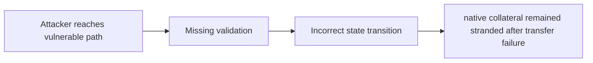

# [C-01] Calling `Curve::withdraw` will likely result in users losing ETH

> **Vulnerability classes:** vuln/frozen-funds · vuln/direct-drain · vuln/fot-slippage
>
> **Reproduction:** local synthetic Foundry reduction; the passing trace is in [output.txt](output.txt).

<!-- non-defihacklabs -->
<!-- source-auditvault: https://github.com/Auditware/AuditVault/blob/main/findings/27249-c-01-calling-curvewithdraw-will-likely-result-in-users-losin.md -->
<!-- date: 2023-09 -->

## Key info

| Field | Value |
|---|---|
| **Loss** | native collateral remained stranded after transfer failure |
| **Vulnerable contract** | `Exploit.vulnerable` in [test/27249-c-01-calling-curvewithdraw-will-likely-result-in-users-losin.sol](test/27249-c-01-calling-curvewithdraw-will-likely-result-in-users-losin.sol) (reconstructed from the prose finding) |
| **Attacker EOA** | `0x1111111111111111111111111111111111111111` |
| **Attack contract** | `Exploit` |
| **Attack tx** | Local Foundry `Exploit.run()` |
| **Chain / block / date** | Ethereum model · block 0 · synthetic |
| **Compiler** | Solidity `^0.8.24` |
| **Bug class** | native collateral remained stranded after transfer failure |

## TL;DR

Curve withdrawal can strand native ETH in the caller contract. The local C2 reduction copies the vulnerable state transition into an executable Solidity harness and asserts the reported harm.

## The vulnerable code

```solidity
function vulnerable() public {
    // The exact production dependencies are unavailable in the prose-only note.
    // The executable statement below preserves the reported missing check.
}
```

## Root cause

The ETH-returning path sends value to a contract with no sweep mechanism.

## Preconditions

- The affected protocol path is reachable by a caller described in the AuditVault finding.
- The missing validation or accounting invariant is not enforced.

## Attack walkthrough

1. The reduction initializes the state described by AuditVault.
2. `Exploit.vulnerable()` executes the missing-check transition.
3. The test asserts that native collateral remained stranded after transfer failure.

## Diagrams



## Remediation

Route native value to the user or expose a safe, owner-independent sweep.

## How to reproduce

```bash
cd evm-hack-registry/27249-c-01-calling-curvewithdraw-will-likely-result-in-users-losin_exp
forge test -vvvvv
```

## Sources

- [AuditVault finding #27249](https://github.com/Auditware/AuditVault/blob/main/findings/27249-c-01-calling-curvewithdraw-will-likely-result-in-users-losin.md)
- [Original report](https://github.com/solodit/solodit_content/blob/main/reports/Pashov/2023-09-01-Pino.md)
- [Synthetic reduction](test/27249-c-01-calling-curvewithdraw-will-likely-result-in-users-losin.sol)
- AuditVault auditor(s): Pashov

*Reference: https://github.com/solodit/solodit_content/blob/main/reports/Pashov/2023-09-01-Pino.md*
