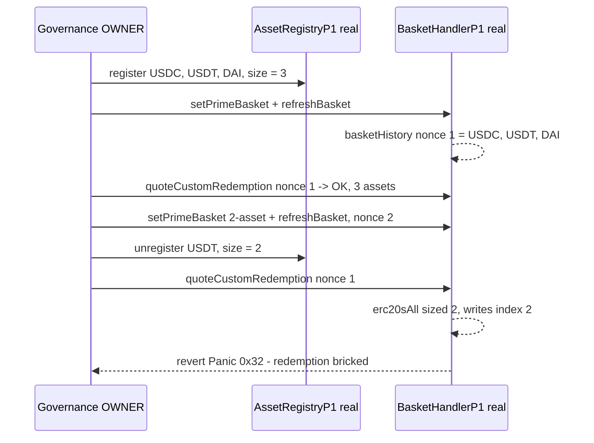

# Reserve `quoteCustomRedemption` reverts once an old basket asset is unregistered (redemption DoS)

> **Vulnerability classes:** vuln/logic/array-out-of-bounds · vuln/defi/denial-of-service
>
> **Reproduction:** the test deploys the REAL `AssetRegistryP1` and the REAL (vulnerable) `BasketHandlerP1` at the audited commit and drives them through the real governance path. It shows the same legitimate custom-redemption request going from *working* to *reverting index-out-of-bounds* purely because governance unregistered one asset of a historical basket.

<!-- source-auditvault: https://github.com/Auditware/AuditVault/blob/main/findings/27331-h-01-custom-redemption-might-revert-if-old-assets-were-unreg.md -->

## Root cause

Reserve's [`BasketHandlerP1.quoteCustomRedemption`](src/reserve/target/p1/BasketHandler.sol#L384-L457) prices a redemption against one or more *historical* baskets. It allocates its working array from the **current** registry size:

```solidity
IERC20[] memory erc20sAll = new IERC20[](assetRegistry.size());   // L391 - root cause
...
for (uint256 j = 0; j < b.erc20s.length; ++j) {                    // iterates the HISTORICAL basket
    ...
    erc20sAll[len] = erc20;                                        // L418 - out-of-bounds write
    ++len;
}
```

The historical basket (`basketHistory[nonce]`) can contain **more** distinct ERC20s than `assetRegistry.size()` returns, because an asset that was in an old basket can later be unregistered. When `len` reaches `assetRegistry.size()`, the next `erc20sAll[len] = erc20` writes past the end of the array and the transaction reverts with `Panic(0x32)` (array index out-of-bounds).

Redemption is a core protocol guarantee that must remain available at all times (even while frozen). Bricking it can cause a depeg, or let a malicious governance trap collateral by unregistering an asset that lives in a still-redeemable historical basket. The fix ([PR #857](https://github.com/reserve-protocol/protocol/pull/857)) reworks `redeemCustom` so the array is no longer under-sized.

## Exploit walkthrough (real numbers)

The test deploys the real components behind ERC1967 proxies (the audited `ComponentP1` constructor locks the implementation initializer, so proxies are mandatory) and wires them through a minimal `Main` (Main is pure infrastructure - component registry + `OWNER` gating - and is not part of the bug). The `BasketHandlerP1`<->`BasketLibP1` external-library link is honoured; `safeMulDivFloor` delegates its fixed-point math to the real `FixLib.mulDiv` on the backing manager.

1. Register three collateral (USDC, USDT, DAI) in the **real** `AssetRegistryP1` -> `size() == 3`.
2. Governance sets the prime basket `{0.9 USDC, 0.05 USDT, 0.05 DAI}` and calls `refreshBasket()`; the real `_switchBasket()`/`BasketLibP1.nextBasket` records **basket nonce 1 = {USDC, USDT, DAI}**.
3. `quoteCustomRedemption([nonce 1], [1e18], 1e18)` **succeeds** and returns the 3 backing assets.
4. Governance switches the prime basket to `{0.9 DAI, 0.1 USDC}` (nonce 2) and **unregisters USDT**. The real `AssetRegistry._erc20s` (an `EnumerableSet`) shrinks: `size() == 2`.
5. The identical `quoteCustomRedemption([nonce 1], [1e18], 1e18)` now **reverts `Panic(0x32)`**: `erc20sAll` is sized 2, but the 3-asset historical basket writes index 2.

The assertion proves the concrete harm: the same redemption request that returned 3 assets in step 3 reverts index-out-of-bounds in step 5 - redemption of that basket is permanently unusable.



## Reproduction

```bash
_shared/run-poc/run_poc.sh 27331-h-01-custom-redemption-might-revert-if-old-assets-were-unreg_exp -vvvvv
```

Expected result: `1 passed`. See [`test/27331-h-01-custom-redemption-might-revert-if-old-assets-were-unreg_exp.sol`](test/27331-h-01-custom-redemption-might-revert-if-old-assets-were-unreg_exp.sol). The real audited sources are vendored under [`src/reserve/target/`](src/reserve/target/) (byte-identical to the audited commit); only the opaque collateral tokens, the collateral price plugin, and the `Main`/`BackingManager` infrastructure - none of which are part of the index-out-of-bounds bug - are minimal stand-ins in [`src/reserve/target/poc/PoCEnv.sol`](src/reserve/target/poc/PoCEnv.sol).

## Sources

- [AuditVault finding #27331](https://github.com/Auditware/AuditVault/blob/main/findings/27331-h-01-custom-redemption-might-revert-if-old-assets-were-unreg.md)
- [Reserve `BasketHandler.sol` @ `c4ec2473`](https://github.com/reserve-protocol/protocol/blob/c4ec2473bbcb4831d62af55d275368e73e16b984/contracts/p1/BasketHandler.sol#L391-L428)
- [Reserve mitigation PR #857](https://github.com/reserve-protocol/protocol/pull/857)
- [Code4rena 2023-06 Reserve report](https://code4rena.com/reports/2023-06-reserve)
