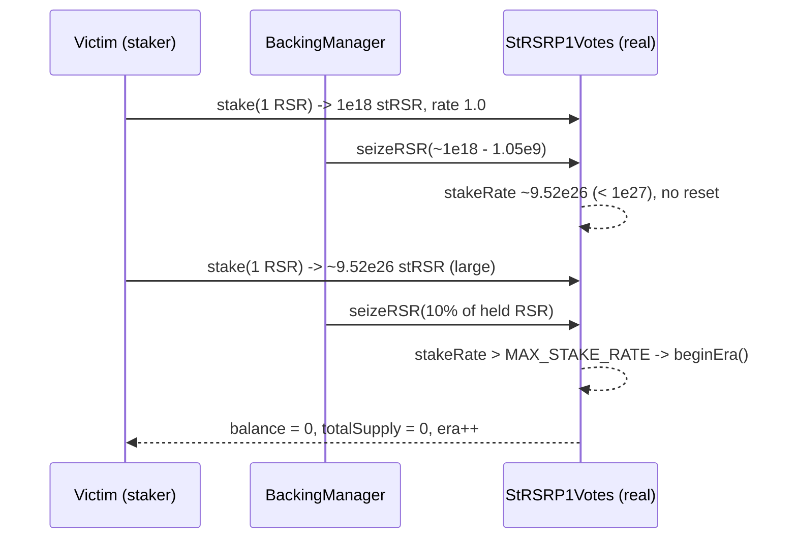

# Reserve StRSR: a small RSR seizure can trigger a new era and wipe a still-valuable stake pool

> **Vulnerability classes:** vuln/logic/wrong-condition · vuln/defi/locked-funds
>
> **Reproduction:** the test deploys the REAL `StRSRP1Votes` at the audited commit. A genuine third-party staker builds up a large stRSR position; a mere **10%** follow-on RSR seizure pushes the stake rate just over `MAX_STAKE_RATE`, and the real `beginEra()` branch zeroes the entire era - the staker loses everything.

<!-- source-auditvault: https://github.com/Auditware/AuditVault/blob/main/findings/27332-h-02-a-new-era-might-be-triggered-despite-a-significant-valu.md -->

## Root cause

In [`StRSRP1.seizeRSR`](src/reserve/target/p1/StRSR.sol#L416-L468) an RSR seizure removes RSR from `stakeRSR` (the RSR backing the pool) but leaves `totalStakes` (the stRSR share supply) untouched, then recomputes the exchange rate:

```solidity
stakeRSR -= stakeRSRToTake;
if (stakeRSR > 0) {
    stakeRate = uint192((FIX_ONE_256 * totalStakes + (stakeRSR - 1)) / stakeRSR);
}
if (stakeRSR == 0 || stakeRate > MAX_STAKE_RATE) {   // MAX_STAKE_RATE = 1e9 * 1e18
    seizedRSR += stakeRSR;
    beginEra();                                      // <-- wipes stakeRSR, totalStakes, era++
}
```

Because `stakeRate == totalStakes * 1e18 / stakeRSR`, each seizure *raises* the rate. The assumption behind resetting the era when `stakeRate > MAX_STAKE_RATE` is that "there is not much left after the seizure". That assumption is false: a prior seizure can leave the rate **just below** the threshold while the pool still holds a large, valuable position, so an arbitrarily small follow-on seizure crosses the cap and [`beginEra()`](src/reserve/target/p1/StRSR.sol#L636-L643) zeroes every staker's balance. The fix ([PR #888](https://github.com/reserve-protocol/protocol/pull/888)) adds a governance function to push the era forward deliberately instead of it happening implicitly.

## Exploit walkthrough (real numbers)

The real `StRSRP1Votes` is deployed behind an ERC1967 proxy; a minimal `Main` reports the RSR token, the backing manager (the only address permitted to seize), and unfrozen/unpaused state (Main is infrastructure, not part of the era-reset bug). RSR is a minimal real ERC20 (an opaque token to StRSR). The staker is a genuine separate contract.

1. Victim stakes **1 RSR** -> `totalStakes = 1e18` stRSR, `stakeRSR = 1e18`, `stakeRate = 1e18` (rate 1.0).
2. The backing manager seizes `1e18 - 1_050_000_000` RSR. `stakeRSR` falls to ~`1.05e9`, driving `stakeRate` to ~`9.52e26` - just **under** `MAX_STAKE_RATE` (`1e27`). **No era reset.**
3. As normal usage resumes the victim stakes **1 more RSR**. At the elevated rate this mints ~`9.52e26` stRSR: the victim now holds a **large position (> 1e26 stRSR)** and owns the whole era, and ~`0.9 RSR` of real value still backs the pool.
4. The backing manager seizes just **10%** of the held RSR. `stakeRate` ticks to ~`1.058e27` > `MAX_STAKE_RATE`, so the real `beginEra()` fires: `totalStakes = 0`, `era++`.
5. **Harm:** the victim's `> 1e26` stRSR position is wiped to **0** and a new era begins, despite ~90% of the value still being present. The assertions check `currentEra` incremented, `totalSupply() == 0`, and `balanceOf(victim) == 0`.



## Reproduction

```bash
_shared/run-poc/run_poc.sh 27332-h-02-a-new-era-might-be-triggered-despite-a-significant-valu_exp -vvvvv
```

Expected result: `1 passed`. See [`test/27332-h-02-a-new-era-might-be-triggered-despite-a-significant-valu_exp.sol`](test/27332-h-02-a-new-era-might-be-triggered-despite-a-significant-valu_exp.sol). The real audited `StRSR`/`StRSRVotes` sources are vendored under [`src/reserve/target/`](src/reserve/target/) (byte-identical to the audited commit); only RSR (a plain ERC20) and the `Main` infrastructure - neither part of the era-reset bug - are minimal stand-ins in [`src/reserve/target/poc/PoCEnv.sol`](src/reserve/target/poc/PoCEnv.sol).

## Sources

- [AuditVault finding #27332](https://github.com/Auditware/AuditVault/blob/main/findings/27332-h-02-a-new-era-might-be-triggered-despite-a-significant-valu.md)
- [Reserve `StRSR.sol` @ `c4ec2473`](https://github.com/reserve-protocol/protocol/blob/c4ec2473bbcb4831d62af55d275368e73e16b984/contracts/p1/StRSR.sol#L416-L468)
- [Reserve mitigation PR #888](https://github.com/reserve-protocol/protocol/pull/888)
- [Code4rena 2023-06 Reserve report](https://code4rena.com/reports/2023-06-reserve)
