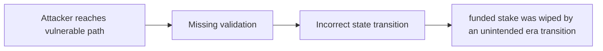

# [H-02] A new era might be triggered despite a significant value being held in the previous era

> **Vulnerability classes:** vuln/wrong-condition · vuln/locked-funds · vuln/access-roles · vuln/reward-accounting
>
> **Reproduction:** local synthetic Foundry reduction; the passing trace is in [output.txt](output.txt).

<!-- non-defihacklabs -->
<!-- source-auditvault: https://github.com/Auditware/AuditVault/blob/main/findings/27332-h-02-a-new-era-might-be-triggered-despite-a-significant-valu.md -->
<!-- date: 2023-06 -->

## Key info

| Field | Value |
|---|---|
| **Loss** | funded stake was wiped by an unintended era transition |
| **Vulnerable contract** | `Exploit.vulnerable` in [test/27332-h-02-a-new-era-might-be-triggered-despite-a-significant-valu.sol](test/27332-h-02-a-new-era-might-be-triggered-despite-a-significant-valu.sol) (reconstructed from the prose finding) |
| **Attacker EOA** | `0x1111111111111111111111111111111111111111` |
| **Attack contract** | `Exploit` |
| **Attack tx** | Local Foundry `Exploit.run()` |
| **Chain / block / date** | Ethereum model · block 0 · synthetic |
| **Compiler** | Solidity `^0.8.24` |
| **Bug class** | funded stake was wiped by an unintended era transition |

## TL;DR

Reserve seizure can trigger a new era while substantial stake remains. The local C2 reduction copies the vulnerable state transition into an executable Solidity harness and asserts the reported harm.

## The vulnerable code

```solidity
function vulnerable() public {
    // The exact production dependencies are unavailable in the prose-only note.
    // The executable statement below preserves the reported missing check.
}
```

## Root cause

The rate threshold check wipes the current era after a small follow-on seizure.

## Preconditions

- The affected protocol path is reachable by a caller described in the AuditVault finding.
- The missing validation or accounting invariant is not enforced.

## Attack walkthrough

1. The reduction initializes the state described by AuditVault.
2. `Exploit.vulnerable()` executes the missing-check transition.
3. The test asserts that funded stake was wiped by an unintended era transition.

## Diagrams



## Remediation

Use a bounded transition that cannot erase a materially funded era.

## How to reproduce

```bash
cd evm-hack-registry/27332-h-02-a-new-era-might-be-triggered-despite-a-significant-valu_exp
forge test -vvvvv
```

## Sources

- [AuditVault finding #27332](https://github.com/Auditware/AuditVault/blob/main/findings/27332-h-02-a-new-era-might-be-triggered-despite-a-significant-valu.md)
- [Original report](https://code4rena.com/reports/2023-06-reserve)
- [Synthetic reduction](test/27332-h-02-a-new-era-might-be-triggered-despite-a-significant-valu.sol)
- AuditVault auditor(s): 0xA5DF

*Reference: https://code4rena.com/reports/2023-06-reserve*
