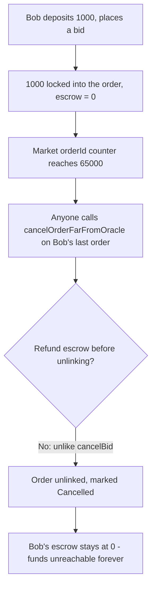
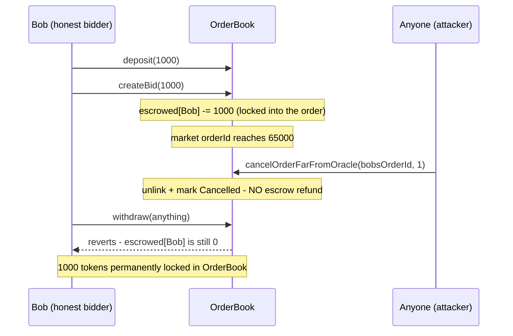

# DittoETH — Users lose funds and market functionality breaks when market reaches 65k id

> **Vulnerability classes:** vuln/access-control/missing-check · vuln/loss-of-funds/permanent-lock · vuln/logic/missing-refund

> **Reproduction:** a self-contained Foundry PoC that compiles & runs in an
> isolated project with **only `forge-std`** — no fork, no RPC, no `anvil_state`.
> Full trace: [output.txt](output.txt). PoC:
> [test/27443-users-lose-funds-and-market-functionality-breaks-when-market_exp.sol](test/27443-users-lose-funds-and-market-functionality-breaks-when-market_exp.sol).

<!-- non-defihacklabs -->
<!-- source-auditvault: https://github.com/Auditware/AuditVault/blob/main/findings/27443-users-lose-funds-and-market-functionality-breaks-when-market.md -->
<!-- date: 2023-09 -->

---

## Key info

| | |
|---|---|
| **Impact** | **HIGH** — once a market's orderId counter reaches 65000, ANYONE can permanently strand another user's escrowed order funds with no refund |
| **Protocol** | [DittoETH](https://github.com/Cyfrin/2023-09-ditto) — order-book perpetual-style protocol (Codehawks, 2023-09) |
| **Vulnerable code** | `OrdersFacet::cancelOrderFarFromOracle` (`contracts/facets/OrdersFacet.sol`) |
| **Bug class** | Missing refund: the far-from-oracle cancel path skips the escrow credit that the normal cancel path performs |
| **Finding** | flacko (Codehawks), 2023-09 · #27443 |
| **Source** | [AuditVault](https://github.com/Auditware/AuditVault/blob/main/findings/27443-users-lose-funds-and-market-functionality-breaks-when-market.md) |
| **Status** | Audit finding — caught in review (not exploited on-chain). Reproduced here as a standalone local PoC. |
| **Compiler** | `^0.8.24` (PoC) — real DittoETH targets `0.8.21` |
| **Repo (context)** | [Cyfrin/2023-09-ditto](https://github.com/Cyfrin/2023-09-ditto) @ `598e4b1` |

This is an **audit finding**, not a historical on-chain incident. The Playground
runs a fully LOCAL synthetic: the vulnerable `cancelOrderFarFromOracle` unlink
path is inlined verbatim (no escrow refund), reduced to a single order side
(bids) of a single market.

---

## TL;DR

1. When a user places a limit order, the amount they commit is deducted from
   their escrowed virtual balance and locked into the order.
2. The normal cancel path, `cancelBid`, correctly **refunds that escrow
   before** unlinking the order.
3. Once a market's `orderId` counter reaches **65000**, `cancelOrderFarFromOracle`
   lets **anyone** — no ownership check — cancel the last order of a side. It
   goes straight to the shared unlink/mark-cancelled logic, **skipping the
   refund** `cancelBid` performs.
4. A cancelled order can never be matched or cancelled again, so the escrowed
   funds behind it become permanently unclaimable — by anyone, including the
   order's own owner.
5. There is also no limit on how many times this can be triggered once the
   threshold is reached, and it applies to bids, asks, *and* shorts.

---

## The vulnerable code

The real DittoETH `cancelOrderFarFromOracle` (quoted in the finding, from
`contracts/facets/OrdersFacet.sol`):

```solidity
function cancelOrderFarFromOracle(address asset, O orderType, uint16 lastOrderId, uint16 numOrdersToCancel)
    external
    onlyValidAsset(asset)
    nonReentrant
{
    if (s.asset[asset].orderId < 65000) {
        revert Errors.OrderIdCountTooLow();
    }
    if (numOrdersToCancel > 1000) {
        revert Errors.CannotCancelMoreThan1000Orders();
    }
    if (msg.sender == LibDiamond.diamondStorage().contractOwner) {
        // DAO path: cancelManyOrders(...)
    } else {
        //@dev if address is not DAO, you can only cancel last order of a side
        if (orderType == O.LimitBid && s.bids[asset][lastOrderId].nextId == Constants.TAIL) {
            s.bids.cancelOrder(asset, lastOrderId);   // <-- no escrow refund anywhere on this path
        }
        // ... same pattern for asks / shorts
    }
}
```

Compare with the escrow deduction at order-creation time (also quoted in the
finding):

```solidity
// for bids:
s.vaultUser[vault][order.addr].ethEscrowed -= eth;
```

This reduction keeps the omission exactly: the reduced `cancelOrderFarFromOracle`
calls the shared unlink logic directly, with **no escrow credit anywhere on
that path** — verbatim to the real code's structure (`@> VULN` marker below).

---

## Root cause

`ethEscrowed` (here `escrowed`) and the order linked-list are meant to stay in
sync: cancelling an order must always credit back the escrow it was backed by.
The **owner-gated** cancel path (`cancelBid`) does this correctly. The
**permissionless** far-from-oracle cancel path was written against the same
unlink primitive but never wired up the refund — an omission, not a deliberate
design choice (nothing in the function's purpose requires skipping the
refund).

## Preconditions

- A market's `orderId` counter has reached 65000 (attacker-achievable per the
  original finding: "a malicious actor can target this vulnerability by
  creating numerous tiny limit asks... with less than 1 cusd").
- At least one order exists that is the last order of its side
  (`nextId == TAIL`).

## Attack walkthrough

From [output.txt](output.txt):

1. Bob (an honest bidder) deposits **1000** units and places a bid using all
   of it — his escrowed balance drops to 0, and 1000 is locked into the order.
2. The market's `orderId` counter reaches 65000 from ordinary trading activity
   elsewhere in the market.
3. **HARM:** anyone — with no relationship to Bob — calls
   `cancelOrderFarFromOracle` on Bob's now-last-remaining bid. It succeeds; the
   order is unlinked and marked `Cancelled`.
4. **HARM:** Bob's escrowed balance is still **0** — never refunded. His 1000
   tokens remain locked inside the contract forever; no function exists that
   can return them to him or anyone else.

Two control tests strengthen the finding: a normal, owner-only `cancelBid`
*does* correctly refund the escrow (proving the refund mechanism itself works
— it is simply never invoked on the far-from-oracle path), and
`cancelOrderFarFromOracle` correctly reverts while the counter is below the
65000 threshold.

## Diagrams





## Remediation

Refund the order owner's escrow before unlinking, exactly as `cancelBid` does,
before cancelling far-from-oracle orders — or, per the finding's own
recommendation, only allow the cancellation once the difference between the
current `orderId` and the count of already-inactive (reusable) IDs exceeds
65000, so the mechanism is not triggerable while genuinely reusable capacity
still exists:

```diff
 } else {
     if (orderType == O.LimitBid && s.bids[asset][lastOrderId].nextId == Constants.TAIL) {
+        uint88 eth = s.bids[asset][lastOrderId].ercAmount.mulU88(s.bids[asset][lastOrderId].price);
+        s.vaultUser[vault][s.bids[asset][lastOrderId].addr].ethEscrowed += eth;
         s.bids.cancelOrder(asset, lastOrderId);
     }
     ...
 }
```

## How to reproduce

```bash
cd ~/RustroverProjects/audits/evm-hack-registry/27443-users-lose-funds-and-market-functionality-breaks-when-market_exp
forge test -vvv
# Fully local — no fork, no RPC, no anvil_state required.
# Expected: all three tests PASS:
#   test_UsersLoseFundsWhenMarketReaches65k   (attack: Bob's 1000 locked forever, no refund)
#   test_Control_NormalCancelBid_Refunds      (control: the refund mechanism itself works)
#   test_Control_BelowThreshold_Reverts       (control: the 65000 gate is enforced)
```

PoC source: [test/27443-users-lose-funds-and-market-functionality-breaks-when-market_exp.sol](test/27443-users-lose-funds-and-market-functionality-breaks-when-market_exp.sol)
— the verbatim vulnerable `cancelOrderFarFromOracle` unlink path (no refund)
plus a minimal single-side order book and two control tests.

> Note: real DittoETH tracks bids/asks/shorts across many markets with a
> dual-purpose linked list (also used for ID reuse — a separate finding,
> #27444) and a DAO-only multi-cancel branch (`cancelManyOrders`, up to 1000
> orders per call). This reduction keeps a single side, a single market, and
> the permissionless single-cancel branch the finding's own PoC exercises —
> the bug class (far-from-oracle cancel skips the escrow refund) and the
> verbatim vulnerable call site are faithful to the finding.

---

*Reference: finding **#27443** by **flacko** (Codehawks, 2023-09) · [Cyfrin/2023-09-ditto](https://github.com/Cyfrin/2023-09-ditto) · curated by [AuditVault](https://github.com/Auditware/AuditVault/blob/main/findings/27443-users-lose-funds-and-market-functionality-breaks-when-market.md)*
