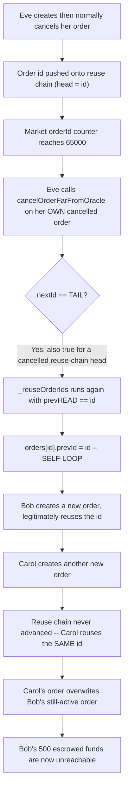
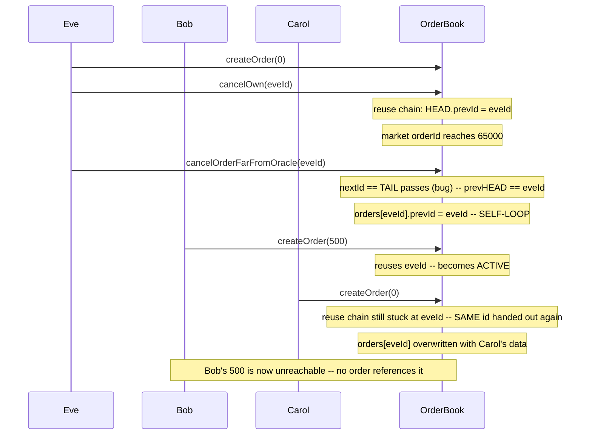

# DittoETH — New orders can overwrite active orders when order id reaches 65000

> **Vulnerability classes:** vuln/logic/linked-list-corruption · vuln/loss-of-funds/permanent-lock · vuln/access-control/missing-check

> **Reproduction:** a self-contained Foundry PoC that compiles & runs in an
> isolated project with **only `forge-std`** — no fork, no RPC, no `anvil_state`.
> Full trace: [output.txt](output.txt). PoC:
> [test/27444-new-orders-can-overwrite-active-orders-when-order-id-reaches_exp.sol](test/27444-new-orders-can-overwrite-active-orders-when-order-id-reaches_exp.sol).

<!-- non-defihacklabs -->
<!-- source-auditvault: https://github.com/Auditware/AuditVault/blob/main/findings/27444-new-orders-can-overwrite-active-orders-when-order-id-reaches.md -->
<!-- date: 2023-09 -->

---

## Key info

| | |
|---|---|
| **Impact** | **HIGH** — once a market's orderId counter reaches 65000, the id-reuse free list can be corrupted into a self-loop, causing a brand-new order to silently overwrite another user's still-active, funded order |
| **Protocol** | [DittoETH](https://github.com/Cyfrin/2023-09-ditto) — order-book perpetual-style protocol (Codehawks, 2023-09) |
| **Vulnerable code** | `OrdersFacet::cancelOrderFarFromOracle` + `LibOrders::_reuseOrderIds` (`contracts/facets/OrdersFacet.sol`, `contracts/libraries/LibOrders.sol`) |
| **Bug class** | Linked-list state corruption: an ambiguous "is this the last order?" check lets a cancel be re-run on an already-cancelled order, self-looping the ID-reuse free list |
| **Finding** | hash (Codehawks), 2023-09 · #27444 |
| **Source** | [AuditVault](https://github.com/Auditware/AuditVault/blob/main/findings/27444-new-orders-can-overwrite-active-orders-when-order-id-reaches.md) |
| **Status** | Audit finding — caught in review (not exploited on-chain). Reproduced here as a standalone local PoC. |
| **Compiler** | `^0.8.24` (PoC) — real DittoETH targets `0.8.21` |
| **Repo (context)** | [Cyfrin/2023-09-ditto](https://github.com/Cyfrin/2023-09-ditto) @ `598e4b1` |

This is an **audit finding**, not a historical on-chain incident. This finding
is closely related to [#27443](../27443-users-lose-funds-and-market-functionality-breaks-when-market_exp/27443-users-lose-funds-and-market-functionality-breaks-when-market_exp.md)
(same `cancelOrderFarFromOracle` entry point) but is a **distinct root cause**:
where #27443 is a missing escrow refund, #27444 is a linked-list self-loop that
causes brand-new orders — created by anyone, any time afterward — to silently
overwrite each other.

---

## TL;DR

1. DittoETH tracks each order side (bids/asks/shorts) as a doubly-linked list
   between `HEAD` and `TAIL` sentinels, PLUS a second, dual-purpose "reuse
   chain" of cancelled order ids threaded through `HEAD.prevId`.
2. `cancelOrderFarFromOracle`'s permissionless branch identifies "the last
   order" solely by `nextId == TAIL`. But `_reuseOrderIds` **also** stamps
   `nextId == TAIL` on any order it pushes onto the reuse chain — so an
   **already-cancelled** order sitting at the head of the reuse chain
   satisfies the exact same check.
3. Calling `cancelOrderFarFromOracle` on such an order re-runs the
   cancel/reuse logic on it a **second time**. On that pass,
   `_reuseOrderIds` receives `prevHEAD == id` (the order already IS the
   reuse-chain head), and `orders[id].prevId = prevHEAD` sets the order's
   `prevId` to **itself** — a self-loop.
4. The free list can never advance past a self-looped id: the very next
   **two** brand-new orders both get handed that same id. The second
   order's creation silently **overwrites** the first — even though the
   first was never cancelled by anyone and still had funds escrowed.

---

## The vulnerable code

The ambiguous "last order" check (quoted in the finding, from
`contracts/facets/OrdersFacet.sol`):

```solidity
if (msg.sender == LibDiamond.diamondStorage().contractOwner) {
    if (orderType == O.LimitBid && s.bids[asset][lastOrderId].nextId == Constants.TAIL) {
        s.bids.cancelManyOrders(asset, lastOrderId, numOrdersToCancel);
    } else if ( /* asks / shorts */ ) { ... }
} else {
    //@dev if address is not DAO, you can only cancel last order of a side
    if (orderType == O.LimitBid && s.bids[asset][lastOrderId].nextId == Constants.TAIL) {
        s.bids.cancelOrder(asset, lastOrderId);
    } else if ( /* asks / shorts */ ) { ... }
}
```

The self-loop (quoted in the finding, from `contracts/libraries/LibOrders.sol`,
with the auditor's own `@audit` comment kept):

```solidity
function _reuseOrderIds(...) private {
    // more code
    // @audit if the prevHead was order with id itself, then it's prevId will be id
    if (prevHEAD != Constants.HEAD) {
        orders[asset][id].prevId = prevHEAD;
    } else {
        // ...
```

This reduction keeps both blamed pieces verbatim: `cancelOrderFarFromOracle`'s
`nextId == TAIL` check and `_reuseOrderIds`'s `orders[id].prevId = prevHEAD`
self-loop branch.

---

## Root cause

The active-order list and the cancelled-order reuse chain share the SAME two
struct fields (`prevId`/`nextId`) for two DIFFERENT purposes, both terminated
by the same `TAIL`/`HEAD` sentinels. `cancelOrderFarFromOracle`'s "is this the
last order" test (`nextId == TAIL`) cannot tell which purpose currently
applies to a given order — so it happily re-processes an order that is
*already* in the cancelled/reuse state. Re-processing an order whose
`prevId` already equals the current reuse-chain head produces a
self-referential pointer that the free-list's forward-popping logic can never
escape.

## Preconditions

- The market's `orderId` counter has reached 65000.
- At least one order exists that has already been cancelled normally and is
  currently the head of the ID-reuse chain (`nextId == TAIL` from that push,
  not from being genuinely last-active).

## Attack walkthrough

From [output.txt](output.txt):

1. Eve creates an order, then normally cancels it herself — the id is
   recycled onto the (previously empty) reuse chain, becoming its head.
2. The market's `orderId` counter reaches 65000 from ordinary trading
   activity elsewhere in the market.
3. Eve calls `cancelOrderFarFromOracle` on her OWN already-cancelled order.
   There is nothing left to cancel — but the ambiguous `nextId == TAIL`
   check lets the call through anyway.
4. **VULN:** `_reuseOrderIds` receives `prevHEAD == id` (Eve's order already
   IS the reuse-chain head) and sets the order's `prevId` to itself — a
   self-loop.
5. Bob creates a brand-new order with **500** — he legitimately reuses the
   (genuinely free) recycled id and becomes fully **ACTIVE**.
6. **HARM:** Carol creates another brand-new order. Because the reuse chain
   never advanced past the self-looped id, Carol is handed the **exact same
   id Bob just used** — her order's creation silently **overwrites** Bob's
   still-active order in storage.
7. **HARM:** Bob's escrowed balance is permanently stuck at 0. No order in
   the system references his 500 anymore, and no refund was ever issued — his
   funds are unreachable by any function.

A control test confirms that, absent the double-processing of an
already-cancelled order (a single normal cancel, with no
`cancelOrderFarFromOracle` re-trigger), two sequential new orders correctly
receive **distinct** ids and Bob's order survives intact — proving the
collision only happens once the reuse chain is corrupted.

## Diagrams





## Remediation

Do not rely on `nextId == TAIL` alone to identify "the last active order" —
also verify the order's `orderType` is `Active` (not `Cancelled`/`Matched`)
before allowing `cancelOrderFarFromOracle` to process it:

```diff
 if (orderType == O.LimitBid && s.bids[asset][lastOrderId].nextId == Constants.TAIL) {
+    if (s.bids[asset][lastOrderId].orderType != O.LimitBid) revert Errors.NotActiveOrder();
     s.bids.cancelOrder(asset, lastOrderId);
 }
```

## How to reproduce

```bash
cd ~/RustroverProjects/audits/evm-hack-registry/27444-new-orders-can-overwrite-active-orders-when-order-id-reaches_exp
forge test -vvv
# Fully local — no fork, no RPC, no anvil_state required.
# Expected: both tests PASS:
#   test_NewOrdersOverwriteActiveOrdersAt65k   (attack: Carol's order overwrites Bob's active order)
#   test_Control_NoCorruption_DistinctIds      (control: without the double-cancel, ids stay distinct)
```

PoC source: [test/27444-new-orders-can-overwrite-active-orders-when-order-id-reaches_exp.sol](test/27444-new-orders-can-overwrite-active-orders-when-order-id-reaches_exp.sol)
— the verbatim vulnerable `nextId == TAIL` check and `_reuseOrderIds` self-loop
branch, plus a minimal single-side order book and a control test.

> Note: real DittoETH's reuse chain and active list span bids/asks/shorts
> across many markets with a DAO multi-cancel branch (`cancelManyOrders`, up
> to 1000 orders per call) — out of scope here. This reduction keeps a single
> side, a single market, and the exact self-loop mechanics the finding's own
> `@audit` comment identifies (`"if the prevHead was order with id itself,
> then it's prevId will be id"`) — the bug class and the verbatim vulnerable
> lines are faithful to the finding.

---

*Reference: finding **#27444** by **hash** (Codehawks, 2023-09) · [Cyfrin/2023-09-ditto](https://github.com/Cyfrin/2023-09-ditto) · curated by [AuditVault](https://github.com/Auditware/AuditVault/blob/main/findings/27444-new-orders-can-overwrite-active-orders-when-order-id-reaches.md)*
