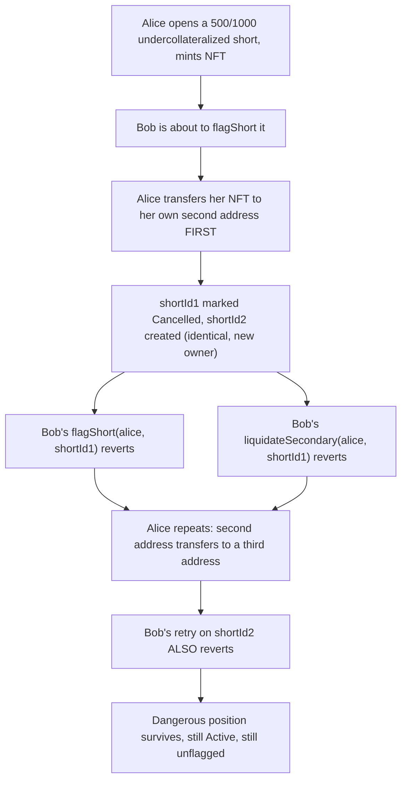
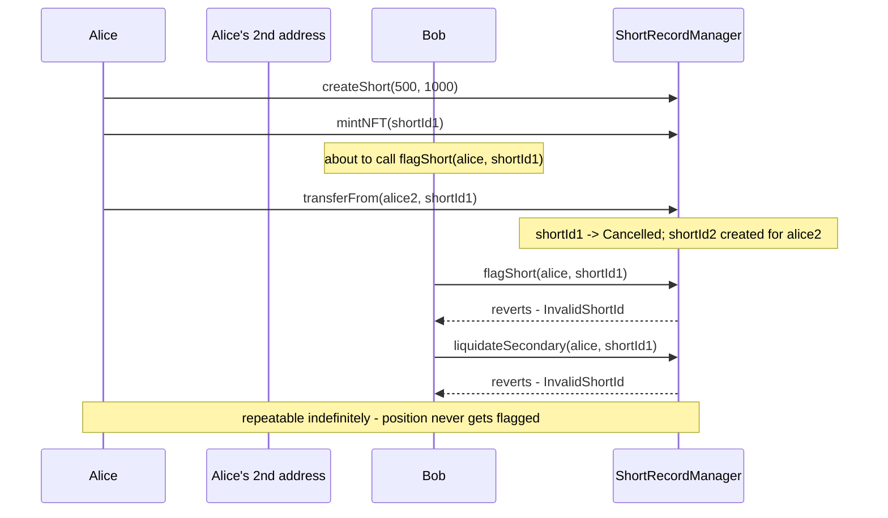

# DittoETH — Owner of a bad ShortRecord can front-run flagShort calls AND liquidateSecondary

> **Vulnerability classes:** vuln/access-control/insufficient-guard · vuln/logic/liquidation-manipulation · vuln/dos/liveness

> **Reproduction:** a self-contained Foundry PoC that compiles & runs in an
> isolated project with **only `forge-std`** — no fork, no RPC, no `anvil_state`.
> Full trace: [output.txt](output.txt). PoC:
> [test/27454-owner-of-a-bad-shortrecord-can-front-run-flagshort-calls-and_exp.sol](test/27454-owner-of-a-bad-shortrecord-can-front-run-flagshort-calls-and_exp.sol).

<!-- non-defihacklabs -->
<!-- source-auditvault: https://github.com/Auditware/AuditVault/blob/main/findings/27454-owner-of-a-bad-shortrecord-can-front-run-flagshort-calls-and.md -->
<!-- date: 2023-09 -->

---

## Key info

| | |
|---|---|
| **Impact** | **HIGH** — a short owner can indefinitely evade being flagged or liquidated by transferring their own position's NFT the instant a flag/liquidation is attempted |
| **Protocol** | [DittoETH](https://github.com/Cyfrin/2023-09-ditto) — order-book perpetual-style protocol (Codehawks, 2023-09) |
| **Vulnerable code** | `LibShortRecord::transferShortRecord` (`contracts/libraries/LibShortRecord.sol`) |
| **Bug class** | Insufficient guard: transfer validity is checked against Cancelled/flagged status, but never against collateral health |
| **Finding** | hash (Codehawks), 2023-09 · #27454 |
| **Source** | [AuditVault](https://github.com/Auditware/AuditVault/blob/main/findings/27454-owner-of-a-bad-shortrecord-can-front-run-flagshort-calls-and.md) |
| **Status** | Audit finding — caught in review (not exploited on-chain). Reproduced here as a standalone local PoC. |
| **Compiler** | `^0.8.24` (PoC) — real DittoETH targets `0.8.21` |
| **Repo (context)** | [Cyfrin/2023-09-ditto](https://github.com/Cyfrin/2023-09-ditto) @ `598e4b1` |

This is an **audit finding**, not a historical on-chain incident. Note: unlike
classic MEV front-running, this attack needs **no real mempool timing trick** —
the short's owner controls their own transaction ordering, so "beating" a
flag/liquidation attempt just means calling `transferFrom` before it, which
this reduction reproduces directly and deterministically.

---

## TL;DR

1. Every DittoETH short position (a `ShortRecord`) can be represented as an
   NFT and transferred.
2. `flagShort` and `liquidateSecondary` both require their TARGET
   `ShortRecord` to still be `Active`.
3. Transferring a `ShortRecord`'s NFT **deletes the OLD record** (marks it
   `Cancelled`) and **recreates an identical one under the new owner** — the
   transfer path checks the record isn't already cancelled or flagged, but
   **never checks its collateral health**.
4. A short's owner can therefore watch for (or simply anticipate) an
   incoming flag/liquidation attempt and beat it by transferring their own
   NFT to another address they control **first** — invalidating the exact id
   being targeted.
5. The trick is **free and indefinitely repeatable**: the owner just keeps
   moving the position to a fresh address whenever someone tries to act on
   it, permanently dodging both flagging and liquidation while the protocol
   remains exposed to their bad debt.

---

## The vulnerable code

The transfer path that never checks collateral health (structure quoted in
the finding, from `contracts/libraries/LibShortRecord.sol`):

```solidity
function transferShortRecord(address from, address to, uint40 tokenId, STypes.NFT memory nft) internal {
    STypes.ShortRecord storage short = s.shortRecords[asset][from][nft.shortRecordId];
    if (short.status == SR.Cancelled) revert Errors.OriginalShortRecordCancelled();
    if (short.flaggerId != 0) revert Errors.CannotTransferFlaggedShort();
    // <- NO collateral-ratio / health check here
    deleteShortRecord(asset, from, nft.shortRecordId);
    // ... recreate an identical ShortRecord under `to`
```

The gate `flagShort` and `liquidateSecondary` both rely on (quoted in the
finding, `MarginCallPrimaryFacet::flagShort`'s `onlyValidShortRecord`
modifier, and the same check in `MarginCallSecondaryFacet::liquidateSecondary`):

```solidity
// onlyValidShortRecord requires the SR at (owner, shortRecordId) to be
// non-Cancelled — exactly what a front-run transfer breaks.
```

This reduction keeps the transfer path's missing health check verbatim (the
`@> VULN` marker below) and mirrors both consuming gates.

---

## Root cause

A `ShortRecord`'s validity for flagging/liquidation is entirely determined by
its `status` field. The transfer path is the ONLY code path that can change
`status` to `Cancelled` outside of an actual liquidation — and it is
fully owner-controlled and permissionless with respect to the position's own
health. Nothing stops an owner from using it purely as an evasion tool the
instant their position becomes dangerous.

## Preconditions

- A short position exists and its NFT has been minted (a normal, permissionless step).
- The owner can send a transaction before the flag/liquidation attempt lands
  (trivially true for their OWN transfer versus someone else's separate call).

## Attack walkthrough

From [output.txt](output.txt):

1. Alice opens a dangerously undercollateralized short (**500** collateral
   against **1000** debt) and mints its NFT.
2. Bob is about to flag Alice's dangerous position. Alice front-runs him by
   transferring her NFT to her own second address **first** — this deletes
   `shortId1` (marks it `Cancelled`) and creates `shortId2`, identical, under
   her second address.
3. **HARM:** Bob's `flagShort(alice, shortId1)` reverts — the id he targeted
   no longer refers to an `Active` short.
4. **HARM:** Bob's `liquidateSecondary(alice, shortId1)` reverts too — the
   same `Active`-status gate blocks liquidation.
5. Alice repeats the trick: her second address transfers to a third address,
   front-running Bob's retry on `shortId2`.
6. **HARM:** Bob's second `flagShort` attempt, on `shortId2`, **also**
   reverts. The dangerous position (now `shortId3`, still 500/1000) survives
   fully `Active` and still never flagged.

A control test confirms that, absent any front-running transfer, `flagShort`
correctly succeeds against a genuinely still-`Active` short — proving the
block is caused specifically by the transfer invalidating the id, not by
`flagShort` being broken outright.

## Diagrams





## Remediation

Require the short's collateral ratio to be healthy (above the primary
liquidation threshold) before allowing a transfer, per the finding's own
recommendation:

```diff
 function transferShortRecord(...) internal {
     STypes.ShortRecord storage short = s.shortRecords[asset][from][nft.shortRecordId];
     if (short.status == SR.Cancelled) revert Errors.OriginalShortRecordCancelled();
     if (short.flaggerId != 0) revert Errors.CannotTransferFlaggedShort();
+    if (short.getCollateralRatioSpotPrice(LibOracle.getSavedOrSpotOraclePrice(asset))
+        < LibAsset.primaryLiquidationCR(asset)) {
+        revert Errors.InsufficientCollateral();
+    }
     deleteShortRecord(asset, from, nft.shortRecordId);
     ...
```

## How to reproduce

```bash
cd ~/RustroverProjects/audits/evm-hack-registry/27454-owner-of-a-bad-shortrecord-can-front-run-flagshort-calls-and_exp
forge test -vvv
# Fully local — no fork, no RPC, no anvil_state required.
# Expected: both tests PASS:
#   test_FrontrunFlagShortAndLiquidateSecondary   (attack: both flag and liquidate attempts revert, twice)
#   test_Control_NoFrontrun_FlagSucceeds          (control: without the transfer, flagShort works fine)
```

PoC source: [test/27454-owner-of-a-bad-shortrecord-can-front-run-flagshort-calls-and_exp.sol](test/27454-owner-of-a-bad-shortrecord-can-front-run-flagshort-calls-and_exp.sol)
— the verbatim vulnerable transfer path (no health check) plus a minimal
short/NFT/flag/liquidate scaffold and a control test.

> Note: real DittoETH computes collateral ratios from a live price oracle and
> supports full margin-call reward/liquidation payout logic — out of scope
> here. This reduction keeps the exact mechanism the finding blames (transfer
> invalidates the flag/liquidation target with no health check) faithful to
> the finding's own two PoC scenarios (`test_audit_frontrunFlagShort` and
> `test_audit_frontrunPreventFlagAndSecondaryLiquidation`).

---

*Reference: finding **#27454** by **hash** (Codehawks, 2023-09) · [Cyfrin/2023-09-ditto](https://github.com/Cyfrin/2023-09-ditto) · curated by [AuditVault](https://github.com/Auditware/AuditVault/blob/main/findings/27454-owner-of-a-bad-shortrecord-can-front-run-flagshort-calls-and.md)*
