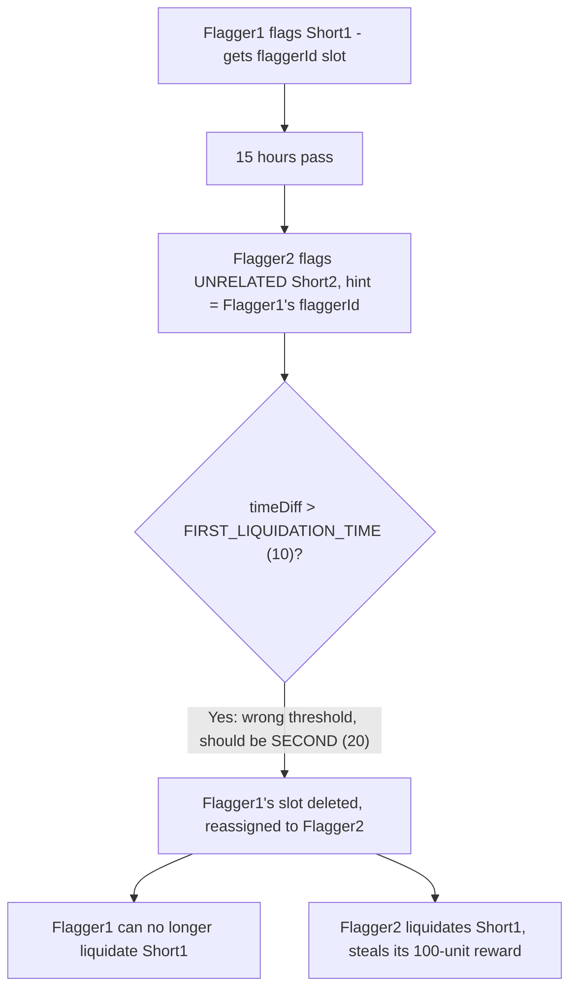
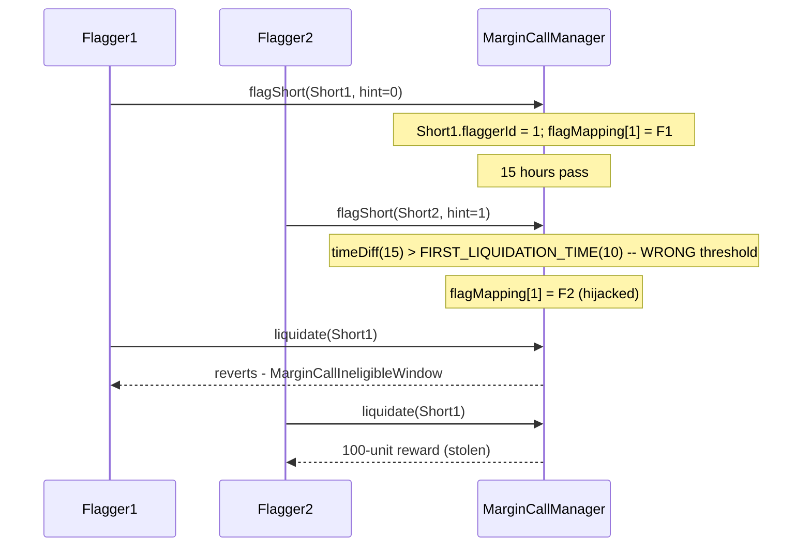

# DittoETH — Flag can be overridden by another user

> **Vulnerability classes:** vuln/logic/wrong-threshold · vuln/loss-of-funds/reward-theft · vuln/access-control/shared-resource

> **Reproduction:** a self-contained Foundry PoC that compiles & runs in an
> isolated project with **only `forge-std`** — no fork, no RPC, no `anvil_state`.
> Full trace: [output.txt](output.txt). PoC:
> [test/27465-flag-can-be-overriden-by-another-user-codehawks-dittoeth-git_exp.sol](test/27465-flag-can-be-overriden-by-another-user-codehawks-dittoeth-git_exp.sol).

<!-- non-defihacklabs -->
<!-- source-auditvault: https://github.com/Auditware/AuditVault/blob/main/findings/27465-flag-can-be-overriden-by-another-user-codehawks-dittoeth-git.md -->
<!-- date: 2023-09 -->

---

## Key info

| | |
|---|---|
| **Impact** | **MEDIUM/HIGH** (report severity Medium; AuditVault severity tag High) — a new flagger can hijack another flagger's global flaggerId slot via a completely UNRELATED short, stealing their liquidation reward eligibility one liquidation-tier too early |
| **Protocol** | [DittoETH](https://github.com/Cyfrin/2023-09-ditto) — order-book perpetual-style protocol (Codehawks, 2023-09) |
| **Vulnerable code** | `LibShortRecord::setFlagger` (`contracts/libraries/LibShortRecord.sol`) |
| **Bug class** | Wrong threshold: compares elapsed time against `firstLiquidationTime` where `secondLiquidationTime` is required |
| **Finding** | serialcoder (Codehawks), 2023-09 · #27465 |
| **Source** | [AuditVault](https://github.com/Auditware/AuditVault/blob/main/findings/27465-flag-can-be-overriden-by-another-user-codehawks-dittoeth-git.md) |
| **Status** | Audit finding — caught in review (not exploited on-chain). Reproduced here as a standalone local PoC. |
| **Compiler** | `^0.8.24` (PoC) — real DittoETH targets `0.8.21` |
| **Repo (context)** | [Cyfrin/2023-09-ditto](https://github.com/Cyfrin/2023-09-ditto) @ `598e4b1` |

This is an **audit finding**, not a historical on-chain incident. The Playground
runs a fully LOCAL synthetic: the vulnerable `setFlagger` id-reuse time check
is inlined verbatim, reduced to a minimal flagger/liquidation-reward model.

---

## TL;DR

1. A `flaggerId` is a **global, reusable slot** (`flagMapping[id] => address`
   tracks who currently holds it); each `ShortRecord` just stores WHICH
   `flaggerId` number flags it.
2. `setFlagger` lets a brand-new flagger reuse an existing `flaggerId` slot
   once `firstLiquidationTime` hours have passed since **that slot's
   holder's own last update**.
3. But the original flagger is supposed to keep **exclusive** liquidation
   rights on the short **they** flagged until the LATER
   `secondLiquidationTime` — the check uses the wrong (earlier) threshold.
4. Because the slot is global, hijacking it via a **completely unrelated
   short's** flag call silently reassigns liquidation-reward eligibility for
   the ORIGINAL flagger's short too — one liquidation-tier too early.
5. Result: the original flagger loses the ability to liquidate their own
   flagged short, and the hijacker — who never touched that short — collects
   its liquidation reward instead.

---

## The vulnerable code

The wrong-threshold check (verbatim, `LibShortRecord::setFlagger`):

```solidity
function setFlagger(STypes.ShortRecord storage short, address cusd, uint16 flaggerHint) internal {
    if (flagStorage.g_flaggerId == 0) {
        address flaggerToReplace = s.flagMapping[flaggerHint];
        uint256 timeDiff = flaggerToReplace != address(0)
            ? LibOrders.getOffsetTimeHours() - s.assetUser[cusd][flaggerToReplace].g_updatedAt
            : 0;
        //@dev re-use an inactive flaggerId
        if (timeDiff > LibAsset.firstLiquidationTime(cusd)) {   // <- should be secondLiquidationTime
            delete s.assetUser[cusd][flaggerToReplace].g_flaggerId;
            short.flaggerId = flagStorage.g_flaggerId = flaggerHint;
        } else if (s.flaggerIdCounter < type(uint16).max) {
            ...
        }
        s.flagMapping[short.flaggerId] = msg.sender;
```

This reduction keeps the exact wrong-threshold comparison, marked `@> VULN`
below, and mirrors the global `flagMapping` slot semantics.

---

## Root cause

DittoETH's liquidation flow has two time tiers: the flagger who flags a
short gets an **exclusive** window (`firstLiquidationTime` → `secondLiquidationTime`)
to liquidate it themselves and collect the reward; only after
`secondLiquidationTime` should the flaggerId slot become available for
reuse by anyone else. `setFlagger`'s id-reuse branch checks the **wrong**
(earlier) threshold — `firstLiquidationTime` — so the exclusive window is
cut short by exactly the gap between the two thresholds, and the reuse can
be triggered from **any** short's flag call, not just the one whose slot is
being reused.

## Preconditions

- Flagger1 has flagged Short1, receiving a freshly-minted `flaggerId`.
- At least `firstLiquidationTime` hours have passed since Flagger1's last
  update (but possibly still well before `secondLiquidationTime`).
- Flagger2 has never held a `flaggerId` slot themselves and flags ANY other
  short, passing Flagger1's `flaggerId` as the reuse hint.

## Attack walkthrough

From [output.txt](output.txt):

1. Flagger1 flags **Short1** first, receiving a freshly-minted `flaggerId`.
2. **15 hours** pass — past `FIRST_LIQUIDATION_TIME` (10) but well before
   `SECOND_LIQUIDATION_TIME` (20). Flagger1's exclusive window on Short1
   should still be running.
3. Flagger2, who has never flagged anything, flags a completely **unrelated
   Short2**, passing Flagger1's `flaggerId` as the hint.
4. **VULN:** the buggy time check (`timeDiff > FIRST_LIQUIDATION_TIME`)
   passes. Flagger1's `flaggerId` slot is deleted and reassigned to
   Flagger2 — via a short Flagger2 never touched.
5. **HARM:** Flagger1 can no longer liquidate his OWN flagged short — his
   `liquidate(Short1)` call now reverts (`MarginCallIneligibleWindow`).
6. **HARM:** Flagger2 CAN liquidate Short1 and collects its **100-unit**
   liquidation reward, despite never having flagged Short1 at all.

A control test confirms that, before `FIRST_LIQUIDATION_TIME` has elapsed,
the reuse attempt correctly falls through to minting a fresh `flaggerId`
instead of hijacking the existing slot — proving the bug is specifically the
wrong threshold, not that the reuse guard is missing entirely.

## Diagrams





## Remediation

Compare against `secondLiquidationTime`, per the finding's own recommendation:

```diff
-if (timeDiff > LibAsset.firstLiquidationTime(cusd)) {
+if (timeDiff > LibAsset.secondLiquidationTime(cusd)) {
     delete s.assetUser[cusd][flaggerToReplace].g_flaggerId;
     short.flaggerId = flagStorage.g_flaggerId = flaggerHint;
 } else if (s.flaggerIdCounter < type(uint16).max) {
```

## How to reproduce

```bash
cd ~/RustroverProjects/audits/evm-hack-registry/27465-flag-can-be-overriden-by-another-user-codehawks-dittoeth-git_exp
forge test -vvv
# Fully local — no fork, no RPC, no anvil_state required.
# Expected: both tests PASS:
#   test_FlagCanBeOverriddenByAnotherUser   (attack: Flagger2 steals Short1's reward)
#   test_Control_BeforeThreshold_NoHijack   (control: below the threshold, no hijack occurs)
```

PoC source: [test/27465-flag-can-be-overriden-by-another-user-codehawks-dittoeth-git_exp.sol](test/27465-flag-can-be-overriden-by-another-user-codehawks-dittoeth-git_exp.sol)
— the verbatim vulnerable wrong-threshold comparison plus a minimal
flag/liquidate/reward scaffold and a control test.

> Note: real DittoETH computes `firstLiquidationTime`/`secondLiquidationTime`
> per-asset and ties liquidation rewards to actual margin-call payout math —
> out of scope here. This reduction keeps a single global flaggerId slot and
> the exact wrong-threshold comparison the finding blames, faithful to the
> finding's own quoted `setFlagger` snippet and PoC test
> (`test_FlaggerId_Override_Before_Call`).

---

*Reference: finding **#27465** by **serialcoder** (Codehawks, 2023-09) · [Cyfrin/2023-09-ditto](https://github.com/Cyfrin/2023-09-ditto) · curated by [AuditVault](https://github.com/Auditware/AuditVault/blob/main/findings/27465-flag-can-be-overriden-by-another-user-codehawks-dittoeth-git.md)*
