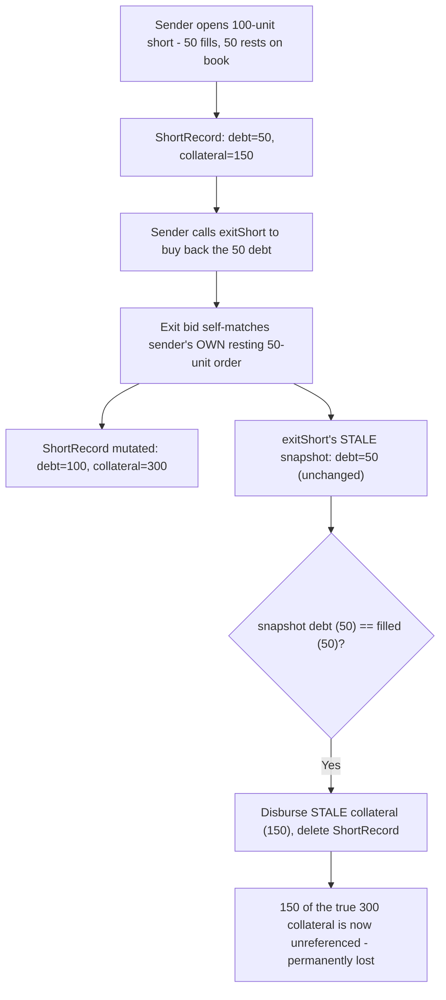
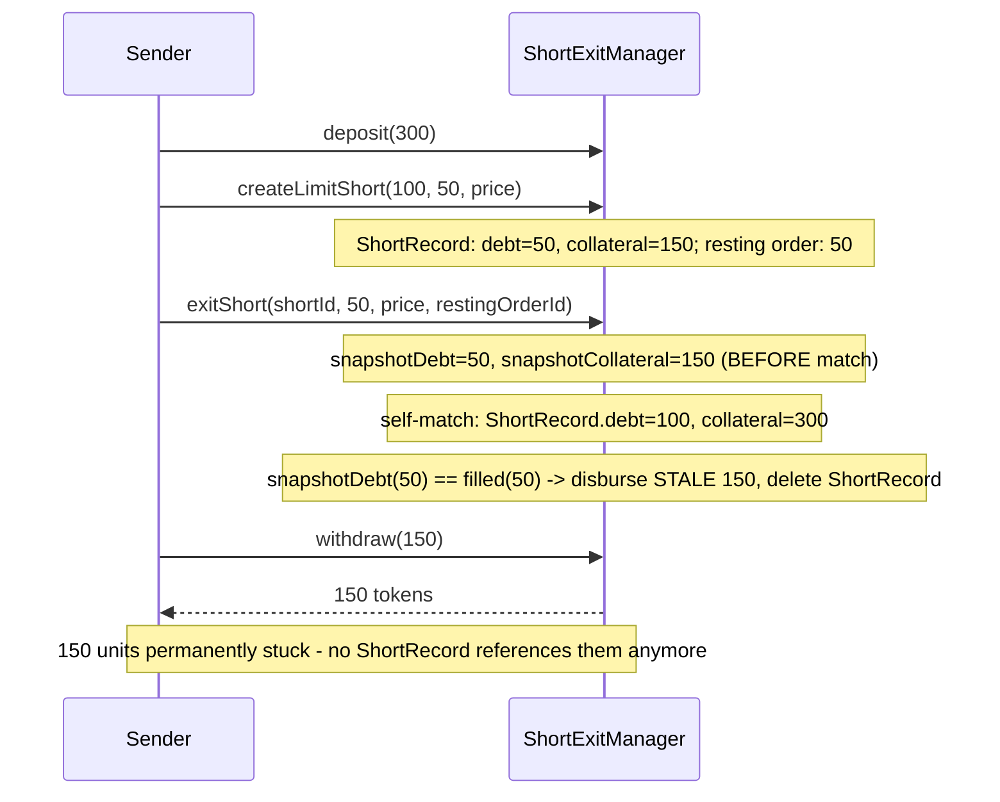

# DittoETH — Users can lose collateral when exiting a short

> **Vulnerability classes:** vuln/logic/stale-snapshot · vuln/loss-of-funds/permanent-lock · vuln/logic/self-match

> **Reproduction:** a self-contained Foundry PoC that compiles & runs in an
> isolated project with **only `forge-std`** — no fork, no RPC, no `anvil_state`.
> Full trace: [output.txt](output.txt). PoC:
> [test/27476-users-can-loose-collateral-when-exiting-a-short-codehawks-di_exp.sol](test/27476-users-can-loose-collateral-when-exiting-a-short-codehawks-di_exp.sol).

<!-- non-defihacklabs -->
<!-- source-auditvault: https://github.com/Auditware/AuditVault/blob/main/findings/27476-users-can-loose-collateral-when-exiting-a-short-codehawks-di.md -->
<!-- date: 2023-09 -->

---

## Key info

| | |
|---|---|
| **Impact** | **HIGH** — an honest user closing their OWN short can permanently lose part of their own collateral, with no adversary required |
| **Protocol** | [DittoETH](https://github.com/Cyfrin/2023-09-ditto) — order-book perpetual-style protocol (Codehawks, 2023-09) |
| **Vulnerable code** | `ExitShortFacet::exitShort` (`contracts/facets/ExitShortFacet.sol`) |
| **Bug class** | Stale snapshot: pre-match debt/collateral values are used to decide disbursement AFTER a same-call self-match mutates the same state |
| **Finding** | hash (Codehawks), 2023-09 · #27476 |
| **Source** | [AuditVault](https://github.com/Auditware/AuditVault/blob/main/findings/27476-users-can-loose-collateral-when-exiting-a-short-codehawks-di.md) |
| **Status** | Audit finding — caught in review (not exploited on-chain). Reproduced here as a standalone local PoC. |
| **Compiler** | `^0.8.24` (PoC) — real DittoETH targets `0.8.21` |
| **Repo (context)** | [Cyfrin/2023-09-ditto](https://github.com/Cyfrin/2023-09-ditto) @ `598e4b1` |

This is an **audit finding**, not a historical on-chain incident. Unlike the
other DittoETH findings in this batch, this one needs **no attacker at all** —
it is a normal user losing their own funds while exiting a position the
ordinary way.

---

## TL;DR

1. `exitShort` closes a short by placing a bid to buy back its debt.
2. If a user has a **partially-filled** short (some debt already locked into
   a `ShortRecord`, the rest still resting as an open short order on the
   book), their own exit bid can end up matching their **own resting order**
   — there is nothing preventing a self-match.
3. That match adds the newly-filled debt AND collateral **into the SAME
   `ShortRecord`** via `fillShortRecord`.
4. But `exitShort` captured the `ShortRecord`'s debt and collateral as
   **snapshots taken BEFORE the match**. If the snapshot debt equals the
   filled amount, it treats this as a "Full Exit" — disbursing the **stale**
   collateral snapshot and **deleting** the `ShortRecord` entirely.
5. Whatever collateral the self-match just added is now referenced by
   nothing: the `ShortRecord` that would have owned it no longer exists.
   It is **permanently lost**.

---

## The vulnerable code

The stale-snapshot disbursement (verbatim, `ExitShortFacet::exitShort`):

```solidity
(e.ethFilled, e.ercAmountLeft) = IDiamond(payable(address(this))).createForcedBid(
    msg.sender, e.asset, price, buyBackAmount, shortHintArray
);
e.ercFilled = buyBackAmount - e.ercAmountLeft;
Asset.ercDebt -= e.ercFilled;
s.assetUser[e.asset][msg.sender].ercEscrowed -= e.ercFilled;

// @audit if the debt is fully filled, the short record is deleted
if (e.ercDebt == e.ercFilled) {
    // Full Exit
    LibShortRecord.disburseCollateral(e.asset, msg.sender, e.collateral, short.zethYieldRate, short.updatedAt);
    LibShortRecord.deleteShortRecord(e.asset, msg.sender, id);
```

`e.ercDebt` and `e.collateral` were captured earlier in the function — BEFORE
`createForcedBid` ran. If that bid self-matches the user's own resting order,
`matchlowestSell` mutates the SAME `ShortRecord` (verbatim, quoted in the finding):

```solidity
if (lowestSell.shortRecordId > 0) {
    // shortRecord has been partially filled before
    LibShortRecord.fillShortRecord(asset, lowestSell.addr, lowestSell.shortRecordId, status, shortFillEth, fillErc, ...);
```

This reduction keeps both blamed pieces verbatim: the stale-snapshot
comparison/disbursement in `exitShort`, and the same-`ShortRecord` mutation in
the matching path.

---

## Root cause

`exitShort` reads the `ShortRecord`'s state ONCE, before it can possibly
change, then makes an irreversible decision (delete + disburse) based on that
READ — without re-checking whether the intervening `createForcedBid` call
changed the exact record it is about to delete. A self-match is the specific
condition under which that assumption breaks: normally a match affects
someone ELSE's order/record, but the orderbook does not exclude the caller's
own resting orders from being matched.

## Preconditions

- The user has a `ShortRecord` with a *partially* filled debt (some of the
  original order rests unfilled on the book, linked to the same record).
- The user's `exitShort` bid ends up matching that SAME resting order (very
  plausible: the user is intentionally buying back at their own resting
  price, one of the most likely fills available).

## Attack walkthrough

From [output.txt](output.txt):

1. Sender deposits **300** and opens a **100**-unit short; only **50** units
   fill immediately (`ShortRecord`: debt=50, collateral=150) — the other 50
   rests on the book as sender's own open short order.
2. Sender calls `exitShort` to buy back the 50 debt. The exit bid
   **self-matches** sender's own resting 50-unit order.
3. **VULN:** the self-match adds 50 more debt and 150 more collateral into
   the SAME `ShortRecord` (debt → 100, collateral → 300) — but `exitShort`'s
   pre-match snapshot (debt=50) still equals the filled amount (50), so it
   disburses the **stale** collateral snapshot (150, not the updated 300)
   and deletes the `ShortRecord`.
4. **HARM:** sender's escrowed balance increases by only 150 — the
   self-match's own 150 contribution is now unreferenced by any accounting
   entry anywhere.
5. **HARM:** sender withdraws everything they have left. The 150-unit
   shortfall remains stuck in the contract forever.

A control test confirms that when the exit bid matches a **different**
user's resting order instead (no self-match), the disbursed snapshot IS the
correct, up-to-date value — proving the loss is specifically caused by the
self-match mutating the very record being deleted, not a general accounting
bug.

## Diagrams





## Remediation

Re-check the debt and disburse the CURRENT (post-match) collateral, not the
pre-match snapshot, per the finding's own recommendation:

```diff
-if (e.ercDebt == e.ercFilled) {
+if (e.ercDebt == e.ercFilled && short.ercDebt == e.ercDebt) {
     // Full Exit
     LibShortRecord.disburseCollateral(e.asset, msg.sender, e.collateral, short.zethYieldRate, short.updatedAt);
     LibShortRecord.deleteShortRecord(e.asset, msg.sender, id);
```

(or, more robustly, re-read `short.ercDebt`/`short.collateral` fresh after
the match completes, rather than relying on any pre-match snapshot at all.)

## How to reproduce

```bash
cd ~/RustroverProjects/audits/evm-hack-registry/27476-users-can-loose-collateral-when-exiting-a-short-codehawks-di_exp
forge test -vvv
# Fully local — no fork, no RPC, no anvil_state required.
# Expected: both tests PASS:
#   test_UserLoosesCollateralOnMatchingWithOwnShort   (attack: sender loses 150 to the stale snapshot)
#   test_Control_NoSelfMatch_CorrectDisbursement      (control: matching someone ELSE's order disburses correctly)
```

PoC source: [test/27476-users-can-loose-collateral-when-exiting-a-short-codehawks-di_exp.sol](test/27476-users-can-loose-collateral-when-exiting-a-short-codehawks-di_exp.sol)
— the verbatim vulnerable stale-snapshot comparison/disbursement plus a
minimal short/exit/match scaffold and a control test.

> Note: real DittoETH tracks `ercEscrowed` and `ethEscrowed` as separate
> ledgers and computes collateral from live price/yield-rate accounting — out
> of scope here. This reduction uses a single escrow ledger and a simplified
> collateral multiplier so a fully-filled-then-fully-closed position
> reconciles cleanly to its original margin in the correct case, isolating
> exactly the self-match/stale-snapshot loss the finding blames — faithful to
> the finding's own quoted code and example scenario.

---

*Reference: finding **#27476** by **hash** (Codehawks, 2023-09) · [Cyfrin/2023-09-ditto](https://github.com/Cyfrin/2023-09-ditto) · curated by [AuditVault](https://github.com/Auditware/AuditVault/blob/main/findings/27476-users-can-loose-collateral-when-exiting-a-short-codehawks-di.md)*
