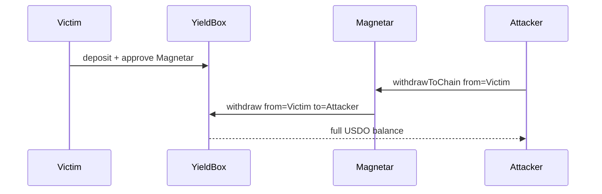

# Tapioca DAO — Magnetar has no approval checking (position drain)

> **Vulnerability classes:** vuln/direct-drain · vuln/missing-modifier · vuln/access-roles

> **Reproduction:** self-contained Foundry PoC with **only `forge-std`** — no fork, no RPC.
> Full trace: [output.txt](output.txt). PoC:
> [test/27528-h-38-magnetar-contract-has-no-approval-checking-code4rena-ta.sol](test/27528-h-38-magnetar-contract-has-no-approval-checking-code4rena-ta.sol).

<!-- non-defihacklabs -->
<!-- source-auditvault: https://github.com/Auditware/AuditVault/blob/main/findings/27528-h-38-magnetar-contract-has-no-approval-checking-code4rena-ta.md -->
<!-- date: 2023-07 -->

---

## Key info

| | |
|---|---|
| **Impact** | **HIGH** — any caller drains a victim's YieldBox shares via Magnetar after the victim approved Magnetar for helper UX |
| **Protocol** | [Tapioca DAO](https://tapioca.xyz) — omnichain money market |
| **Vulnerable code** | `Magnetar.withdrawToChain` — no operator / msg.sender check on `from` |
| **Bug class** | Missing authorization on periphery helper |
| **Finding** | Code4rena — Tapioca, 2023-07 · #27528 · reporter **carrotsmuggler** |
| **Report** | [code4rena.com/reports/2023-07-tapioca](https://code4rena.com/reports/2023-07-tapioca) |
| **Source** | [AuditVault](https://github.com/Auditware/AuditVault/blob/main/findings/27528-h-38-magnetar-contract-has-no-approval-checking-code4rena-ta.md) |
| **Status** | Audit finding — confirmed |
| **Compiler** | `^0.8.24` (PoC) |

---

## TL;DR

1. Users approve Magnetar on YieldBox so helpers can manage positions.
2. `withdrawToChain(from=victim, receiver=attacker)` has no operator check.
3. YieldBox only sees Magnetar as approved operator → full drain.

## The vulnerable code

```solidity
function withdrawToChain(..., address from, address receiver, uint256 amount, ...) external {
    // @> VULN: no check that msg.sender is approved operator of `from`
    yieldBox.withdraw(assetId, from, receiver, amount, share);
}
```

**Fix:** `require(operators[from][msg.sender] || msg.sender == from);` on every Magnetar entry that acts for `from`.

## Root cause

Magnetar relies on YieldBox approvals granted *to Magnetar itself*, not on a per-caller operator map. Any third party can invoke helpers with a victim `from`.

## Attack walkthrough

1. Victim deposits 1000 USDO into YieldBox and `setApprovalForAll(Magnetar, true)`.
2. Attacker calls `withdrawToChain(from=victim, receiver=attacker, amount=1000)`.
3. Attacker holds 1000 USDO; victim YieldBox balance is 0.

## Diagrams



## Impact

Direct theft of any asset a user approved Magnetar to manage (YieldBox shares, market positions via the same pattern).

## Taxonomy

- genome: liquidation-logic, direct-drain, liquidation-underwater, vote-delegation-loop
- sector: bridge, governance, lending, stable, staking
- severity: high
- platform: code4rena

## Sources

- [AuditVault finding #27528](https://github.com/Auditware/AuditVault/blob/main/findings/27528-h-38-magnetar-contract-has-no-approval-checking-code4rena-ta.md)
- [Code4rena report 2023-07-tapioca](https://code4rena.com/reports/2023-07-tapioca)
- Reduced from [Tapioca-DAO/tapioca-bar-audit](https://github.com/Tapioca-DAO/tapioca-bar-audit) Magnetar withdraw path (contest code)
