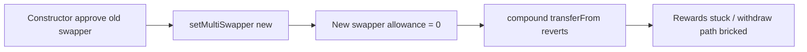

# Tapioca DAO — AaveStrategy setMultiSwapper bricks compound

> **Vulnerability classes:** vuln/wrong-condition · vuln/access-roles · vuln/permanent

> **Reproduction:** self-contained Foundry PoC with **only `forge-std`** — no fork, no RPC.
> Full trace: [output.txt](output.txt). PoC:
> [test/27529-h-39-aavestrategysol-changing-swapper-breaks-the-contract-co.sol](test/27529-h-39-aavestrategysol-changing-swapper-breaks-the-contract-co.sol).

<!-- non-defihacklabs -->
<!-- source-auditvault: https://github.com/Auditware/AuditVault/blob/main/findings/27529-h-39-aavestrategysol-changing-swapper-breaks-the-contract-co.md -->
<!-- date: 2023-07 -->

---

## Key info

| | |
|---|---|
| **Impact** | **HIGH** — after swapper upgrade, `compound()` reverts; rewards stuck and withdraw paths that compound first break |
| **Protocol** | [Tapioca DAO](https://tapioca.xyz) |
| **Vulnerable code** | `AaveStrategy.setMultiSwapper` — updates pointer without approve |
| **Bug class** | Incomplete admin setter / missing allowance transfer |
| **Finding** | Code4rena — Tapioca, 2023-07 · #27529 · reporter **carrotsmuggler** |
| **Report** | [code4rena.com/reports/2023-07-tapioca](https://code4rena.com/reports/2023-07-tapioca) |
| **Source** | [AuditVault](https://github.com/Auditware/AuditVault/blob/main/findings/27529-h-39-aavestrategysol-changing-swapper-breaks-the-contract-co.md) |
| **Status** | Confirmed by Tapioca (dup #222) |
| **Compiler** | `^0.8.24` (PoC) |

---

## TL;DR

1. Constructor approves the initial multiSwapper for rewardToken.
2. `setMultiSwapper` only stores the new address.
3. New swapper has zero allowance → `compound` transferFrom fails → withdrawals that compound first brick.

## The vulnerable code

```solidity
function setMultiSwapper(address _swapper) external onlyOwner {
    emit MultiSwapper(address(swapper), _swapper);
    // @> VULN: no approve / revoke
    swapper = ISwapper(_swapper);
}
```

**Fix:** revoke old allowance, assign, approve new (as in ConvexTricryptoStrategy).

## Root cause

Allowance is treated as constructor-only setup, but the swapper is mutable.

## Attack walkthrough

1. Strategy holds 100 AAVE rewards; initial swapper is approved.
2. Owner upgrades multiSwapper (routine ops).
3. Anyone calling `compound` reverts; rewards remain unswapped; WETH balance stays 0.

## Diagrams



## Impact

Broken compounding and withdraw liveness after any legitimate swapper upgrade — permanent fund impairment until emergency re-approve.

## Taxonomy

- genome: wrong-condition, permanent, access-roles, fot-slippage, liquidation-underwater, oracle-freshness
- sector: dex, governance, lending, token, vault
- severity: high
- platform: code4rena

## Sources

- [AuditVault finding #27529](https://github.com/Auditware/AuditVault/blob/main/findings/27529-h-39-aavestrategysol-changing-swapper-breaks-the-contract-co.md)
- [Code4rena report 2023-07-tapioca](https://code4rena.com/reports/2023-07-tapioca)
- Reduced from Tapioca AaveStrategy.sol setMultiSwapper (2023-07 contest)
