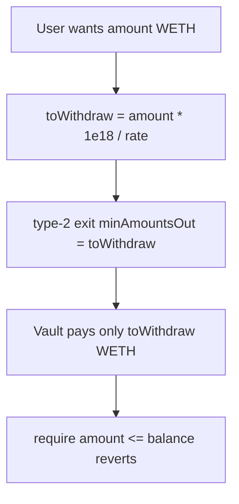

# Tapioca DAO — BalancerStrategy _withdraw scales WETH as BPT

> **Vulnerability classes:** vuln/wrong-condition · vuln/direct-drain · vuln/fot-slippage

> **Reproduction:** self-contained Foundry PoC with **only `forge-std`** — no fork, no RPC.
> Full trace: [output.txt](output.txt). PoC:
> [test/27530-h-40-balancerstrategysol-withdraw-withdraws-insufficient-to.sol](test/27530-h-40-balancerstrategysol-withdraw-withdraws-insufficient-to.sol).

<!-- non-defihacklabs -->
<!-- source-auditvault: https://github.com/Auditware/AuditVault/blob/main/findings/27530-h-40-balancerstrategysol-withdraw-withdraws-insufficient-to.md -->
<!-- date: 2023-07 -->

---

## Key info

| | |
|---|---|
| **Impact** | **HIGH** — full WETH withdraw reverts after under-exiting the Balancer pool (`BalancerStrategy: not enough`) |
| **Protocol** | [Tapioca DAO](https://tapioca.xyz) |
| **Vulnerable code** | `BalancerStrategy._withdraw` scales amount by `pricePerShare` then uses it as type-2 exact tokens out |
| **Bug class** | Unit mismatch / wrong exit kind argument |
| **Finding** | Code4rena — Tapioca, 2023-07 · #27530 · reporter **carrotsmuggler** |
| **Report** | [code4rena.com/reports/2023-07-tapioca](https://code4rena.com/reports/2023-07-tapioca) |
| **Source** | [AuditVault](https://github.com/Auditware/AuditVault/blob/main/findings/27530-h-40-balancerstrategysol-withdraw-withdraws-insufficient-to.md) |
| **Status** | Confirmed (dup #51) |
| **Compiler** | `^0.8.24` (PoC) |

---

## TL;DR

1. `_withdraw` converts desired WETH → BPT-like figure via `getRate`.
2. `_vaultWithdraw` encodes type-2 exact-tokens-out with that figure as minAmountsOut.
3. Vault pays only the scaled amount → require balance fails → withdraw DoS.

## The vulnerable code

```solidity
uint256 toWithdraw = (((amount - queued) * (10 ** decimals)) / pricePerShare);
// @> VULN: scaled value used as exact WETH out
_vaultWithdraw(toWithdraw);
```

**Fix:** pass unscaled WETH amount for exact-tokens-out, or convert correctly for exact-BPT-in.

## Root cause

Type-2 Balancer exits withdraw *exactly* `minAmountsOut`, not “at least this much after BPT math.” Scaling by pricePerShare underpays WETH.

## Attack walkthrough

1. Strategy holds ample BPT, rate = 2e18.
2. User requests 1000 WETH withdraw.
3. Vault exits only 500 WETH → `not enough` revert; BPT remains stuck for full exit.

## Diagrams



## Impact

Withdrawal liveness failure for Balancer strategy deposits — funds effectively frozen for full-size exits when idle buffer is insufficient.

## Taxonomy

- genome: wrong-condition, direct-drain, access-roles, fot-slippage
- sector: dex, governance, liquid-staking, vault
- severity: high
- platform: code4rena

## Sources

- [AuditVault finding #27530](https://github.com/Auditware/AuditVault/blob/main/findings/27530-h-40-balancerstrategysol-withdraw-withdraws-insufficient-to.md)
- [Code4rena report 2023-07-tapioca](https://code4rena.com/reports/2023-07-tapioca)
- Reduced from Tapioca BalancerStrategy._withdraw / _vaultWithdraw
