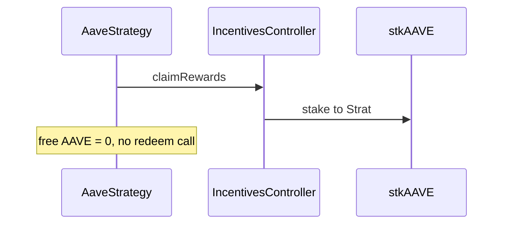

# Tapioca DAO — AaveStrategy rewards locked as unredeemable stkAAVE

> **Vulnerability classes:** vuln/frozen-funds · vuln/reward-accounting · vuln/direct-drain

> **Reproduction:** self-contained Foundry PoC with **only `forge-std`** — no fork, no RPC.
> Full trace: [output.txt](output.txt). PoC:
> [test/27531-h-41-rewards-compounded-in-aavestrategy-are-unredeemable-cod.sol](test/27531-h-41-rewards-compounded-in-aavestrategy-are-unredeemable-cod.sol).

<!-- non-defihacklabs -->
<!-- source-auditvault: https://github.com/Auditware/AuditVault/blob/main/findings/27531-h-41-rewards-compounded-in-aavestrategy-are-unredeemable-cod.md -->
<!-- date: 2023-07 -->

---

## Key info

| | |
|---|---|
| **Impact** | **HIGH** — claimed AAVE incentives auto-stake to stkAAVE and are never redeemed → permanent reward lock |
| **Protocol** | [Tapioca DAO](https://tapioca.xyz) |
| **Vulnerable code** | `AaveStrategy.compound` — missing `stakingRewardToken.redeem` |
| **Bug class** | Incomplete reward path / frozen funds |
| **Finding** | Code4rena — Tapioca, 2023-07 · #27531 · reporter **Ack** |
| **Report** | [code4rena.com/reports/2023-07-tapioca](https://code4rena.com/reports/2023-07-tapioca) |
| **Source** | [AuditVault](https://github.com/Auditware/AuditVault/blob/main/findings/27531-h-41-rewards-compounded-in-aavestrategy-are-unredeemable-cod.md) |
| **Status** | Confirmed (dup #243) |
| **Compiler** | `^0.8.24` (PoC) |

---

## TL;DR

1. AAVE incentivesController stakes claimed rewards into stkAAVE immediately.
2. `compound()` claims incentives but never calls `redeem`.
3. Strategy holds stkAAVE with zero free AAVE/WETH — rewards unusable.

## The vulnerable code

```solidity
function compound() external {
    incentivesController.claimRewards(...); // auto-stakes to stkAAVE
    // @> VULN: never calls stakingRewardToken.redeem()
}
```

**Fix:** after cooldown, `redeem` stkAAVE → swap free AAVE → re-deposit WETH.

## Root cause

Compounding was designed around free rewardToken balances; the incentives path delivers staked receipts instead.

## Attack walkthrough

1. Strategy accrues 500 AAVE claimable incentives.
2. `compound()` stakes them as 500 stkAAVE.
3. Free AAVE = 0, WETH compounded = 0; no strategy path unlocks stk.

## Diagrams



## Impact

Yield intended for depositors is permanently stuck as staked receipt tokens.

## Taxonomy

- genome: frozen-funds, direct-drain, reward-accounting
- sector: governance, lending, staking, staking-pool, token
- severity: high
- platform: code4rena

## Sources

- [AuditVault finding #27531](https://github.com/Auditware/AuditVault/blob/main/findings/27531-h-41-rewards-compounded-in-aavestrategy-are-unredeemable-cod.md)
- [Code4rena report 2023-07-tapioca](https://code4rena.com/reports/2023-07-tapioca)
- Reduced from Tapioca AaveStrategy.compound + AAVE incentives stake path
