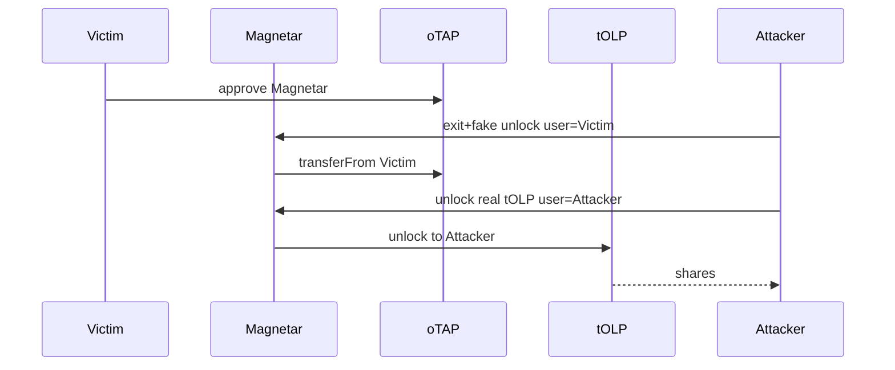

# Tapioca DAO — steal oTAP contents via Magnetar exit/unlock

> **Vulnerability classes:** vuln/missing-modifier · vuln/direct-drain · vuln/vote-delegation-loop

> **Reproduction:** self-contained Foundry PoC with **only `forge-std`** — no fork, no RPC.
> Full trace: [output.txt](output.txt). PoC:
> [test/27532-h-42-attacker-can-steal-victims-otap-position-contents-via-m.sol](test/27532-h-42-attacker-can-steal-victims-otap-position-contents-via-m.sol).

<!-- non-defihacklabs -->
<!-- source-auditvault: https://github.com/Auditware/AuditVault/blob/main/findings/27532-h-42-attacker-can-steal-victims-otap-position-contents-via-m.md -->
<!-- date: 2023-07 -->

---

## Key info

| | |
|---|---|
| **Impact** | **HIGH** — two-step Magnetar call steals unlocked tOLP shares after victim approves oTAP |
| **Protocol** | [Tapioca DAO](https://tapioca.xyz) |
| **Vulnerable code** | `MagnetarMarketModule._exitPositionAndRemoveCollateral` — caller-controlled user/targets |
| **Bug class** | Missing msg.sender==user + untrusted external targets |
| **Finding** | Code4rena — Tapioca, 2023-07 · #27532 · reporter **Ack** |
| **Report** | [code4rena.com/reports/2023-07-tapioca](https://code4rena.com/reports/2023-07-tapioca) |
| **Source** | [AuditVault](https://github.com/Auditware/AuditVault/blob/main/findings/27532-h-42-attacker-can-steal-victims-otap-position-contents-via-m.md) |
| **Status** | Confirmed by Tapioca |
| **Compiler** | `^0.8.24` (PoC) |

---

## TL;DR

1. Victim approves Magnetar for oTAP so they can exit via the helper.
2. Attacker exits victim oTAP with a fake unlock target (no-op).
3. Attacker unlocks real tOLP with `user=attacker` → receives locked shares.

## The vulnerable code

```solidity
// @> VULN: transfers victim oTAP without msg.sender==user
OTAP(oTapAddress).safeTransferFrom(user, address(this), tokenId, "0x");
// ...
// @> VULN: unlock target and user are caller-controlled
TOLP(unlockData.target).unlock(tOLPId, singularity, user);
```

**Fix:** require `user == msg.sender`; whitelist exit/unlock targets.

## Root cause

Multi-flag helper trusts all addresses and the `user` parameter once ERC721 approval exists for Magnetar.

## Attack walkthrough

1. Step1: exit=true, unlock=true, fake unlock target, user=victim.
2. Step2: exit=false, unlock=true, real tOLP, user=attacker.
3. Attacker holds 1000 share tokens; victim gets nothing.

## Diagrams



## Impact

Theft of twAML-locked oTAP position contents (YieldBox shares behind tOLP).

## Taxonomy

- genome: missing-modifier, direct-drain, vote-delegation-loop
- sector: governance, lending, nft, staking
- severity: high
- platform: code4rena

## Sources

- [AuditVault finding #27532](https://github.com/Auditware/AuditVault/blob/main/findings/27532-h-42-attacker-can-steal-victims-otap-position-contents-via-m.md)
- [Code4rena report 2023-07-tapioca](https://code4rena.com/reports/2023-07-tapioca)
- Reduced from MagnetarMarketModule._exitPositionAndRemoveCollateral
