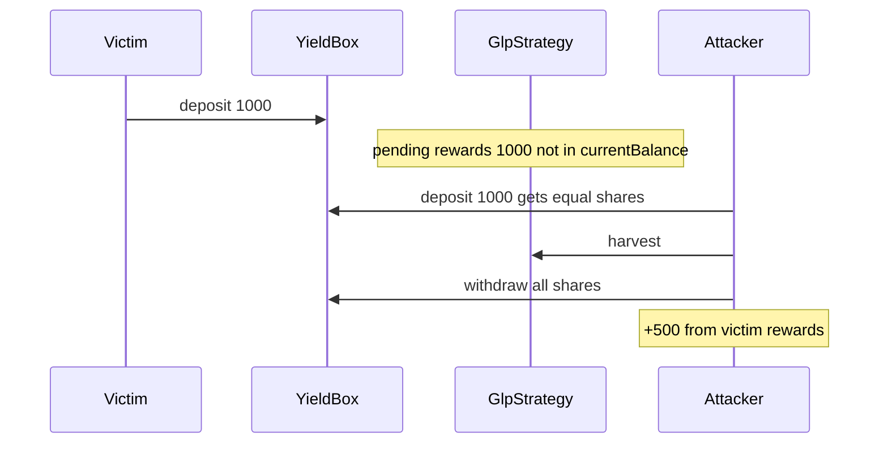

# Tapioca DAO — GlpStrategy currentBalance ignores unclaimed rewards

> **Vulnerability classes:** vuln/rounding-direction · vuln/reward-theft · vuln/reward-accounting

> **Reproduction:** self-contained Foundry PoC with **only `forge-std`** — no fork, no RPC.
> Full trace: [output.txt](output.txt). PoC:
> [test/27533-h-43-accounted-balance-of-glpstrategy-does-not-match-withdra.sol](test/27533-h-43-accounted-balance-of-glpstrategy-does-not-match-withdra.sol).

<!-- non-defihacklabs -->
<!-- source-auditvault: https://github.com/Auditware/AuditVault/blob/main/findings/27533-h-43-accounted-balance-of-glpstrategy-does-not-match-withdra.md -->
<!-- date: 2023-07 -->

---

## Key info

| | |
|---|---|
| **Impact** | **HIGH** — deposit while rewards pending mints inflated shares; harvest then withdraw steals pro-rata rewards |
| **Protocol** | [Tapioca DAO](https://tapioca.xyz) |
| **Vulnerable code** | `GlpStrategy._currentBalance` — free GLP only |
| **Bug class** | Incomplete NAV / reward accounting |
| **Finding** | Code4rena — Tapioca, 2023-07 · #27533 · reporter **cergyk** |
| **Report** | [code4rena.com/reports/2023-07-tapioca](https://code4rena.com/reports/2023-07-tapioca) |
| **Source** | [AuditVault](https://github.com/Auditware/AuditVault/blob/main/findings/27533-h-43-accounted-balance-of-glpstrategy-does-not-match-withdra.md) |
| **Status** | Confirmed by Tapioca |
| **Compiler** | `^0.8.24` (PoC) |

---

## TL;DR

1. YieldBox prices shares from `strategy.currentBalance()`.
2. `_currentBalance` omits unclaimed rewards.
3. Deposit → harvest → withdraw extracts older depositors' rewards.

## The vulnerable code

```solidity
function _currentBalance() internal view returns (uint256 amount) {
    // @> VULN: ignores pending rewards
    amount = IERC20(contractAddress).balanceOf(address(this));
}
```

**Fix:** include claimable reward value in `currentBalance`.

## Root cause

Share mint uses incomplete TVL, so late depositors buy cheap shares against pending yield.

## Attack walkthrough

1. Victim deposits 1000 GLP (all free balance).
2. 1000 GLP-equivalent rewards accrue off-balance.
3. Attacker deposits 1000 → gets 1000 shares (1:1 vs free only).
4. Harvest; attacker withdraws → +500 profit (half of pending).

## Diagrams



## Impact

Theft of unclaimed strategy rewards from prior depositors.

## Taxonomy

- genome: rounding-direction, reward-theft, variant, integer-bounds, reward-accounting
- sector: governance
- severity: high
- platform: code4rena

## Sources

- [AuditVault finding #27533](https://github.com/Auditware/AuditVault/blob/main/findings/27533-h-43-accounted-balance-of-glpstrategy-does-not-match-withdra.md)
- [Code4rena report 2023-07-tapioca](https://code4rena.com/reports/2023-07-tapioca)
- Reduced from GlpStrategy._currentBalance + YieldBox depositAsset share mint
