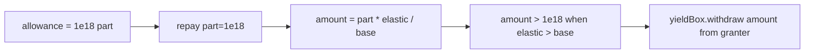

# Tapioca DAO — repay allowance checked on part, pulls elastic

> **Vulnerability classes:** vuln/wrong-condition · vuln/direct-drain · vuln/vote-delegation-loop

> **Reproduction:** self-contained Foundry PoC with **only `forge-std`** — no fork, no RPC.
> Full trace: [output.txt](output.txt). PoC:
> [test/27534-h-44-bigbangrepay-and-singularityrepay-spend-more-than-allow.sol](test/27534-h-44-bigbangrepay-and-singularityrepay-spend-more-than-allow.sol).

<!-- non-defihacklabs -->
<!-- source-auditvault: https://github.com/Auditware/AuditVault/blob/main/findings/27534-h-44-bigbangrepay-and-singularityrepay-spend-more-than-allow.md -->
<!-- date: 2023-07 -->

---

## Key info

| | |
|---|---|
| **Impact** | **HIGH** — spender approved for `part` can pull more asset than allowed once interest makes elastic > base |
| **Protocol** | [Tapioca DAO](https://tapioca.xyz) |
| **Vulnerable code** | `BigBang._repay` / `SGLBorrow.repay` — `allowedBorrow(from, part)` then withdraw `amount` |
| **Bug class** | Unit mismatch (part vs elastic) in allowance |
| **Finding** | Code4rena — Tapioca, 2023-07 · #27534 · reporter **zzzitron** |
| **Report** | [code4rena.com/reports/2023-07-tapioca](https://code4rena.com/reports/2023-07-tapioca) |
| **Source** | [AuditVault](https://github.com/Auditware/AuditVault/blob/main/findings/27534-h-44-bigbangrepay-and-singularityrepay-spend-more-than-allow.md) |
| **Status** | Audit finding with Hardhat PoC in report |
| **Compiler** | `^0.8.24` (PoC) |

---

## TL;DR

1. `approveBorrow` documents a maximum spendable amount.
2. `repay` checks allowance against debt `part`.
3. `_repay` converts part→elastic and withdraws `amount > part` after interest.

## The vulnerable code

```solidity
function repay(..., uint256 part) public allowedBorrow(from, part) {
    return _repay(from, to, part);
}
function _repay(...) internal returns (uint256 amount) {
    (totalBorrow, amount) = totalBorrow.sub(part, true);
    // @> VULN: pulls elastic amount, not part
    yieldBox.withdraw(assetId, from, address(this), amount, 0);
}
```

**Fix:** check allowance against the elastic `amount` actually pulled.

## Root cause

Allowance units are treated as asset amounts, but the check uses debt-share parts while the pull uses elastic.

## Attack walkthrough

1. Victim approves spender for 1e18 part; victim funds YieldBox.
2. Market elastic > base after accrual.
3. Spender repays 1e18 part → pulls >1e18 asset from victim.

## Diagrams



## Impact

Approved repayers can overspend the granter's YieldBox asset balance beyond the stated allowance; gap grows with interest.

## Taxonomy

- genome: wrong-condition, direct-drain, vote-delegation-loop
- sector: governance, lending, staking, token
- severity: high
- platform: code4rena

## Sources

- [AuditVault finding #27534](https://github.com/Auditware/AuditVault/blob/main/findings/27534-h-44-bigbangrepay-and-singularityrepay-spend-more-than-allow.md)
- [Code4rena report 2023-07-tapioca](https://code4rena.com/reports/2023-07-tapioca)
- Reduced from BigBang._repay / MarketERC20 approveBorrow semantics @ tapioca-bar-audit
