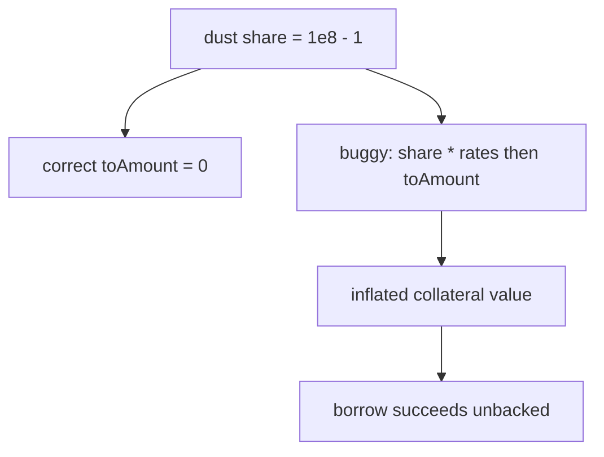

# Tapioca DAO — Market solvency multiplies share before toAmount

> **Vulnerability classes:** vuln/liquidation-logic · vuln/data-corruption · vuln/oracle-manipulation-resistance

> **Reproduction:** self-contained Foundry PoC with **only `forge-std`** — no fork, no RPC.
> Full trace: [output.txt](output.txt). PoC:
> [test/27535-h-45-sglliquidation-computeassetamounttosolvency-market-isso.sol](test/27535-h-45-sglliquidation-computeassetamounttosolvency-market-isso.sol).

<!-- non-defihacklabs -->
<!-- source-auditvault: https://github.com/Auditware/AuditVault/blob/main/findings/27535-h-45-sglliquidation-computeassetamounttosolvency-market-isso.md -->
<!-- date: 2023-07 -->

---

## Key info

| | |
|---|---|
| **Impact** | **HIGH** — dust collateral share (0 amount) falsely solvent → unbacked borrow; liquidations under-size |
| **Protocol** | [Tapioca DAO](https://tapioca.xyz) |
| **Vulnerable code** | `Market._isSolvent` / `_computeMaxBorrowableAmount` / `SGLLiquidation._computeAssetAmountToSolvency` |
| **Bug class** | Share→amount conversion order error |
| **Finding** | Code4rena — Tapioca, 2023-07 · #27535 · reporter **zzzitron** |
| **Report** | [code4rena.com/reports/2023-07-tapioca](https://code4rena.com/reports/2023-07-tapioca) |
| **Source** | [AuditVault](https://github.com/Auditware/AuditVault/blob/main/findings/27535-h-45-sglliquidation-computeassetamounttosolvency-market-isso.md) |
| **Status** | Confirmed by Tapioca |
| **Compiler** | `^0.8.24` (PoC) |

---

## TL;DR

1. Solvency multiplies `userCollateralShare` by rate factors *before* `yieldBox.toAmount`.
2. Dust shares that convert to 0 amount inflate into non-zero collateral value.
3. User borrows against zero real collateral; same bug under-liquidates SGL.

## The vulnerable code

```solidity
return yieldBox.toAmount(
    collateralId,
    // @> VULN: scale share before toAmount
    collateralShare * (EXCHANGE_RATE_PRECISION / FEE_PRECISION) * collateralizationRate,
    false
) >= ...;
```

**Fix:** `toAmount(share)` first, then apply exchange/collat rates (as BigBang liquidation does).

## Root cause

Share scaling and amount conversion are non-commutative under integer division; pre-scaling bypasses rounding-to-zero.

## Attack walkthrough

1. Add collateral share `1e8 - 1` → `toAmount` = 0.
2. Buggy solvency still allows borrow (e.g. 100 units).
3. Position is falsely solvent; protocol holds unbacked debt.

## Diagrams



## Impact

Unbacked borrowing and under-liquidation — direct protocol insolvency risk.

## Taxonomy

- genome: liquidation-logic, data-corruption/price-manipulation, liquidation-underwater, oracle-manipulation-resistance
- sector: governance, lending, token
- severity: high
- platform: code4rena

## Sources

- [AuditVault finding #27535](https://github.com/Auditware/AuditVault/blob/main/findings/27535-h-45-sglliquidation-computeassetamounttosolvency-market-isso.md)
- [Code4rena report 2023-07-tapioca](https://code4rena.com/reports/2023-07-tapioca)
- Reduced from Market.sol _isSolvent @ tapioca-bar-audit 2286f80
