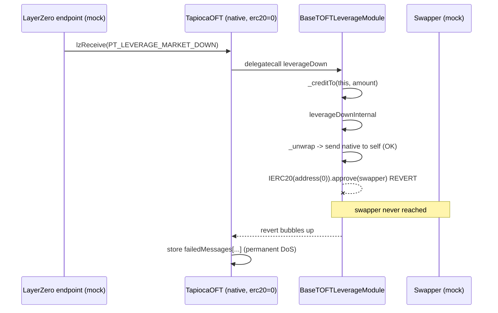

<!-- source-auditvault: https://github.com/Auditware/AuditVault/blob/main/findings/27536-h-46-toft-leveragedown-always-fails-if-toft-is-a-wrapper-for.md -->

# [H-46] TOFT `leverageDown` always fails when the TOFT wraps the native gas token

- **Protocol:** Tapioca DAO (`tapiocaz` — LayerZero OFTv2 wrappers)
- **Source contest:** [Code4rena 2023-07-tapioca](https://code4rena.com/reports/2023-07-tapioca) · reporter: windhustler
- **Real repo / commit:** `Tapioca-DAO/tapiocaz-audit@bcf61f79464cfdc0484aa272f9f6e28d5de36a8f` (audited submodule of [`code-423n4/2023-07-tapioca`](https://github.com/code-423n4/2023-07-tapioca)), deps `tapioca-sdk@90d1e8a1`, `tapioca-periph@68f20cbb`, OpenZeppelin `4.8.2`
- **Vulnerable file:** `contracts/tOFT/modules/BaseTOFTLeverageModule.sol:215`
- **Severity:** High (permanent liveness DoS + loss of burned TOFT / airdropped gas)

## Root cause

A `TapiocaOFT`/`mTapiocaOFT` can wrap either an ERC20 or the **native gas token**. When it
wraps native, its underlying is recorded as the sentinel `erc20 == address(0)`
(`TapiocaOFT.sol:74`, `BaseTOFTStorage.sol:28`).

The cross-chain leverage-down flow (`sendForLeverage` → LayerZero → `leverageDown` →
`leverageDownInternal`) unwraps the underlying and then swaps it to USDO. The swap approval
is done **unconditionally with an ERC20 call**:

```solidity
// BaseTOFTLeverageModule.leverageDownInternal — line 215
_unwrap(address(this), amount);                       // native branch: OK (sends ETH to self)
IERC20(erc20).approve(externalData.swapper, amount);  // erc20 == address(0)  ==>  REVERT
```

For a native-wrapping TOFT this is `IERC20(address(0)).approve(...)`. Because `address(0)`
has no code, Solidity's high-level call (which expects a `bool` return) reverts on the
`extcodesize == 0` guard — **before the swapper is ever reached**.

The revert propagates back into `leverageDown`, whose `module.delegatecall(...)` fails, so
`leverageDown` reverts; LayerZero's `NonblockingLzApp` then **parks the packet in
`failedMessages`**. Because the payload is unchanged, every `retryMessage` re-executes the
exact same path and fails identically. The leverage position can **never** be de-leveraged,
and the user's source-side burned TOFT + airdropped gas are permanently lost.

## Real exploit (this PoC)

The PoC deploys the **real** `TapiocaOFT` + the **real** `BaseTOFTLeverageModule` (and the
three sibling modules) from the audited commit. Only the opaque boundaries are mocked — the
LayerZero endpoint, the DEX swapper (`ISwapper`), the Magnetar helper, and the USDO output
token. The vulnerable TOFT / leverage logic is untouched audited source.

A real inbound `PT_LEVERAGE_MARKET_DOWN` (776) packet is delivered through the genuine
`lzReceive → _nonblockingLzReceive → leverageDown → leverageDownInternal` path:

- **Native TOFT (`erc20 == address(0)`)** — `AMOUNT = 1e18` wrapped native. The packet is
  parked as a **failed message** (`failedMessages[...] == keccak256(payload)`), the swapper
  is **never reached** (execution dies at the `approve(address(0))` on line 215), and a retry
  fails identically. Position is permanently stuck.
- **Control ERC20 TOFT** — identical packet, real ERC20 underlying. The path clears the
  approve and completes end-to-end: **no** failed message, the swapper + repay legs are
  reached.

DoS finding ⇒ profit is `0` by design; the harm is asserted mechanically (the native leg
must be a parked failure while the ERC20 control succeeds).



## Reproduce

```bash
_shared/run-poc/run_poc.sh 27536-h-46-toft-leveragedown-always-fails-if-toft-is-a-wrapper-for_exp -vvvvv
```

Registry test asserts: native `leverageDown` → parked failed message + swapper unreached +
retry still fails; ERC20 control → no failed message + swapper reached.

## Mitigation

Disable `sendForLeverage` (revert on the sending side) when `erc20 == address(0)`, or
special-case the native underlying in `leverageDownInternal` (wrap to WETH / skip the ERC20
`approve`). Confirmed by 0xRektora (Tapioca).
