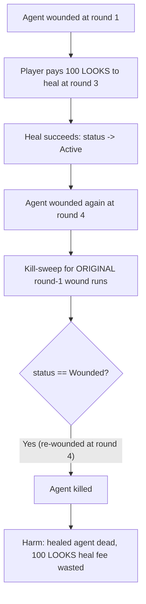
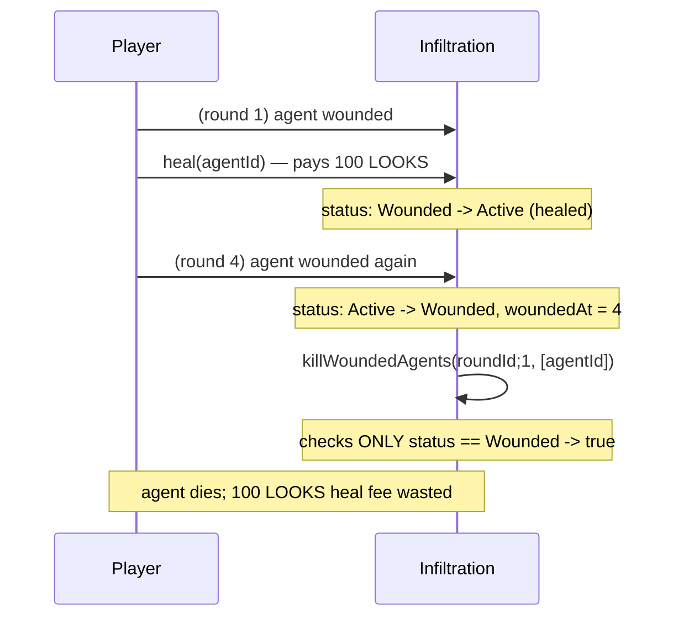

# LooksRare "Infiltration" — _killWoundedAgents kills a healed agent

> **Vulnerability classes:** vuln/logic/wrong-condition · vuln/state/stale-status-check · vuln/loss-of-funds/direct-drain

> **Reproduction:** a self-contained Foundry PoC that compiles & runs in an
> isolated project with **only `forge-std`** — no fork, no RPC, no `anvil_state`.
> Full trace: [output.txt](output.txt). PoC:
> [test/27586-h-1-killwoundedagents-sherlock-looksrare-git_exp.sol](test/27586-h-1-killwoundedagents-sherlock-looksrare-git_exp.sol).

<!-- non-defihacklabs -->
<!-- source-auditvault: https://github.com/Auditware/AuditVault/blob/main/findings/27586-h-1-killwoundedagents-sherlock-looksrare-git.md -->
<!-- date: 2023-10 -->

---

## Key info

| | |
|---|---|
| **Impact** | **HIGH** — a player who successfully heals a wounded agent (paying LOOKS tokens) still loses the agent later, wasting the heal fee and forcing them out of the game |
| **Protocol** | [LooksRare "Infiltration"](https://github.com/LooksRare/contracts-infiltration) — an on-chain NFT survival game |
| **Vulnerable code** | `Infiltration._killWoundedAgents` — `if (agents[index].status == AgentStatus.Wounded) { ... kill ... }` |
| **Bug class** | Wrong condition: checks only the agent's current status, never WHEN it was wounded |
| **Finding** | Sherlock — LooksRare "Infiltration", 2023-10 · #27586 (H-1) · reporter **cergyk** (dupes: ast3ros, klaus, mstpr-brainbot) |
| **Report** | [sherlock-audit/2023-10-looksrare-judging#21](https://github.com/sherlock-audit/2023-10-looksrare-judging/issues/21) |
| **Source** | [AuditVault](https://github.com/Auditware/AuditVault/blob/main/findings/27586-h-1-killwoundedagents-sherlock-looksrare-git.md) |
| **Status** | Audit finding — caught in review (fixed via [PR #148](https://github.com/LooksRare/contracts-infiltration/pull/148) / [PR #164](https://github.com/LooksRare/contracts-infiltration/pull/164)), not exploited on-chain. Reproduced here as a standalone local PoC. |
| **Compiler** | `^0.8.24` (PoC) |

This is an **audit finding**, not a historical on-chain incident. The real
Infiltration game uses Chainlink VRF to draw wounds/deaths each round; the PoC
keeps the vulnerable status-only check in `_killWoundedAgents` **verbatim**
and reduces round advancement / wounding / healing to direct calls so the same
bug fires deterministically and cheatcode-free.

---

## TL;DR

1. `_killWoundedAgents(roundId, ...)` kills every agent in its list whose
   `status == AgentStatus.Wounded` — but it never checks `woundedAt == roundId`.
2. A player's agent is wounded at round 1. The player pays LOOKS tokens to
   `heal` it at round 3 — this **succeeds**, and the agent's status returns to
   `Active`.
3. The **same agent** is wounded again at round 4 (an ordinary later game
   event, no fault of the player).
4. The kill-sweep scheduled for the **original** wound (`roundId == 1`) still
   runs. It checks only the agent's current status — which is `Wounded` again
   because of the round-4 re-wound — and **kills the agent anyway**.
5. **HARM:** the player paid the LOOKS heal fee for nothing — the agent they
   successfully healed is dead regardless, and they are forced out of the game.

---

## The vulnerable code

The status-only check (verbatim, `Infiltration._killWoundedAgents`):

```solidity
function _killWoundedAgents(
    uint256 roundId,
    uint256 currentRoundAgentsAlive
) private returns (uint256 deadAgentsCount) {
    ...
    for (uint256 i; i < woundedAgentIdsCount; ) {
        uint256 woundedAgentId = woundedAgentIdsInRound[i.unsafeAdd(1)];

        uint256 index = agentIndex(woundedAgentId);
@>      if (agents[index].status == AgentStatus.Wounded) {   // never checks WHEN wounded
            ...
        }

        ...
    }

    emit Killed(roundId, woundedAgentIds);
}
```

The recommended fix (from the report):

```diff
-           if (agents[index].status == AgentStatus.Wounded) {
+           if (agents[index].status == AgentStatus.Wounded && agents[index].woundedAt == roundId) {
```

---

## Root cause

`_killWoundedAgents` is supposed to kill agents that have been `Wounded` for
`ROUNDS_TO_BE_WOUNDED_BEFORE_DEAD` rounds **without being healed**. Its check
conflates "is currently Wounded" with "is still wounded from the specific
round this sweep is for" — the two are the same only if an agent can be
wounded at most once in its lifetime. Because agents can be healed and then
wounded again, a wound from round R2 makes an agent look Wounded to the
kill-sweep scheduled for an unrelated, already-healed wound from round R1 <
R2, and the sweep kills it for the wrong reason.

## Preconditions

- An agent must be wounded, then healed, then wounded again before the
  original wound's kill-sweep round arrives — a fully ordinary sequence of
  game events, not an attacker action.
- No special permissions or timing manipulation are required; this can happen
  to any honest player through normal play.

## Attack walkthrough

From [output.txt](output.txt):

1. The player's agent is wounded at round 1 (`woundedAt = 1`).
2. At round 3, the player pays `HEAL_COST` (100 LOOKS) to `heal` the agent —
   the heal **succeeds**: status becomes `Active`.
3. At round 4, the same agent is wounded again (`woundedAt = 4`).
4. The kill-sweep for the original wound (`roundId = 1`) runs and checks only
   `status == AgentStatus.Wounded` — true again because of the round-4 wound —
   so it sets the agent's status to `Dead`.
5. **HARM:** the agent is dead despite the player's successful heal, and the
   100 LOOKS heal fee was charged for a heal that provided zero benefit. A
   control test confirms that if the agent is **not** wounded again after
   healing, the same kill-sweep leaves it alive — isolating the bug to the
   missing `woundedAt == roundId` check.

## Diagrams





## Remediation

Also require `agents[index].woundedAt == roundId` in the kill-sweep check, so
a kill-sweep only ever kills the agent for the specific wound it was scheduled
for, never for an unrelated later wound.

## How to reproduce

```bash
cd ~/RustroverProjects/audits/evm-hack-registry/27586-h-1-killwoundedagents-sherlock-looksrare-git_exp
forge test -vvv
# Fully local — no fork, no RPC, no anvil_state required.
# Expected: all 3 tests PASS:
#   test_exploit                              (Exploit-driven harm)
#   test_healThenRewound_stillDies            (standalone rebuild, mirrors finding's round-based PoC)
#   test_control_healWithoutRewound_survives  (control: no re-wound -> agent survives)
```

PoC source: [test/27586-h-1-killwoundedagents-sherlock-looksrare-git_exp.sol](test/27586-h-1-killwoundedagents-sherlock-looksrare-git_exp.sol)
— the verbatim vulnerable status-only check plus a wound/heal/re-wound/kill
sequence and a control test.

> Note: the exact `ROUNDS_TO_BE_WOUNDED_BEFORE_DEAD` value and VRF-driven
> wound/kill scheduling are reduced-model details (the real game uses
> Chainlink VRF each round; out of scope here) — the reduction preserves the
> verbatim vulnerable check and the round-numbering semantics it depends on
> (`woundedAt` vs. the sweep's `roundId`), which is the faithful part of the bug.

---

*Reference: finding **#27586 (H-1)** by **cergyk** in the [Sherlock LooksRare "Infiltration" review (Oct 2023)](https://github.com/sherlock-audit/2023-10-looksrare-judging/issues/21) · curated by [AuditVault](https://github.com/Auditware/AuditVault/blob/main/findings/27586-h-1-killwoundedagents-sherlock-looksrare-git.md)*
