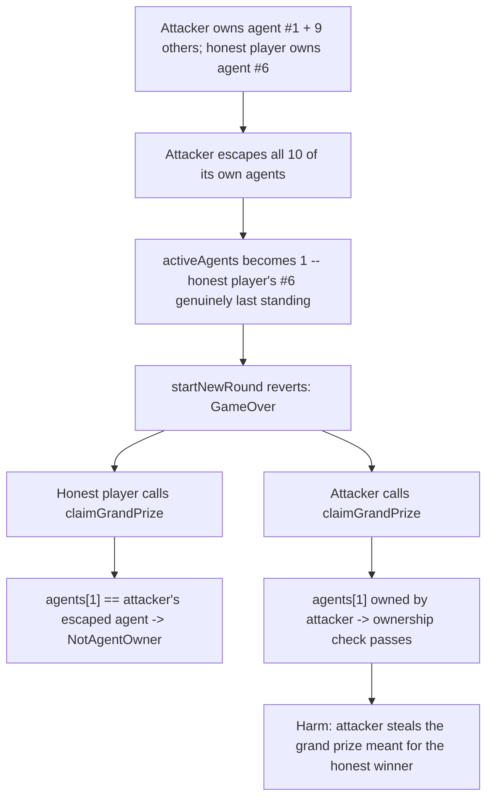
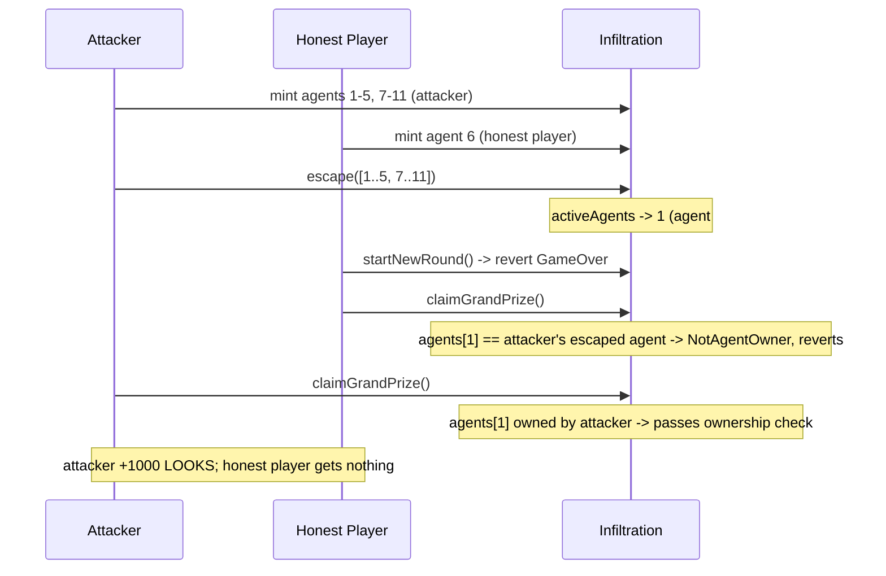

# LooksRare "Infiltration" — attacker steals the grand prize by force ending the game

> **Vulnerability classes:** vuln/logic/wrong-condition · vuln/access-control/stale-authorization-slot · vuln/loss-of-funds/reward-theft

> **Reproduction:** a self-contained Foundry PoC that compiles & runs in an
> isolated project with **only `forge-std`** — no fork, no RPC, no `anvil_state`.
> Full trace: [output.txt](output.txt). PoC:
> [test/27588-h-3-attacker-can-steal-reward-of-actual-winner-by-force-endi_exp.sol](test/27588-h-3-attacker-can-steal-reward-of-actual-winner-by-force-endi_exp.sol).

<!-- non-defihacklabs -->
<!-- source-auditvault: https://github.com/Auditware/AuditVault/blob/main/findings/27588-h-3-attacker-can-steal-reward-of-actual-winner-by-force-endi.md -->
<!-- date: 2023-10 -->

---

## Key info

| | |
|---|---|
| **Impact** | **HIGH** — an attacker force-ends the game while a genuinely honest player is the true last player standing, then steals the grand prize meant for that honest player |
| **Protocol** | [LooksRare "Infiltration"](https://github.com/LooksRare/contracts-infiltration) — an on-chain NFT survival game |
| **Vulnerable code** | `Infiltration.claimGrandPrize` — `uint256 agentId = agents[1].agentId; _assertAgentOwnership(agentId);`, enabled by `startNewRound`'s `activeAgents == 1` end condition |
| **Bug class** | Stale authorization slot: the "winner" is whoever owns the FIXED array slot 1, not whoever is actually still active when the game ends |
| **Finding** | Sherlock — LooksRare "Infiltration", 2023-10 · #27588 (H-3) · reporter **cergyk** (dupes: 0xReiAyanami, SilentDefendersOfDeFi, mstpr-brainbot) |
| **Report** | [sherlock-audit/2023-10-looksrare-judging#98](https://github.com/sherlock-audit/2023-10-looksrare-judging/issues/98) |
| **Source** | [AuditVault](https://github.com/Auditware/AuditVault/blob/main/findings/27588-h-3-attacker-can-steal-reward-of-actual-winner-by-force-endi.md) |
| **Status** | Audit finding — caught in review (fixed via [PR #154](https://github.com/LooksRare/contracts-infiltration/pull/154)), not exploited on-chain. Reproduced here as a standalone local PoC. |
| **Compiler** | `^0.8.24` (PoC) |

This is an **audit finding**, not a historical on-chain incident. The real
Infiltration game tracks agents/wounds via VRF-driven rounds; the PoC keeps
the vulnerable `activeAgents == 1` end condition and the slot-1-based
`claimGrandPrize` payout **verbatim** and reduces minting/escaping to direct
calls so the same bug fires deterministically and cheatcode-free.

---

## TL;DR

1. The game force-ends the instant `gameInfo.activeAgents == 1`
   (`startNewRound` reverts `GameOver`).
2. `claimGrandPrize` pays the prize to whoever owns the agent parked at the
   **fixed array slot 1** — it never checks that slot 1 is actually still
   active.
3. An attacker who owns agent #1 (plus many others) `escape`s every other
   agent they own, leaving an honest player's agent as the sole active
   participant — the game correctly ends, since the honest player genuinely
   is the last one standing.
4. Escaping does **not** change ownership, so the attacker still owns agent
   #1, even though it already escaped and is no longer active.
5. **HARM:** the attacker calls `claimGrandPrize`; it reads `agents[1]` (the
   attacker's own, inactive agent), passes the ownership check, and pays the
   attacker the grand prize — while the honest player, the true last player
   standing, is rejected and receives nothing.

---

## The vulnerable code

The force-end condition (verbatim, `Infiltration.startNewRound`):

```solidity
uint256 activeAgents = gameInfo.activeAgents;
if (activeAgents == 1) {
    revert GameOver();
}
```

The prize payout (verbatim, `Infiltration.claimGrandPrize`):

```solidity
uint256 agentId = agents[1].agentId;
_assertAgentOwnership(agentId);
```

Neither snippet cross-checks the other: the end condition only counts *how
many* agents are active, and the payout only checks *ownership* of a fixed
slot — nothing ties "the agent that made `activeAgents` become 1" to "the
agent whose owner gets paid."

---

## Root cause

The prize logic implicitly assumes slot 1 (`agents[1]`) is always occupied by
a still-in-the-game agent, and that whoever owns it is the winner once the
game ends. Escaping breaks that assumption: it removes an agent from the
active headcount but leaves the array slot and its ownership untouched. An
attacker who happens to hold slot 1 can therefore manufacture a legitimate
game-over state (by escaping everything else they own) while still owning
the now-irrelevant slot-1 agent, and cash in on someone else's victory.

## Preconditions

- The attacker must own the agent at array slot 1 (trivial — the first minter
  gets slot 1; anyone who mints early or buys/trades into it qualifies) and
  enough other agents to be a plausible player.
- At least one other, genuinely honest player must be active for the
  attacker to steal from.

## Attack walkthrough

From [output.txt](output.txt):

1. 11 agents are minted: the attacker owns agents 1-5 and 7-11 (10 agents,
   including the pivotal slot 1); the honest player owns agent 6.
2. The attacker calls `escape` with all 10 of its own agent ids in a single
   transaction.
3. `gameInfo.activeAgents` correctly becomes 1 — the honest player's agent
   (#6) is genuinely the sole remaining active participant.
4. `startNewRound` now reverts with `GameOver` — the game agrees it is over.
5. The honest player calls `claimGrandPrize` and is **rejected**
   (`NotAgentOwner`): `agents[1].agentId` is the attacker's escaped agent, not
   theirs.
6. **HARM:** the attacker calls `claimGrandPrize` and **succeeds** — it still
   owns the stale slot-1 agent, so `_assertAgentOwnership` passes. The
   attacker walks away with the full grand prize; the honest last player
   standing gets nothing. A control test confirms that when the sole survivor
   genuinely IS parked at slot 1, `claimGrandPrize` correctly pays them —
   isolating the bug to the slot-1/active mismatch, not a broken payout
   mechanism.

## Diagrams





## Remediation

Start a new round before the real end of the game to clear wounded agents and
re-order/re-index agent slots, so that the slot the payout reads from is
guaranteed to belong to the agent that is actually still active (as suggested
in the report), or have `claimGrandPrize` directly identify the last active
agent instead of trusting a fixed slot.

## How to reproduce

```bash
cd ~/RustroverProjects/audits/evm-hack-registry/27588-h-3-attacker-can-steal-reward-of-actual-winner-by-force-endi_exp
forge test -vvv
# Fully local — no fork, no RPC, no anvil_state required.
# Expected: all 3 tests PASS:
#   test_exploit                              (Exploit-driven harm)
#   test_forceWin_standalone                  (standalone rebuild, mirrors finding's own test_forceWin PoC)
#   test_control_soleSurvivorAtSlot1_getsPaid (control: legitimate slot-1 winner is paid correctly)
```

PoC source: [test/27588-h-3-attacker-can-steal-reward-of-actual-winner-by-force-endi_exp.sol](test/27588-h-3-attacker-can-steal-reward-of-actual-winner-by-force-endi_exp.sol)
— the verbatim vulnerable end condition and slot-1 payout, plus the finding's
mint/escape/claim attack sequence and a control test.

> Note: array re-indexing on wound/death and the exact VRF-driven round
> lifecycle are reduced-model details (out of scope here); the reduction
> preserves the verbatim end condition, the verbatim slot-1 payout check, and
> the fact that escaping leaves ownership untouched — the faithful parts of
> the bug.

---

*Reference: finding **#27588 (H-3)** by **cergyk** in the [Sherlock LooksRare "Infiltration" review (Oct 2023)](https://github.com/sherlock-audit/2023-10-looksrare-judging/issues/98) · curated by [AuditVault](https://github.com/Auditware/AuditVault/blob/main/findings/27588-h-3-attacker-can-steal-reward-of-actual-winner-by-force-endi.md)*
