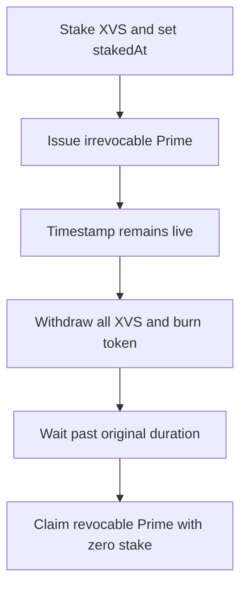

# Venus Prime — stale staking timestamp permits a free revocable Prime claim

> **Vulnerability classes:** vuln/logic/incorrect-state-transition · vuln/logic/state-update · vuln/reward-theft

> **Reproduction:** self-contained Foundry PoC with no fork, RPC, or cheatcodes. Full trace: [output.txt](output.txt). Driver: [test/28832-h-01-primesol-user-can-claim-prime-token-without-having-any_exp.sol](test/28832-h-01-primesol-user-can-claim-prime-token-without-having-any_exp.sol).

<!-- non-defihacklabs -->
<!-- source-auditvault: https://github.com/Auditware/AuditVault/blob/main/findings/28832-h-01-primesol-user-can-claim-prime-token-without-having-any.md -->
<!-- date: 2023-09 -->

**AuditVault taxonomy:** `lang/solidity` · `sector/governance` · `sector/staking` · `platform/code4rena` · `has/github` · `has/poc` · `severity/high` · genome: `wrong-condition` · `reward-theft` · `timestamp-dependence`

## Key info

| | |
|---|---|
| **Impact** | **HIGH** — an account can obtain a revocable Prime token after it has withdrawn every unit of XVS. |
| **Protocol** | [Venus](https://code4rena.com/reports/2023-09-venus) |
| **Vulnerable code** | `Prime.sol` irrevocable-token issue path |
| **Finding** | Code4rena Venus, 2023-09 · #28832 (H-01) · reporter **santipu_** |
| **Status** | Audit finding; local reduction preserves the stale-state transition. |
| **Compiler** | `^0.8.24` (local reduction) |

## TL;DR

`stakedAt` determines whether an account has waited long enough to claim a revocable
Prime token. The irrevocable `issue` branch mints the token but does not clear that
timestamp. A user can enter that branch, withdraw all XVS, burn the irrevocable
token, wait out the original clock, and then claim a revocable token while holding
no stake.

The local PoC stakes 10,000 units, issues the irrevocable token, withdraws the
entire stake, burns it, advances the local clock, and successfully claims the
revocable token. It asserts both zero staked balance and the unauthorized claim.

## The vulnerable code

```solidity
if (irrevocable) {
    _mint(true, users[i]); // @> VULN: stakedAt[users[i]] is not deleted
}
```

The revocable paths clear this eligibility timestamp. This exceptional irrevocable
path leaves it live even though the user can later own no qualifying stake.

## Root cause

Eligibility state is coupled to the stake lifecycle but is not reset on every token
state transition that invalidates the prior eligibility context. The stale timestamp
is subsequently trusted by `claim` as though the user were still staked.

## Preconditions

- A user can receive an irrevocable Prime token before the staking duration ends.
- The user can withdraw its XVS and burn or otherwise dispose of that token.
- The old `stakedAt` value passes the configured duration when claiming.

## Attack walkthrough

1. The attacker stakes, establishing `stakedAt`.
2. The protocol issues an irrevocable Prime token through the vulnerable branch.
3. The attacker withdraws all stake and burns the irrevocable token.
4. After the original delay, `claim` accepts the stale timestamp and mints a revocable token without any XVS collateral.

## Diagrams



## Remediation

Clear eligibility state when issuing an irrevocable token, matching the other issuance and claim branches:

```solidity
delete stakedAt[users[i]];
_mint(true, users[i]);
```

Also test every transition that removes stake or changes token type before relying on a historic timestamp for a new privilege.

## How to reproduce

```bash
cd /workspaces/RustroverProjects/audits/evm-hack-registry/28832-h-01-primesol-user-can-claim-prime-token-without-having-any_exp
forge test -vvv
```

## Sources

- [AuditVault finding #28832](https://github.com/Auditware/AuditVault/blob/main/findings/28832-h-01-primesol-user-can-claim-prime-token-without-having-any.md)
- [Code4rena Venus report](https://code4rena.com/reports/2023-09-venus)

*Reference: Code4rena Venus finding H-01, curated by AuditVault.*
