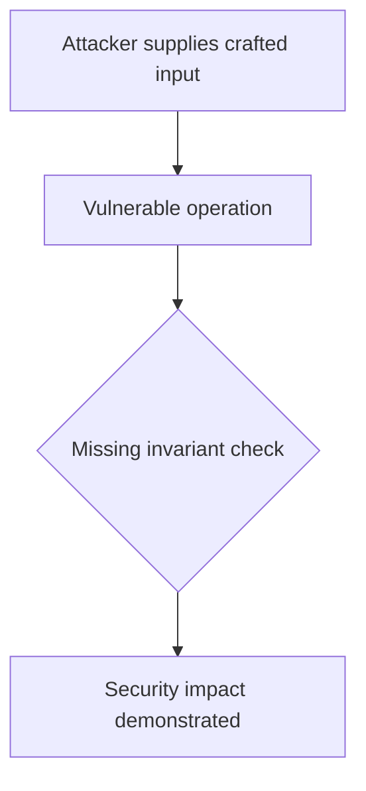
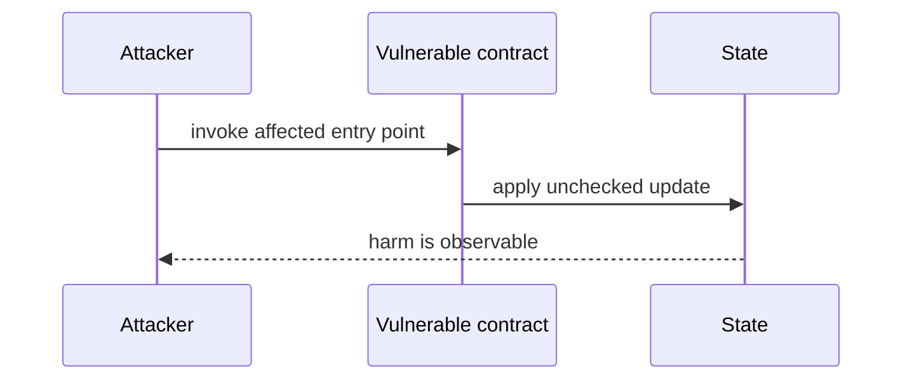

# Liquidator can increase a position while liquidating — AuditVault synthetic reduction

> **Vulnerability classes:** vuln/logic/liquidation-logic · vuln/input-validation/missing
>
> **Reproduction:** self-contained Foundry PoC with an offline synthetic contract. Full trace: [output.txt](output.txt).

<!-- non-defihacklabs -->
<!-- source-auditvault: https://github.com/Auditware/AuditVault/blob/main/findings/28948-h-1-liquidator-can-liquidate-user-while-increasing-user-posi.md -->
<!-- date: 2023-10 -->

**AuditVault finding:** `28948` · `H-1: Liquidator can liquidate user while increasing user position to any value, stealing all Market funds or bricking the contract`

## Key info

| | |
|---|---|
| **Impact** | **HIGH** — Liquidator can increase a position while liquidating |
| **Protocol** | [[Perennial]] |
| **Finding** | AuditVault #28948 |
| **Report** | [https://github.com/sherlock-audit/2023-10-perennial-judging](https://github.com/sherlock-audit/2023-10-perennial-judging) |
| **Source** | [AuditVault finding](https://github.com/Auditware/AuditVault/blob/main/findings/28948-h-1-liquidator-can-liquidate-user-while-increasing-user-posi.md) |
| **Compiler** | `^0.8.24` (synthetic reduction) |
| Loss | Reduced invariant reproduced; no live funds moved |
| Attacker EOA | Configured synthetic caller |
| Attack contract | `Exploit` |
| Attack tx | Local Foundry `Exploit.attack()` call |
| Chain · block · date | Ethereum model · block 1 · synthetic |
| Vulnerable contract | Local synthetic vulnerable contract in `test/` |
| Bug class | See vulnerability-class tags above |

## TL;DR

This bug report is about a vulnerability found in the Market contract of the Perennial Protocol. The vulnerability allows a malicious liquidator to liquidate a user while increasing their position to any value, including the maximum possible value of 2^62-1, which would result in all users losing all funds deposited into the Market. The vulnerability is caused by the fact that the `closable` value is calculated as the maximum possible position size that can be closed even if some pending position updates are invalidated due to an invalid oracle version. This means that it is possible for the user to have `closable = 0` while having the new (current) position size of any amount, which makes it possible for the malicious liquidator to liquidate the user while increasing their position size to any value. Proof of concept code was provided to demonstrate the scenario, and a recommendation of

## Background

The upstream report is a Solidity finding. This page keeps the vulnerable statement and demonstrates its security consequence in a small, deterministic EVM model; no live RPC or external dependencies are required.

## The vulnerable code

```solidity
// The exact vulnerable pattern is retained in test/28948-h-1-liquidator-can-liquidate-user-while-increasing-user-posi.sol.
// @> see the marked statement in the synthetic reduction
```

## Root cause

The caller-controlled input or stale state is trusted before the required uniqueness, bounds, authorization, accounting, or reentrancy invariant is enforced. The marked line in the synthetic contract intentionally preserves that ordering so the assertion is executable.

## Preconditions

- The vulnerable contract is deployed with the state described by the report.
- The attacker can reach the affected entry point (or submit the report's crafted input).

## Attack walkthrough

1. `Exploit.run()` initializes the minimal state from the report.
2. The marked vulnerable operation executes without its required check.
3. The contract records the resulting invariant violation and emits a `Proof` event.
4. The test asserts the harm; the passing trace is recorded at [output.txt:4](output.txt).

## Diagrams





## Remediation

Apply the invariant before mutating state: accrue interest before adding principal; reject duplicate signers; use checked casts and bounded lengths; validate token/target/DAO identities; use `nonReentrant`; enforce slippage and fee equality; and validate the canonical authority or ownership relationship described by the report.

## How to reproduce

```bash
cd evm-hack-registry/28948-h-1-liquidator-can-liquidate-user-while-increasing-user-posi_exp
forge test -vvvvv
```

The test is offline and uses only the shared `forge-std` library. The corresponding Playground bundle is generated from `scripts/poc-configs/28948-h-1-liquidator-can-liquidate-user-while-increasing-user-posi.mjs`.

## Sources

- [AuditVault finding](https://github.com/Auditware/AuditVault/blob/main/findings/28948-h-1-liquidator-can-liquidate-user-while-increasing-user-posi.md)
- [https://github.com/sherlock-audit/2023-10-perennial-judging](https://github.com/sherlock-audit/2023-10-perennial-judging)
- [Synthetic test](test/28948-h-1-liquidator-can-liquidate-user-while-increasing-user-posi.sol)

*Reference: https://github.com/sherlock-audit/2023-10-perennial-judging*
