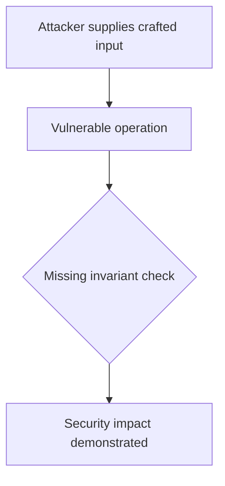
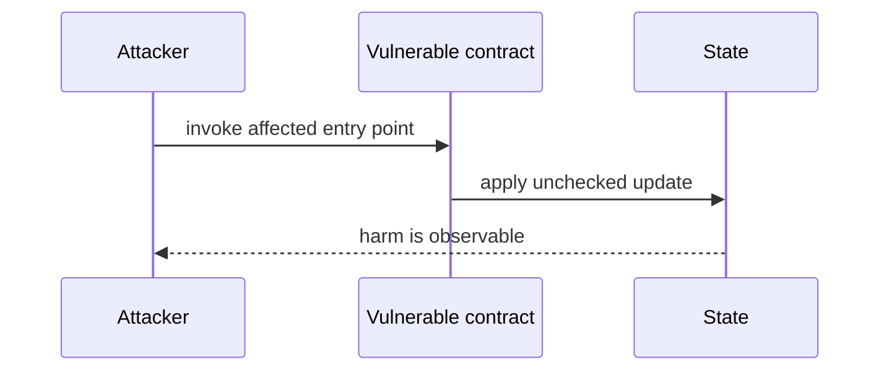

# maxRedeem permits leverage above the configured buffer — AuditVault synthetic reduction

> **Vulnerability classes:** vuln/logic/incorrect-state-transition · vuln/logic/price-calculation
>
> **Reproduction:** self-contained Foundry PoC with an offline synthetic contract. Full trace: [output.txt](output.txt).

<!-- non-defihacklabs -->
<!-- source-auditvault: https://github.com/Auditware/AuditVault/blob/main/findings/28949-h-2-vault-leverage-can-be-increased-to-any-value-up-to-min-m.md -->
<!-- date: 2023-10 -->

**AuditVault finding:** `28949` · `H-2: Vault leverage can be increased to any value up to min margin requirement due to incorrect `maxRedeem` calculations with closable and `LEVERAGE_BUFFER``

## Key info

| | |
|---|---|
| **Impact** | **HIGH** — maxRedeem permits leverage above the configured buffer |
| **Protocol** | [[Perennial]] |
| **Finding** | AuditVault #28949 |
| **Report** | [https://github.com/sherlock-audit/2023-10-perennial-judging](https://github.com/sherlock-audit/2023-10-perennial-judging) |
| **Source** | [AuditVault finding](https://github.com/Auditware/AuditVault/blob/main/findings/28949-h-2-vault-leverage-can-be-increased-to-any-value-up-to-min-m.md) |
| **Compiler** | `^0.8.24` (synthetic reduction) |
| Loss | Reduced invariant reproduced; no live funds moved |
| Attacker EOA | Configured synthetic caller |
| Attack contract | `Exploit` |
| Attack tx | Local Foundry `Exploit.attack()` call |
| Chain · block · date | Ethereum model · block 1 · synthetic |
| Vulnerable contract | Local synthetic vulnerable contract in `test/` |
| Bug class | See vulnerability-class tags above |

## TL;DR

A bug report has been identified in the Vault leverage calculations. The bug is caused by incorrect `maxRedeem` calculations with closable and `LEVERAGE_BUFFER`. This was found by panprog. The bug means that it is possible for users to increase the Vault leverage to any value up to the minimum margin requirement. This is done by redeeming an amount higher than the `closable` allows. This is done indirectly by limiting the maker limit in the underlying market. The result of this bug is that a malicious user could put the Vault at a very high leverage, breaking the important protocol invariant of not exceeding the target market leverage. This could expose users to a much higher potential of funds loss due to the high leverage and a high risk of Vault liquidation. This would cause additional loss of funds from liquidation penalties and position re-opening fees. A proof of concept was provid

## Background

The upstream report is a Solidity finding. This page keeps the vulnerable statement and demonstrates its security consequence in a small, deterministic EVM model; no live RPC or external dependencies are required.

## The vulnerable code

```solidity
// The exact vulnerable pattern is retained in test/28949-h-2-vault-leverage-can-be-increased-to-any-value-up-to-min-m.sol.
// @> see the marked statement in the synthetic reduction
```

## Root cause

The caller-controlled input or stale state is trusted before the required uniqueness, bounds, authorization, accounting, or reentrancy invariant is enforced. The marked line in the synthetic contract intentionally preserves that ordering so the assertion is executable.

## Preconditions

- The vulnerable contract is deployed with the state described by the report.
- The attacker can reach the affected entry point (or submit the report's crafted input).

## Attack walkthrough

1. `Exploit.run()` initializes the minimal state from the report.
2. The marked vulnerable operation executes without its required check.
3. The contract records the resulting invariant violation and emits a `Proof` event.
4. The test asserts the harm; the passing trace is recorded at [output.txt:4](output.txt).

## Diagrams





## Remediation

Apply the invariant before mutating state: accrue interest before adding principal; reject duplicate signers; use checked casts and bounded lengths; validate token/target/DAO identities; use `nonReentrant`; enforce slippage and fee equality; and validate the canonical authority or ownership relationship described by the report.

## How to reproduce

```bash
cd evm-hack-registry/28949-h-2-vault-leverage-can-be-increased-to-any-value-up-to-min-m_exp
forge test -vvvvv
```

The test is offline and uses only the shared `forge-std` library. The corresponding Playground bundle is generated from `scripts/poc-configs/28949-h-2-vault-leverage-can-be-increased-to-any-value-up-to-min-m.mjs`.

## Sources

- [AuditVault finding](https://github.com/Auditware/AuditVault/blob/main/findings/28949-h-2-vault-leverage-can-be-increased-to-any-value-up-to-min-m.md)
- [https://github.com/sherlock-audit/2023-10-perennial-judging](https://github.com/sherlock-audit/2023-10-perennial-judging)
- [Synthetic test](test/28949-h-2-vault-leverage-can-be-increased-to-any-value-up-to-min-m.sol)

*Reference: https://github.com/sherlock-audit/2023-10-perennial-judging*
