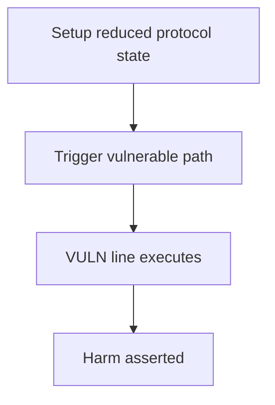

# Open Dollar — incorrect calculations for surplus auction creation

> **Vulnerability classes:** underflow · known-pattern · direct-drain · integer-bounds

> **Reproduction:** a self-contained Foundry PoC that compiles & runs in an
> isolated project with **only `forge-std`** — no fork, no RPC, no `anvil_state`.
> Full trace: [output.txt](output.txt). PoC:
> [test/29347-h-01-incorrect-calculations-for-surplus-auction-creation-cau_exp.sol](test/29347-h-01-incorrect-calculations-for-surplus-auction-creation-cau_exp.sol).

<!-- non-defihacklabs -->
<!-- source-auditvault: https://github.com/Auditware/AuditVault/blob/main/findings/29347-h-01-incorrect-calculations-for-surplus-auction-creation-cau.md -->
<!-- date: 2023-10 -->

---

## Key info

| | |
|---|---|
| **Impact** | **HIGH — ONE_HUNDRED_WAD used instead of WAD creates 99× inflated ghost surplus auctions and double-counts surplus** |
| **Protocol** | Open Dollar |
| **Vulnerable code** | `AccountingEngine` |
| **Bug class** | underflow |
| **Finding** | Code4rena — Open Dollar, 2023-10 · #29347 · reporter **tnquanghuy0512** |
| **Report** | [code4rena.com/reports/2023-10-opendollar](https://code4rena.com/reports/2023-10-opendollar) |
| **Source** | [AuditVault](https://github.com/Auditware/AuditVault/blob/main/findings/29347-h-01-incorrect-calculations-for-surplus-auction-creation-cau.md) |
| **Status** | Audit finding — caught in review, not exploited on-chain. Reproduced as a standalone local PoC. |
| **Compiler** | `^0.8.24` (PoC) |

This is an **audit finding**, not a historical on-chain incident. The PoC keeps
the vulnerable logic **verbatim** (marked `@> VULN`) and reduces dependencies
to the minimum needed to show the claimed harm.

---

## TL;DR

1. auctionSurplus compares surplusTransferPercentage to ONE_HUNDRED_WAD (always true).
2. amountToSell uses wmul(ONE_HUNDRED_WAD - pct) → ~99× surplusAmount.
3. At 100% transfer, a ghost auction of 297 still starts while 3 is transferred.
4. Double-counting breaks accounting and can underflow elsewhere.

---

## The vulnerable code

See `test/29347-h-01-incorrect-calculations-for-surplus-auction-creation-cau.sol` — the `@> VULN` marker is on the blamed line (line 130 in the synthetic).

## Root cause

Percentage math uses ONE_HUNDRED_WAD (100e18) where WAD (1e18) is required.

## Preconditions

Protocol operating conditions that make the path reachable (see finding report). No exotic privileges beyond those the real call path requires.

## Attack walkthrough

From [output.txt](output.txt): the `Exploit.run()` path executes the attack end-to-end and `require`s the harm.

## Diagrams

## Impact

Massively inflated surplus auctions plus full transfer — accounting insolvency risk.

## Sources

- [AuditVault finding](https://github.com/Auditware/AuditVault/blob/main/findings/29347-h-01-incorrect-calculations-for-surplus-auction-creation-cau.md)
- [Code4rena report](https://code4rena.com/reports/2023-10-opendollar)
- Protocol source: https://github.com/open-dollar/od-contracts
