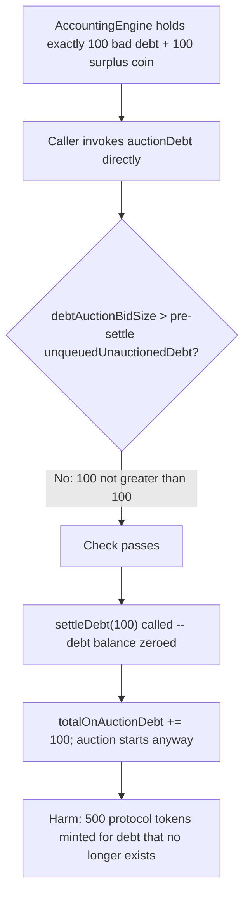
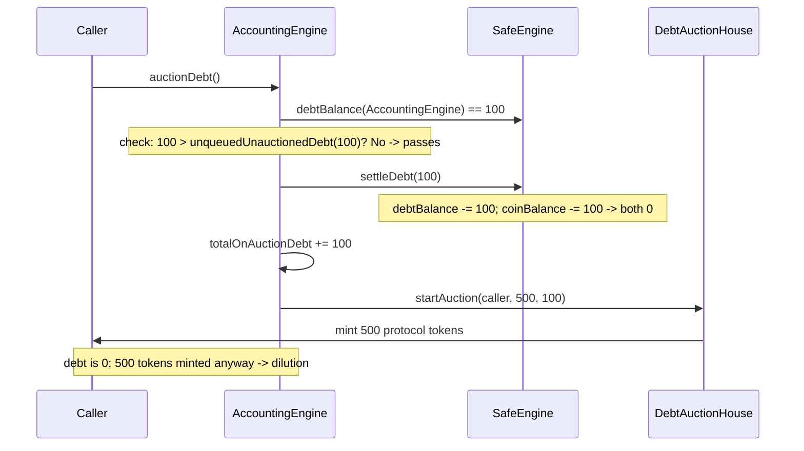

# Open Dollar — missing debt check lets users start a debt auction of non-existent debt

> **Vulnerability classes:** vuln/logic/check-ordering · vuln/accounting/stale-precondition · vuln/token-dilution

> **Reproduction:** a self-contained Foundry PoC that compiles & runs in an
> isolated project with **only `forge-std`** — no fork, no RPC, no `anvil_state`.
> Full trace: [output.txt](output.txt). PoC:
> [test/29348-h-02-missing-debt-check-lets-users-start-a-debt-auction-of-n_exp.sol](test/29348-h-02-missing-debt-check-lets-users-start-a-debt-auction-of-n_exp.sol).

<!-- non-defihacklabs -->
<!-- source-auditvault: https://github.com/Auditware/AuditVault/blob/main/findings/29348-h-02-missing-debt-check-lets-users-start-a-debt-auction-of-n.md -->
<!-- date: 2023-10 -->

---

## Key info

| | |
|---|---|
| **Impact** | **HIGH** — a debt auction starts and mints/sells protocol tokens to cover bad debt that no longer exists, diluting the protocol token for no reason |
| **Protocol** | [Open Dollar](https://opendollar.com) — a RAI/Reflexer-style CDP stablecoin |
| **Vulnerable code** | `AccountingEngine.auctionDebt` — the insufficient-debt check runs against the pre-settle debt balance, then `_settleDebt` is called with that same pre-settle amount |
| **Bug class** | Stale precondition: a validity check is evaluated before a state-mutating call that can invalidate it, with no re-check afterward |
| **Finding** | Code4rena — Open Dollar, 2023-10 · #29348 (H-02) · reporter **Falconhoof** |
| **Report** | [code4rena.com/reports/2023-10-opendollar](https://code4rena.com/reports/2023-10-opendollar) |
| **Source** | [AuditVault](https://github.com/Auditware/AuditVault/blob/main/findings/29348-h-02-missing-debt-check-lets-users-start-a-debt-auction-of-n.md) |
| **Status** | Audit finding — caught in review (fixed via [PR #253](https://github.com/open-dollar/od-contracts/pull/253)), not exploited on-chain. Reproduced here as a standalone local PoC. |
| **Compiler** | `^0.8.24` (PoC) |

This is an **audit finding**, not a historical on-chain incident. The real
`AccountingEngine` sits inside a full RAI-style CDP/SAFE stack; the PoC keeps
the vulnerable check-then-settle sequence **verbatim** and reduces the
SAFEEngine, protocol token, and debt auction house to the minimum needed to
show the dilution mechanically.

---

## TL;DR

1. `auctionDebt()` checks `debtAuctionBidSize > _unqueuedUnauctionedDebt(debtBalance)`
   using the **current (pre-settle)** debt balance, reverting only if there
   isn't enough.
2. It then calls `_settleDebt` with that **same pre-settle** unqueued/
   unauctioned amount — using up the protocol's surplus coin to net off bad
   debt.
3. `_settleDebt` can consume the **entire** debt buffer the check just
   validated, but `auctionDebt` never re-checks debt availability afterward.
4. `totalOnAuctionDebt` is incremented and the debt auction starts anyway, at
   the **full** `debtAuctionBidSize`.
5. **HARM:** the debt auction mints/sells protocol tokens to "cover" bad debt
   that the function's own settle call already erased — a pure token
   dilution with no debt behind it.

---

## The vulnerable code

The check-then-settle sequence (verbatim, `AccountingEngine.auctionDebt`):

```solidity
if (_params.debtAuctionBidSize > _unqueuedUnauctionedDebt(_debtBalance))
    revert(); // (checked BEFORE settling — AccountingEngine.sol:181)

_settleDebt(_unqueuedUnauctionedDebt(_debtBalance)); // AccountingEngine.sol:183
// ... auction starts unconditionally at debtAuctionBidSize
```

The recommended fix (from the report):

> Introduce the check `(_params.debtAuctionBidSize > _unqueuedUnauctionedDebt(_debtBalance))`
> **after** calling `_settleDebt`, to ensure there is still enough bad debt
> once the settlement has run.

---

## Root cause

The function validates a precondition (enough unqueued/unauctioned bad debt)
and then immediately performs a state change (`_settleDebt`) that can
invalidate that very precondition, without re-validating afterward. This is a
classic check-then-act-on-stale-state bug: the check and the auction it gates
are separated by a state mutation that the check does not account for.

## Preconditions

- The `AccountingEngine` must have unqueued/unauctioned bad debt at or above
  `debtAuctionBidSize` (an ordinary operating condition — this is exactly the
  debt the auction mechanism exists to cover).
- The `AccountingEngine` must have enough surplus system coin to let
  `_settleDebt` consume that debt in the same call (also an ordinary
  operating condition, since surplus coin accrues from protocol fees).
- No special permissions are required — `auctionDebt()` is a permissionless,
  publicly callable function in the real protocol.

## Attack walkthrough

From [output.txt](output.txt):

1. The `AccountingEngine` is seeded with exactly `debtAuctionBidSize` (100, in
   `rad` units) of real bad debt, plus matching surplus coin to cover it —
   the boundary case where the check just barely passes.
2. A caller invokes `auctionDebt()` directly (no external `settleDebt` call
   first).
3. The check passes: the pre-settle unqueued/unauctioned debt (100) is not
   less than `debtAuctionBidSize` (100).
4. `settleDebt` runs with that same pre-settle amount (100), zeroing out the
   `AccountingEngine`'s debt balance entirely.
5. **HARM:** `totalOnAuctionDebt` is still increased by 100, and the debt
   auction starts anyway, minting 500 protocol tokens to the caller — tokens
   sold to "cover" debt that the function's own settle call already
   eliminated. A control test confirms that if `settleDebt` is called
   **externally** before `auctionDebt` (the finding's other test-case order),
   the check correctly sees the post-settle (zero) debt and reverts —
   isolating the bug to the missing re-check inside `auctionDebt` itself.

## Diagrams





## Remediation

Re-run the insufficient-debt check **after** `_settleDebt` completes, using
the post-settle debt balance, so the auction only starts when real bad debt
still remains to justify it.

## How to reproduce

```bash
cd ~/RustroverProjects/audits/evm-hack-registry/29348-h-02-missing-debt-check-lets-users-start-a-debt-auction-of-n_exp
forge test -vvv
# Fully local — no fork, no RPC, no anvil_state required.
# Expected: all 3 tests PASS:
#   test_exploit                              (Exploit-driven harm)
#   test_auctionDebt_direct_mintsForZeroDebt   (standalone rebuild, finding's "second test case")
#   test_control_externalSettleFirst_reverts   (control: finding's "first test case" — correctly reverts)
```

PoC source: [test/29348-h-02-missing-debt-check-lets-users-start-a-debt-auction-of-n_exp.sol](test/29348-h-02-missing-debt-check-lets-users-start-a-debt-auction-of-n_exp.sol)
— the verbatim vulnerable check-then-settle sequence, plus the finding's two
test-case orderings (direct call vs. externally-settled-first) as attack and
control.

> Note: the real `AccountingEngine`'s debt-queue mechanics (`pushDebtToQueue`/
> `popDebtFromQueue`) and rad-unit (1e45) fixed-point scaling are reduced-model
> simplifications (out of scope here — this PoC uses plain integer units); the
> reduction preserves the verbatim check-before-settle ordering and the exact
> boundary condition (debt == debtAuctionBidSize) that is the faithful part of
> the bug.

---

*Reference: finding **#29348 (H-02)** by **Falconhoof** in the [Code4rena Open Dollar review (Oct 2023)](https://code4rena.com/reports/2023-10-opendollar) · curated by [AuditVault](https://github.com/Auditware/AuditVault/blob/main/findings/29348-h-02-missing-debt-check-lets-users-start-a-debt-auction-of-n.md)*
