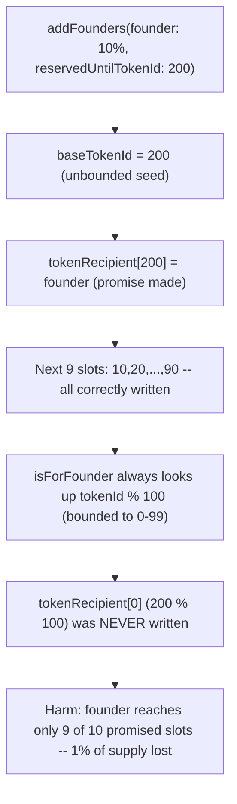
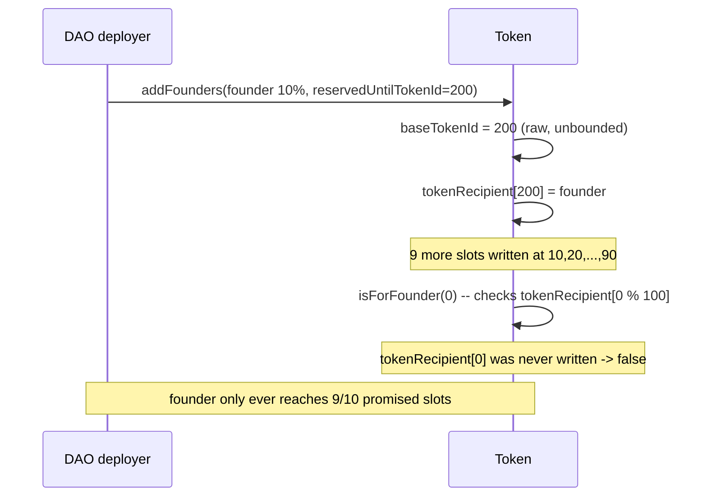

# Nouns Builder — when reservedUntilTokenId > 100, first founder loses 1% NFT

> **Vulnerability classes:** vuln/logic/wrong-condition · vuln/state/unreachable-storage-slot · vuln/loss-of-funds/direct-drain

> **Reproduction:** a self-contained Foundry PoC that compiles & runs in an
> isolated project with **only `forge-std`** — no fork, no RPC, no `anvil_state`.
> Full trace: [output.txt](output.txt). PoC:
> [test/29423-h-1-when-reserveduntiltokenid-100-first-funder-loss-1-nft-sh_exp.sol](test/29423-h-1-when-reserveduntiltokenid-100-first-funder-loss-1-nft-sh_exp.sol).

<!-- non-defihacklabs -->
<!-- source-auditvault: https://github.com/Auditware/AuditVault/blob/main/findings/29423-h-1-when-reserveduntiltokenid-100-first-funder-loss-1-nft-sh.md -->
<!-- date: 2023-09 -->

---

## Key info

| | |
|---|---|
| **Impact** | **HIGH** — a founder is definitely denied one of their promised NFT allocation slots, a permanent 1% loss of the total token supply, whenever `reservedUntilTokenId > 100` |
| **Protocol** | [Nouns Builder](https://nouns.build) — NFT DAO auction/funding protocol |
| **Vulnerable code** | `Token._addFounders` — `uint256 baseTokenId = reservedUntilTokenId;` |
| **Bug class** | Unreachable storage slot: a value is written outside the range any real lookup ever queries |
| **Finding** | Sherlock — Nouns Builder, 2023-09 · #29423 (H-1) · reporter **0x52** (40+ duplicate reports) |
| **Report** | [sherlock-audit/2023-09-nounsbuilder-judging#42](https://github.com/sherlock-audit/2023-09-nounsbuilder-judging/issues/42) |
| **Source** | [AuditVault](https://github.com/Auditware/AuditVault/blob/main/findings/29423-h-1-when-reserveduntiltokenid-100-first-funder-loss-1-nft-sh.md) |
| **Status** | Audit finding — caught in review (fixed via [PR #122](https://github.com/ourzora/nouns-protocol/pull/122)), not exploited on-chain. Reproduced here as a standalone local PoC. |
| **Compiler** | `^0.8.24` (PoC) |

This is an **audit finding**, not a historical on-chain incident. The PoC
keeps the vulnerable `baseTokenId = reservedUntilTokenId` seed and the
`_tokenId % 100` reduction used by `isForFounder` **verbatim**, matching the
finding's own `test_lossFirst`-style assertion on `tokenRecipient(200)`.

---

## TL;DR

1. `_addFounders` schedules a founder's NFT allocation slots by seeding a
   cursor: `uint256 baseTokenId = reservedUntilTokenId;`.
2. Every REAL ERC-721 token id that will ever be minted is reduced via
   `_tokenId % 100` before any lookup (`_isForFounder`), so only ids in
   `[0, 99]` are ever reachable.
3. If `reservedUntilTokenId > 100` (e.g. 200, a normal, expected
   configuration value), the founder's FIRST scheduled slot is written at
   `tokenRecipient[200]` — an id that no real token can ever land on.
4. `tokenRecipient[0]` (`200 % 100`), the slot that would actually be
   reachable, is never written.
5. **HARM:** the founder was promised 10% of the supply (10 of 100 tokens)
   but can only ever actually receive 9 — a definite, permanent 1% loss of
   the total NFT supply.

---

## The vulnerable code

The scheduling-cursor seed (verbatim, `Token._addFounders`):

```solidity
function _addFounders(IManager.FounderParams[] calldata _founders, uint256 reservedUntilTokenId) internal {
    ...
    // Used to store the base token id the founder will recieve
@>  uint256 baseTokenId = reservedUntilTokenId;

    for (uint256 j; j < founderPct; ++j) {
        baseTokenId = _getNextTokenId(baseTokenId);
        tokenRecipient[baseTokenId] = newFounder;
        ...
        baseTokenId = (baseTokenId + schedule) % 100;
    }
}
```

The lookup that can never reach a slot above 99 (verbatim, `Token._isForFounder`):

```solidity
function _isForFounder(uint256 _tokenId) private returns (bool) {
    // Get the base token id
@>  uint256 baseTokenId = _tokenId % 100;

    if (tokenRecipient[baseTokenId].wallet == address(0)) {
        return false;
    } ...
}
```

The recommended fix (from the report — either variant):

```diff
-               uint256 baseTokenId = reservedUntilTokenId;
+               uint256 baseTokenId = 0;
```
```diff
-               uint256 baseTokenId = reservedUntilTokenId;
+               uint256 baseTokenId = reservedUntilTokenId % 100;
```

---

## Root cause

The scheduling function and the lookup function disagree about the domain of
valid token ids: the scheduler writes at the raw `reservedUntilTokenId`
(unbounded), while the lookup always reduces via `% 100` (bounded to
`[0, 99]`). Whenever `reservedUntilTokenId >= 100`, the very first slot the
scheduler writes falls outside the domain the lookup ever queries, and is
lost forever — the founder's promised allocation shrinks by exactly one slot.

## Preconditions

- `reservedUntilTokenId` (a normal DAO configuration parameter, set at
  deployment or via `setReservedUntilTokenId`) must be greater than 100 — not
  an edge case; any DAO reserving more than 100 tokens for the community
  triggers this.
- No attacker action is required — this harms the founder through completely
  ordinary protocol operation.

## Attack walkthrough

From [output.txt](output.txt):

1. A founder is scheduled with a 10% allocation (`percent = 10`) and
   `reservedUntilTokenId = 200`.
2. `_addFounders` writes `tokenRecipient[200] = founder` — the promise is
   made.
3. But `tokenRecipient[0]` (`200 % 100`) is never written — no real token id
   maps to slot 200.
4. Calling the real lookup path directly confirms it: `isForFounder(0)`
   returns `false` (should have been the founder's), while `isForFounder(10)`
   (a genuinely scheduled slot) correctly returns `true`.
5. **HARM:** scanning all 100 real token ids, only 9 resolve to the founder
   instead of the 10 they were promised — a definite 1% loss of the total
   supply. A control test confirms that with `reservedUntilTokenId <= 100`
   (e.g. 0), the founder receives all 10 promised slots — isolating the bug
   to the `> 100` case.

## Diagrams





## Remediation

Seed `baseTokenId` at `0`, or as `reservedUntilTokenId % 100`, so the
scheduler's first write always lands inside the same `[0, 99]` domain the
lookup function queries.

## How to reproduce

```bash
cd ~/RustroverProjects/audits/evm-hack-registry/29423-h-1-when-reserveduntiltokenid-100-first-funder-loss-1-nft-sh_exp
forge test -vvv
# Fully local — no fork, no RPC, no anvil_state required.
# Expected: all 3 tests PASS:
#   test_exploit                        (Exploit-driven harm)
#   test_lossFirst_standalone           (mirrors the finding's own test_lossFirst assertion)
#   test_control_reservedUnder100_noLoss (control: reservedUntilTokenId <= 100 -> no loss)
```

PoC source: [test/29423-h-1-when-reserveduntiltokenid-100-first-funder-loss-1-nft-sh_exp.sol](test/29423-h-1-when-reserveduntiltokenid-100-first-funder-loss-1-nft-sh_exp.sol)
— the verbatim vulnerable seed and the verbatim `% 100` lookup, plus the
finding's `reservedUntilTokenId = 200` example and a control test.

> Note: this is a non-fund harm (a permanently unreachable NFT allocation
> slot, not a token balance) — the Playground displays it via the
> zero-profit-native pattern; the harm is demonstrated by the recorded
> assertions (9 of 10 promised slots reachable) rather than a token transfer.

---

*Reference: finding **#29423 (H-1)** by **0x52** in the [Sherlock Nouns Builder review (Sep 2023)](https://github.com/sherlock-audit/2023-09-nounsbuilder-judging/issues/42) · curated by [AuditVault](https://github.com/Auditware/AuditVault/blob/main/findings/29423-h-1-when-reserveduntiltokenid-100-first-funder-loss-1-nft-sh.md)*
