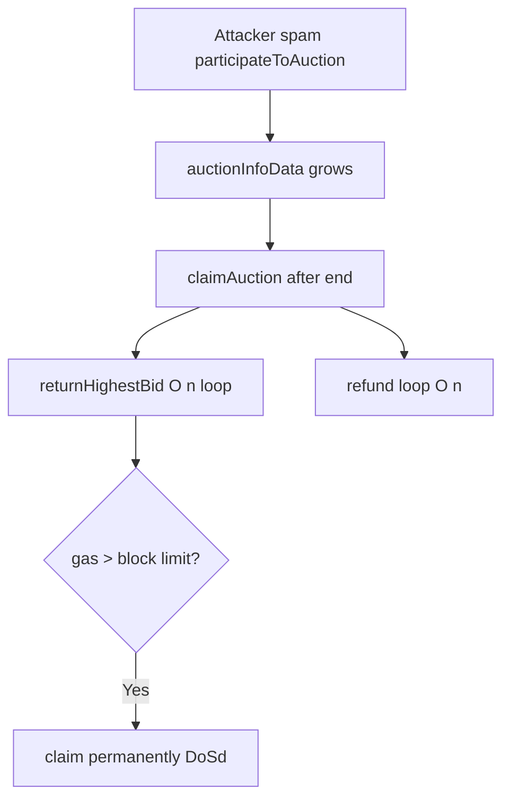

# NextGen — Permanent DoS due to non-shrinking array in unbounded loops

> **Reproduction:** self-contained Foundry PoC (forge-std only) — no fork.
> Full trace: [output.txt](output.txt).

<!-- non-defihacklabs -->
<!-- source-auditvault: https://github.com/Auditware/AuditVault/blob/main/findings/29526-h-05-permanent-dos-due-to-non-shrinking-array-usage-in-an-un.md -->
<!-- date: 2023-10 -->

**AuditVault taxonomy:** lang/solidity · platform/code4rena · severity/high · sector/nft · genome: unbounded-loop · permanent

---

## Key info

| | |
|---|---|
| **Impact** | **HIGH** — spam bids inflate `auctionInfoData`; `claimAuction` OOGs permanently |
| **Protocol** | NextGen |
| **Bug class** | Non-shrinking bid array + unbounded loops in claim/highest-bid |
| **Finding** | Code4rena 2023-10-nextgen H-05 · #29526 |
| **Report** | https://code4rena.com/reports/2023-10-nextgen |
| **Source** | [AuditVault](https://github.com/Auditware/AuditVault/blob/main/findings/29526-h-05-permanent-dos-due-to-non-shrinking-array-usage-in-an-un.md) |
| **Status** | Audit finding — sample+extrapolate gas PoC |
| **Compiler** | `^0.8.24` (PoC) |

---

## TL;DR

`participateToAuction` only pushes bids; arrays never shrink. `returnHighestBid` / `claimAuction` iterate the full array. Enough dust bids make claim OOG → permanent auction DoS.

**HARM:** extrapolated `claimAuction` gas at REAL_N bids exceeds block gas limit.

---

## Root cause

Unbounded growing bid array used in unbounded loops.

## Preconditions

Open auction; attacker can bid with increasing dust amounts.

## Attack walkthrough

Push SAMPLE bids → measure claim gas → extrapolate to REAL_N → require > 30M.

## Diagrams

## Impact

Auction cannot be claimed; NFT and bids stuck.

## Sources

- [AuditVault finding](https://github.com/Auditware/AuditVault/blob/main/findings/29526-h-05-permanent-dos-due-to-non-shrinking-array-usage-in-an-un.md)
- Report: https://code4rena.com/reports/2023-10-nextgen
- Reduced source provenance: github.com/code-423n4/2023-10-nextgen@08a56bac smart-contracts/AuctionDemo.sol
