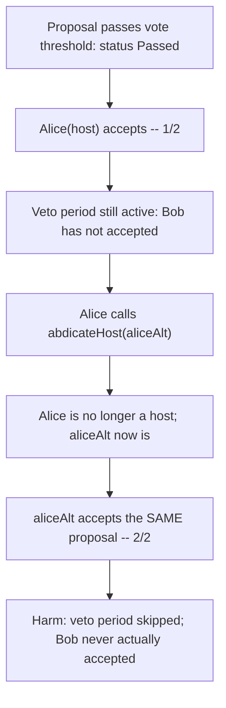
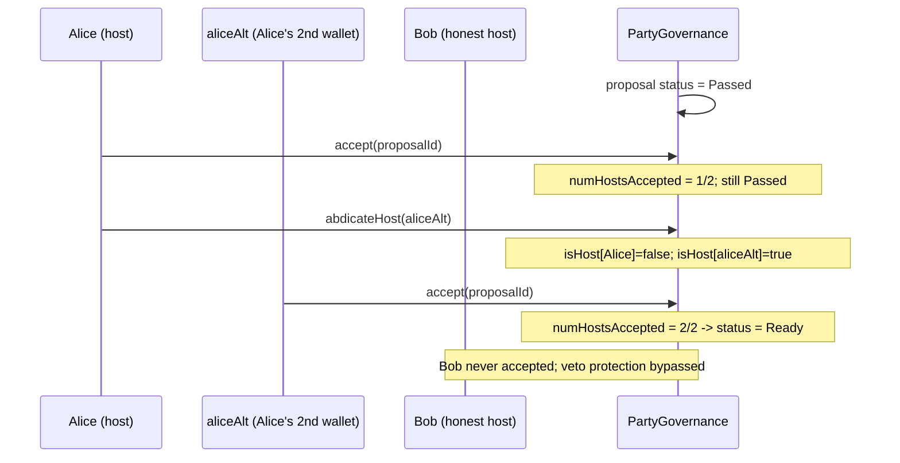

# Party Protocol — single host can unfairly skip the veto period for a proposal

> **Vulnerability classes:** vuln/access-control/identity-bypass · vuln/governance/veto-bypass · vuln/griefing

> **Reproduction:** a self-contained Foundry PoC that compiles & runs in an
> isolated project with **only `forge-std`** — no fork, no RPC, no `anvil_state`.
> Full trace: [output.txt](output.txt). PoC:
> [test/29546-h-02-single-host-can-unfairly-skip-veto-period-for-proposal_exp.sol](test/29546-h-02-single-host-can-unfairly-skip-veto-period-for-proposal_exp.sol).

<!-- non-defihacklabs -->
<!-- source-auditvault: https://github.com/Auditware/AuditVault/blob/main/findings/29546-h-02-single-host-can-unfairly-skip-veto-period-for-proposal.md -->
<!-- date: 2023-10 -->

---

## Key info

| | |
|---|---|
| **Impact** | **HIGH** — a single compromised or malicious host can skip a proposal's veto period entirely, without any other host ever agreeing, enabling governance capture |
| **Protocol** | [Party Protocol](https://partydao.org) — collective on-chain governance/asset-ownership platform |
| **Vulnerable code** | `PartyGovernance.abdicateHost` — transfers host status to a new address with no proposal-time snapshot |
| **Bug class** | Identity bypass: a threshold ("all hosts accepted") is counted by address slot, not by distinct, snapshot-verified identity |
| **Finding** | Code4rena — Party Protocol, 2023-10 · #29546 (H-02) · reporter **3docSec** |
| **Report** | [code4rena.com/reports/2023-10-party](https://code4rena.com/reports/2023-10-party) |
| **Source** | [AuditVault](https://github.com/Auditware/AuditVault/blob/main/findings/29546-h-02-single-host-can-unfairly-skip-veto-period-for-proposal.md) |
| **Status** | Audit finding — caught in review and confirmed by the sponsor, not exploited on-chain. Reproduced here as a standalone local PoC. |
| **Compiler** | `^0.8.24` (PoC) |

This is an **audit finding**, not a historical on-chain incident. The PoC
keeps the vulnerable `abdicateHost` host-transfer logic **verbatim** and
reduces proposal voting/acceptance to the minimum needed to demonstrate the
veto-skip, mirroring the finding's own `test_maliciousHost` PoC shape.

---

## TL;DR

1. After a proposal passes its vote threshold, hosts get a chance to `accept`
   it; once ALL hosts have accepted, the veto delay is skipped and the
   proposal becomes immediately executable.
2. `abdicateHost` lets any current host transfer their host status to a
   BRAND-NEW address at any time — with no snapshot of who was a host when a
   given proposal was created.
3. A single host (Alice) `accept`s a proposal once, then `abdicateHost`s to a
   second wallet she also controls, then `accept`s AGAIN from that second
   wallet.
4. **HARM:** `numHostsAccepted` reaches the full host count and the veto
   period is skipped — even though the OTHER genuinely distinct host (Bob)
   never accepted at all. A single actor wearing two hats can unilaterally
   bypass collective host review. (The May 2023 Tornado Cash governance hack
   used an analogous identity/snapshot bypass to steal ~$1M.)

---

## The vulnerable code

The host-transfer function (verbatim, `PartyGovernance.abdicateHost`):

```solidity
/// @notice Transfer party host status to another.
/// @param newPartyHost The address of the new host.
function abdicateHost(address newPartyHost) external {
    _assertHost();
    // 0 is a special case burn address.
    if (newPartyHost != address(0)) {
        // Cannot transfer host status to an existing host.
        if (isHost[newPartyHost]) {
            revert InvalidNewHostError();
        }
        isHost[newPartyHost] = true;
    } else {
        // Burned the host status
        --numHosts;
    }
    isHost[msg.sender] = false;
    emit HostStatusTransferred(msg.sender, newPartyHost);
}
```

Nothing here (or in `accept`) checks WHEN the transfer happens relative to
any proposal currently awaiting host review, or whether the "new" host is
truly a distinct participant.

---

## Root cause

`numHostsAccepted == numHosts` is meant to mean "every genuinely distinct
host has reviewed and accepted this proposal." But `isHost` is a live,
mutable mapping with no historical snapshot, and `abdicateHost` lets any host
move their slot to a new address whenever they like — including mid-proposal.
A single person can therefore occupy two "host slots" in sequence and satisfy
the threshold alone.

## Preconditions

- The attacker must already be one of the party's hosts (a normal,
  non-privileged-beyond-host-role condition).
- The attacker must control (or be able to acquire) a second address with
  enough voting power to remain a plausible host — `abdicateHost` has no
  further restriction.

## Attack walkthrough

From [output.txt](output.txt):

1. Alice and Bob are the two hosts of a party. A proposal passes its normal
   vote threshold (status `Passed`, veto period active).
2. Alice `accept`s the proposal — `numHostsAccepted` becomes 1 of 2; the
   proposal correctly stays `Passed` (Bob has not accepted).
3. Alice calls `abdicateHost(aliceAlt)`, transferring her host status to a
   second wallet she controls. She is no longer a host; `aliceAlt` now is.
4. `aliceAlt` calls `accept` on the SAME proposal.
5. **HARM:** `numHostsAccepted` reaches 2 of 2 and the proposal transitions to
   `Ready` — veto period skipped — even though Bob, the only genuinely
   distinct other host, never accepted. A control test confirms that without
   abdicating, a lone host's accept is correctly insufficient, and the
   proposal only reaches `Ready` once BOTH real hosts accept — isolating the
   bug to the host-identity bypass via `abdicateHost`.

## Diagrams





## Remediation

Snapshot host status per-proposal (similar to how `votingPower` snapshots
are already used), so `accept` only increments `numHostsAccepted` for
callers who were genuinely hosts at the proposal's creation time, and
`abdicateHost` records new snapshots for both the old and new host rather
than mutating a single live mapping.

## How to reproduce

```bash
cd ~/RustroverProjects/audits/evm-hack-registry/29546-h-02-single-host-can-unfairly-skip-veto-period-for-proposal_exp
forge test -vvv
# Fully local — no fork, no RPC, no anvil_state required.
# Expected: all 3 tests PASS:
#   test_exploit                        (Exploit-driven harm)
#   test_maliciousHost_standalone        (standalone rebuild, mirrors finding's own test_maliciousHost)
#   test_control_bothHostsMustAccept     (control: no abdication -> both real hosts must accept)
```

PoC source: [test/29546-h-02-single-host-can-unfairly-skip-veto-period-for-proposal_exp.sol](test/29546-h-02-single-host-can-unfairly-skip-veto-period-for-proposal_exp.sol)
— the verbatim vulnerable `abdicateHost`, plus the finding's accept/abdicate/
accept-again attack sequence and a control test.

> Note: normal proposal voting-power thresholds and cancellation delays are
> reduced-model simplifications (out of scope here — this PoC drives a
> proposal directly to `Passed`); the reduction preserves the verbatim
> `abdicateHost` transfer and the un-snapshotted `numHostsAccepted` counter,
> the faithful parts of the bug. This is a non-fund/governance harm — the
> Playground displays it via the zero-profit-native pattern.

---

*Reference: finding **#29546 (H-02)** by **3docSec** in the [Code4rena Party Protocol review (Oct 2023)](https://code4rena.com/reports/2023-10-party) · curated by [AuditVault](https://github.com/Auditware/AuditVault/blob/main/findings/29546-h-02-single-host-can-unfairly-skip-veto-period-for-proposal.md)*
