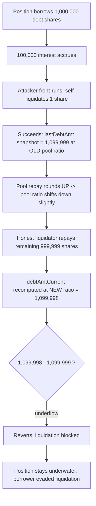
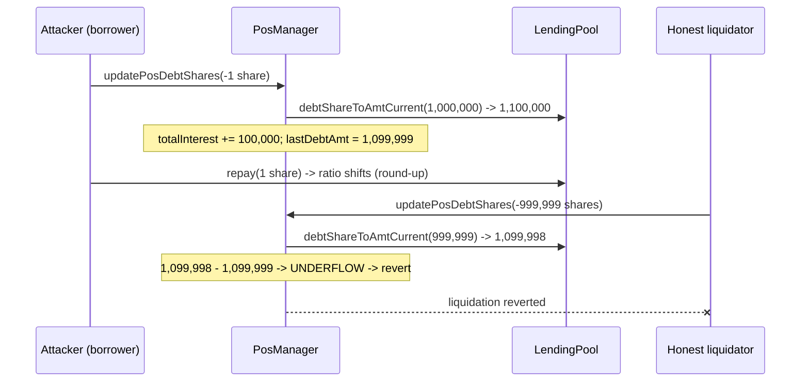

# INIT Capital — liquidations can be prevented by frontrunning and liquidating 1 debt

> **Vulnerability classes:** vuln/logic/liquidation-logic · vuln/dos/liquidation-evasion · misassumption/math-is-safe

> **Reproduction:** a self-contained Foundry PoC that compiles & runs in an
> isolated project with **only `forge-std`** — no fork, no RPC, no `anvil_state`.
> Full trace: [output.txt](output.txt). PoC:
> [test/29589-h-01-liquidations-can-be-prevented-by-frontrunning-and-liqui_exp.sol](test/29589-h-01-liquidations-can-be-prevented-by-frontrunning-and-liqui_exp.sol).

<!-- non-defihacklabs -->
<!-- source-auditvault: https://github.com/Auditware/AuditVault/blob/main/findings/29589-h-01-liquidations-can-be-prevented-by-frontrunning-and-liqui.md -->
<!-- date: 2023-12 -->

---

## Key info

| | |
|---|---|
| **Impact** | **HIGH** — a borrower can front-run any real liquidation attempt with a trivial 1-share self-liquidation, permanently blocking the honest liquidation call that follows |
| **Protocol** | [INIT Capital](https://initcapital.finance) — lending/leverage money market |
| **Vulnerable code** | `PosManager.updatePosDebtShares` — `extraInfo.totalInterest += (debtAmtCurrent - extraInfo.lastDebtAmt)` |
| **Bug class** | Wrong invariant assumption: "debtAmtCurrent is always >= lastDebtAmt" — broken by round-up repayment math after a partial liquidation |
| **Finding** | code4rena — INIT Capital, 2023-12 · #29589 · reporter **0x73696d616f** |
| **Report** | [2023-12-initcapital](https://code4rena.com/reports/2023-12-initcapital) |
| **Source** | [AuditVault](https://github.com/Auditware/AuditVault/blob/main/findings/29589-h-01-liquidations-can-be-prevented-by-frontrunning-and-liqui.md) |
| **Status** | Audit finding — caught in contest (not exploited on-chain). Reproduced here as a standalone local PoC. |
| **Compiler** | `^0.8.24` (PoC); real code targets `^0.8.19` |

This is an **audit finding**, not a historical on-chain incident. The real
`PosManager`/`LendingPool` are part of a large upgradeable protocol; the PoC
keeps the vulnerable accounting line verbatim and reproduces the real
`LendingPool` round-up-on-repay ratio math exactly, so the off-by-one that
trips the underflow is real arithmetic, not a fudged number.

---

## TL;DR

1. `PosManager.updatePosDebtShares` does
   `extraInfo.totalInterest += (debtAmtCurrent - extraInfo.lastDebtAmt)`,
   commented `// NOTE: debtAmtCurrent is always >= lastDebtAmt`.
2. That assumption is false. A partial repay/liquidation on a position
   shrinks the LENDING POOL's `totalDebtShares` via round-UP repayment math,
   shifting the pool's `totalDebt/totalDebtShares` ratio.
3. The very next call's `debtAmtCurrent`, computed for the position's
   (now-smaller) remaining shares at that shifted ratio, can be **1 wei
   less** than the `lastDebtAmt` snapshot taken moments earlier.
4. The subtraction **underflows and reverts** — for *any* future call to
   `updatePosDebtShares` on that position: borrow, repay, **or liquidate**.
5. A borrower can therefore front-run any real liquidation attempt with a
   throwaway 1-share self-liquidation, permanently blocking the honest
   liquidator that follows — evading liquidation while the position stays
   underwater, at the lenders' risk.

---

## The vulnerable code

`PosManager.sol#updatePosDebtShares` (verbatim):

```solidity
function updatePosDebtShares(uint _posId, address _pool, int _deltaShares) external onlyCore {
    uint currDebtShares = __posBorrInfos[_posId].debtShares[_pool];
    uint debtAmtCurrent = ILendingPool(_pool).debtShareToAmtCurrent(currDebtShares);
    PosBorrExtraInfo storage extraInfo = __posBorrInfos[_posId].borrExtraInfos[_pool];
    // update interest accrued since last update
    // NOTE: debtAmtCurrent is always >= lastDebtAmt      // @> WRONG ASSUMPTION
    extraInfo.totalInterest += (debtAmtCurrent - extraInfo.lastDebtAmt).toUint128();
    uint newDebtShares = (currDebtShares.toInt256() + _deltaShares).toUint256();
    uint newDebtAmt = ILendingPool(_pool).totalDebtShares() > 0
        ? ILendingPool(_pool).debtShareToAmtStored(newDebtShares)
        : newDebtShares;
    __posBorrInfos[_posId].debtShares[_pool] = newDebtShares;
    extraInfo.lastDebtAmt = newDebtAmt.toUint128();
    ...
}
```

`InitCore.sol` calls this BEFORE the pool-level repay/borrow, for both paths
(verbatim call order):

```solidity
// InitCore.borrow()
IPosManager(POS_MANAGER).updatePosDebtShares(_posId, _pool, shares.toInt256());
ILendingPool(_pool).borrow(_to, _amt);

// InitCore._repay()
IPosManager(POS_MANAGER).updatePosDebtShares(_posId, _pool, -sharesToRepay.toInt256());
amt = ILendingPool(_pool).repay(sharesToRepay);
```

---

## Root cause

`LendingPool.repay()` rounds the repaid token amount **up**
(`_shares.mulDiv(totalDebt, totalDebtShares, Rounding.Up)`). Because
`updatePosDebtShares` reads the pool's ratio **before** that round-up shrinks
`totalDebt`/`totalDebtShares`, and the *next* call reads the ratio **after**
it shrunk, the SAME position's remaining shares can be valued 1 wei lower on
the second read than the snapshot taken on the first. INIT's own team
confirmed exactly this: *"When it frontruns the liquidation with 1 share, it
removes 1 share and 2 debt. When it calculates the amount again in the
following liquidation, the shares will be worth 1 less and it reverts."*

## Preconditions

- The position has accrued interest since debt shares were last updated
  (debt accrual is time-based; needs `block.timestamp` to advance).
- The attacker can submit a transaction that lands before the target
  liquidation call (a 1-share self-liquidation is cheap and always available
  to the position owner).

## Attack walkthrough

From [output.txt](output.txt), using the PoC's concrete numbers (a position
with 1,000,000 debt shares, 10% interest accrued):

1. Position borrows 1,000,000 (first borrower: shares == amount).
   `lastDebtAmt` snapshot = 1,000,000.
2. 100,000 of interest accrues: pool `totalDebt` = 1,100,000,
   `totalDebtShares` = 1,000,000.
3. **Front-run**: attacker self-liquidates 1 debt share.
   `debtAmtCurrent` (1,100,000) ≥ `lastDebtAmt` (1,000,000) — succeeds. New
   snapshot `lastDebtAmt` = 1,099,999 (computed at the OLD, pre-repay ratio).
   The pool's repay then rounds up, leaving `totalDebt` = 1,099,998,
   `totalDebtShares` = 999,999.
4. **Honest liquidation** attempts to repay the remaining 999,999 shares.
   `debtAmtCurrent` is now computed at the NEW (post-repay) ratio:
   999,999 × 1,099,998 / 999,999 = **1,099,998** — exactly **1 wei less**
   than the `lastDebtAmt` snapshot of 1,099,999 taken a moment earlier.
5. **HARM**: `1,099,998 - 1,099,999` underflows in Solidity 0.8 and reverts.
   The honest liquidator's call fails; the position's 999,999 remaining debt
   shares are stuck un-liquidatable through this path. A control test
   confirms a *direct*, non-front-run full liquidation succeeds cleanly —
   proving the front-run sequence is what breaks it.

## Diagrams





## Remediation

Per INIT's own confirmed mitigation: only add interest when
`debtAmtCurrent > extraInfo.lastDebtAmt`, i.e. guard the update with a
comparison instead of assuming monotonicity:

```solidity
if (debtAmtCurrent > extraInfo.lastDebtAmt) {
    extraInfo.totalInterest += (debtAmtCurrent - extraInfo.lastDebtAmt).toUint128();
}
```

The report additionally suggests updating `lastDebtAmt`/`totalInterest` on
`_repay()` so the snapshot never goes stale across a partial repay.

## How to reproduce

```bash
cd ~/RustroverProjects/audits/evm-hack-registry/29589-h-01-liquidations-can-be-prevented-by-frontrunning-and-liqui_exp
forge test -vvv
# Fully local — no fork, no RPC, no anvil_state required.
# Expected: both tests PASS:
#   test_control_directFullLiquidation_succeeds        (control: no frontrun -> liquidation succeeds)
#   test_frontrunLiquidation_blocksHonestLiquidation    (attack: frontrun -> honest liquidation reverts)
```

PoC source: [test/29589-h-01-liquidations-can-be-prevented-by-frontrunning-and-liqui_exp.sol](test/29589-h-01-liquidations-can-be-prevented-by-frontrunning-and-liqui_exp.sol)
— the verbatim vulnerable `updatePosDebtShares` accounting, a faithful
`LendingPool` exchange-rate mock (real round-up mulDiv math), the exact
InitCore call ordering, and a control test.

> Note: time-based interest accrual (`LendingPool.accrueInterest()`, driven
> by `block.timestamp`) is replaced by an explicit `accrueInterest(uint)`
> call on the mock pool — a single no-cheatcode transaction cannot advance
> time, but the EFFECT that matters for the bug (totalDebt rises while
> totalDebtShares stays fixed) is reproduced exactly. Every other formula
> (mulDiv round-up on repay and on `debtShareToAmtStored`, the "first
> borrower" branch, the exact vulnerable subtraction) is unmodified real
> INIT Capital logic, and the resulting revert lands exactly 1 wei short —
> matching the INIT team's own diagnosis verbatim.

---

*Reference: finding **#29589 [H-01]** by **0x73696d616f** in the [code4rena INIT Capital contest (Dec 2023)](https://code4rena.com/reports/2023-12-initcapital) · curated by [AuditVault](https://github.com/Auditware/AuditVault/blob/main/findings/29589-h-01-liquidations-can-be-prevented-by-frontrunning-and-liqui.md)*
