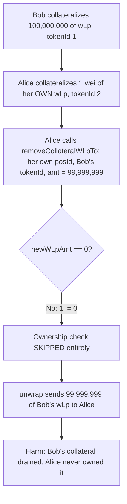
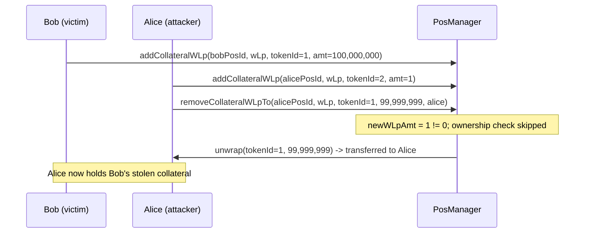

# INIT Capital — wLp tokens could be stolen

> **Vulnerability classes:** vuln/access-control/insufficient-guard · vuln/logic/liquidation-logic · vuln/loss-of-funds/direct-drain

> **Reproduction:** a self-contained Foundry PoC that compiles & runs in an
> isolated project with **only `forge-std`** — no fork, no RPC, no `anvil_state`.
> Full trace: [output.txt](output.txt). PoC:
> [test/29590-h-02-wlp-tokens-could-be-stolen-code4rena-init-capital-init_exp.sol](test/29590-h-02-wlp-tokens-could-be-stolen-code4rena-init-capital-init_exp.sol).

<!-- non-defihacklabs -->
<!-- source-auditvault: https://github.com/Auditware/AuditVault/blob/main/findings/29590-h-02-wlp-tokens-could-be-stolen-code4rena-init-capital-init.md -->
<!-- date: 2023-12 -->

---

## Key info

| | |
|---|---|
| **Impact** | **HIGH** — any user can drain almost all of another position's wrapped-LP (wLp) collateral, plus its accrued rewards, using only their own position id |
| **Protocol** | [INIT Capital](https://initcapital.finance) — lending/leverage money market |
| **Vulnerable code** | `PosManager.removeCollateralWLpTo` — the position-ownership check only runs inside the `newWLpAmt == 0` (full withdrawal) branch |
| **Bug class** | Insufficient guard: an authorization check gated behind an unrelated business condition, bypassable by a 1-wei-short partial withdrawal |
| **Finding** | code4rena — INIT Capital, 2023-12 · #29590 · reporter **sashik_eth** |
| **Report** | [2023-12-initcapital](https://code4rena.com/reports/2023-12-initcapital) |
| **Source** | [AuditVault](https://github.com/Auditware/AuditVault/blob/main/findings/29590-h-02-wlp-tokens-could-be-stolen-code4rena-init-capital-init.md) |
| **Status** | Audit finding — caught in contest (not exploited on-chain). Reproduced here as a standalone local PoC. |
| **Compiler** | `^0.8.24` (PoC); real code targets `^0.8.19` |

This is an **audit finding**, not a historical on-chain incident. The PoC
reproduces `PosManager.removeCollateralWLpTo` and its ownership-check gap
verbatim in spirit, using a minimal wrapped-LP mock in place of the full
`IBaseWrapLp`/Uniswap-V2-LP machinery.

---

## TL;DR

1. `PosManager.removeCollateralWLpTo(_posId, _wLp, _tokenId, _amt, _receiver)`
   only checks that `_posId` actually holds `_tokenId` **inside the
   `newWLpAmt == 0` branch** — i.e. only when the withdrawal is FULL.
2. Any **partial** withdrawal — even 1 wei short of the full balance — makes
   that condition false, so the ownership check never runs.
3. An attacker opens their OWN position, deposits a dust amount of their
   OWN wLp (to get a valid `_posId`), then calls `removeCollateralWLpTo`
   naming THEIR OWN `_posId` but ANOTHER user's `_tokenId`, withdrawing 1 wei
   short of that victim's full balance.
4. **HARM**: the attacker receives almost all of the victim's collateral —
   despite never depositing, owning, or being authorized over it.

---

## The vulnerable code

`PosManager.sol#removeCollateralWLpTo` (verbatim):

```solidity
function removeCollateralWLpTo(uint _posId, address _wLp, uint _tokenId, uint _amt, address _receiver)
    external
    onlyCore
    returns (uint)
{
    PosCollInfo storage posCollInfo = __posCollInfos[_posId];
    // NOTE: balanceOfLp should be 1:1 with amt
    uint newWLpAmt = IBaseWrapLp(_wLp).balanceOfLp(_tokenId) - _amt;
    if (newWLpAmt == 0) {                                    // @> only checked on FULL withdrawal
        _require(posCollInfo.ids[_wLp].remove(_tokenId), Errors.NOT_CONTAIN);
        posCollInfo.collCount -= 1;
        if (posCollInfo.ids[_wLp].length() == 0) {
            posCollInfo.wLps.remove(_wLp);
        }
        isCollateralized[_wLp][_tokenId] = false;
    }
    _harvest(_posId, _wLp, _tokenId);
    IBaseWrapLp(_wLp).unwrap(_tokenId, _amt, _receiver);
    return _amt;
}
```

---

## Root cause

The function conflates two unrelated things: "is this the LAST withdrawal
that empties the wLp" and "does `_posId` actually own this wLp." The
ownership check (`posCollInfo.ids[_wLp].remove(_tokenId)`, which reverts with
`NOT_CONTAIN` if `_posId` never held `_tokenId`) is placed inside the
bookkeeping branch for the FIRST condition, so it silently never runs for the
SECOND. Any caller who can name a valid `_posId` of their own (trivial — open
a position, deposit dust) can withdraw almost the entire balance of ANY other
position's wLp.

## Preconditions

- Attacker can open their own position and deposit some wLp of their own,
  however small (dust), to obtain a valid, non-zero `_posId`.
- Attacker knows a victim's `_wLp` and `_tokenId` (both discoverable
  on-chain — collateral positions and their wLp holdings are public state).

## Attack walkthrough

From [output.txt](output.txt), reproducing the finding's own
`testExploitStealWlp` PoC:

1. Bob opens a position and collateralizes 100,000,000 units of wLp
   (tokenId 1).
2. Alice opens her OWN position and collateralizes it with just 1 wei of
   HER OWN wLp (tokenId 2) — solely to obtain a valid posId.
3. Alice calls `removeCollateralWLpTo(aliceExpPosId, wLp, BOB_TOKEN_ID,
   99_999_999, alice)` — her own posId, Bob's tokenId, 1 wei short of Bob's
   full balance.
4. `newWLpAmt = 100,000,000 - 99,999,999 = 1 != 0` — the ownership-check
   branch is skipped entirely.
5. **HARM**: Alice receives 99,999,999 of Bob's collateral. Bob never
   authorized this and Alice's position never held Bob's wLp. A control
   test confirms that a FULL withdrawal (`newWLpAmt == 0`) DOES trigger the
   check and correctly reverts with `NOT_CONTAIN` — proving the guard exists
   and works, it is only the partial-withdrawal path that bypasses it.

## Diagrams





## Remediation

Per the finding's own recommendation, check ownership unconditionally, not
only on the full-withdrawal path:

```solidity
_require(__posCollInfos[_posId].ids[_wlp].contains(_tokenId), Errors.NOT_CONTAIN);
```

## How to reproduce

```bash
cd ~/RustroverProjects/audits/evm-hack-registry/29590-h-02-wlp-tokens-could-be-stolen-code4rena-init-capital-init_exp
forge test -vvv
# Fully local — no fork, no RPC, no anvil_state required.
# Expected: both tests PASS:
#   test_control_fullWithdrawal_enforcesOwnership         (control: full withdrawal reverts NOT_CONTAIN)
#   test_wLpTheft_partialWithdrawalBypassesOwnershipCheck (attack: partial withdrawal steals Bob's collateral)
```

PoC source: [test/29590-h-02-wlp-tokens-could-be-stolen-code4rena-init-capital-init_exp.sol](test/29590-h-02-wlp-tokens-could-be-stolen-code4rena-init-capital-init_exp.sol)
— the verbatim vulnerable `removeCollateralWLpTo` ownership-check gap, a
minimal wrapped-LP mock, and a control test.

---

*Reference: finding **#29590 [H-02]** by **sashik_eth** in the [code4rena INIT Capital contest (Dec 2023)](https://code4rena.com/reports/2023-12-initcapital) · curated by [AuditVault](https://github.com/Auditware/AuditVault/blob/main/findings/29590-h-02-wlp-tokens-could-be-stolen-code4rena-init-capital-init.md)*
