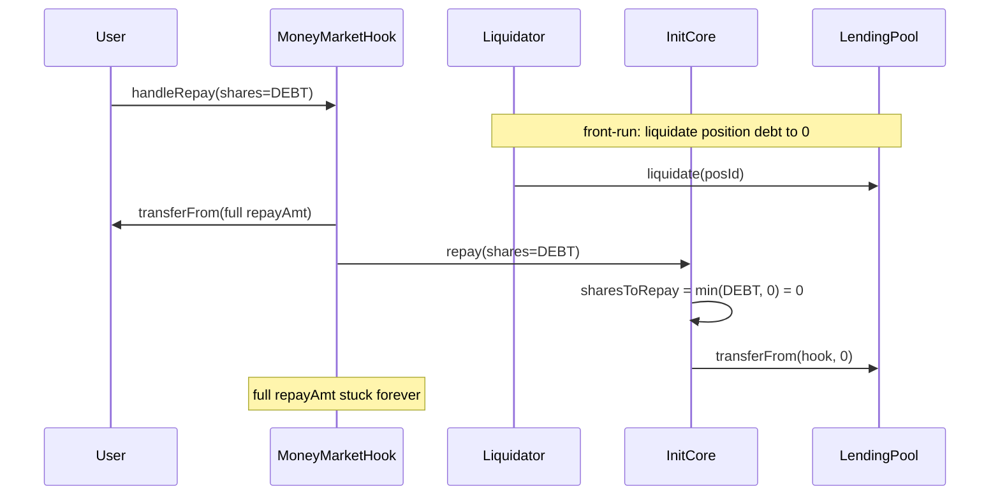

# INIT Capital — MoneyMarketHook#_handleRepay can leave user tokens stuck

> **Vulnerability classes:** vuln/logic/accounting · impact/loss-of-funds/locked-funds · impact/mev/frontrun

> **Reproduction:** a self-contained Foundry PoC that compiles & runs in an
> isolated project with **only `forge-std`** — no fork, no RPC, no `anvil_state`.
> Full trace: [output.txt](output.txt). PoC:
> [test/29591-h-03-handlerepay-of-moneymarkethook-does-not-consider-the-a_exp.sol](test/29591-h-03-handlerepay-of-moneymarkethook-does-not-consider-the-a_exp.sol).

<!-- non-defihacklabs -->
<!-- source-auditvault: https://github.com/Auditware/AuditVault/blob/main/findings/29591-h-03-handlerepay-of-moneymarkethook-does-not-consider-the-a.md -->
<!-- date: 2023-12 -->

---

## Key info

| | |
|---|---|
| **Impact** | **HIGH** — user tokens transferred into MoneyMarketHook for a repay can be permanently stranded when actual position debt is less than the user-supplied share amount (e.g. after a front-running liquidation) |
| **Protocol** | [INIT Capital](https://initcapital.finance) — MoneyMarketHook repay path |
| **Vulnerable code** | `MoneyMarketHook._handleRepay` — computes `repayAmt` from caller-supplied shares only |
| **Bug class** | Missing min(shares, positionDebtShares) before transferFrom into the hook |
| **Finding** | code4rena — INIT Capital, 2023-12 · #29591 · reporter **said** |
| **Report** | [2023-12-initcapital](https://code4rena.com/reports/2023-12-initcapital) |
| **Source** | [AuditVault](https://github.com/Auditware/AuditVault/blob/main/findings/29591-h-03-handlerepay-of-moneymarkethook-does-not-consider-the-a.md) |
| **Status** | Audit finding — caught in contest (not exploited on-chain). Reproduced here as a standalone local PoC. |
| **Compiler** | `^0.8.24` (PoC); real code targets `^0.8.19` |

This is an **audit finding**, not a historical on-chain incident. Sibling INIT Capital
findings from the same contest: #29589, #29590.

---

## TL;DR

1. `MoneyMarketHook._handleRepay` converts the **caller-supplied** `_params[i].shares`
   into `repayAmt` via `debtShareToAmtCurrent` and `transferFrom`s that full amount
   from the user **into the hook**.
2. It never reads the position's **actual** remaining debt shares from PosManager.
3. `InitCore._repay` later silently does `sharesToRepay = min(shares, positionDebtShares)`
   and only pulls that smaller amount out of the hook into the pool.
4. **HARM**: if a liquidator front-runs and zeros the debt, the user's full repay amount
   is pulled into the hook and **none** of it is consumed — tokens stuck with no user
   withdraw path (requires hook upgrade to recover).

---

## The vulnerable code

`MoneyMarketHook.sol#_handleRepay` (verbatim spirit):

```solidity
function _handleRepay(uint _offset, bytes[] memory _data, uint _initPosId, RepayParams[] memory _params)
    internal
    returns (uint, bytes[] memory)
{
    for (uint i; i < _params.length; i = i.uinc()) {
        address uToken = ILendingPool(_params[i].pool).underlyingToken();
        // @> VULN: no min against actual position debt shares
        uint repayAmt = ILendingPool(_params[i].pool).debtShareToAmtCurrent(_params[i].shares);
        _ensureApprove(uToken, repayAmt);
        IERC20(uToken).safeTransferFrom(msg.sender, address(this), repayAmt);
        _data[_offset] =
            abi.encodeWithSelector(IInitCore.repay.selector, _params[i].pool, _params[i].shares, _initPosId);
        _offset = _offset.uinc();
    }
    return (_offset, _data);
}
```

InitCore silently caps:

```solidity
uint positionDebtShares = IPosManager(POS_MANAGER).getPosDebtShares(_posId, _pool);
uint sharesToRepay = _shares < positionDebtShares ? _shares : positionDebtShares;
uint amtToRepay = ILendingPool(_pool).debtShareToAmtCurrent(sharesToRepay);
IERC20(tokenToRepay).safeTransferFrom(msg.sender, _pool, amtToRepay); // msg.sender = hook
```

**Fix:** check provided shares against actual debt shares before the transferFrom
(e.g. `shares = min(params.shares, getPosDebtShares(...))`).

---

## Root cause

The hook is a temporary escrow for the multicall repay path, but it sizes the escrow
from **user intent** rather than **on-chain residual debt**. Any reduction of debt
between the user's intent and InitCore's execution (liquidation, partial repay race)
leaves a non-zero residual balance inside a contract with no public withdraw.

---

## Preconditions

- User constructs a MoneyMarketHook repay for shares ≥ current position debt
  (typically a "repay all" path).
- Position debt can decrease before the hook's multicall executes (liquidator
  front-run is the canonical case).
- Hook has no recovery path for over-pulled underlying without an upgrade.

---

## Attack walkthrough

1. User has position with `DEBT_SHARES` outstanding; prepares to repay all via hook.
2. Liquidator front-runs and liquidates the full debt → `positionDebtShares = 0`.
3. User's hook repay runs: pulls `debtShareToAmtCurrent(DEBT_SHARES)` into the hook.
4. InitCore.repay caps at 0 shares → transfers 0 out of the hook.
5. Full amount remains stuck in the hook; user balance is reduced.

---

## Diagrams



---

## Impact

Concrete fund lock: the user's full intended repay amount is permanently stranded
in MoneyMarketHook. INIT team noted the hook is upgradeable so funds are
recoverable by admin upgrade, but users face a temporary lock and every incident
requires an upgrade — judge kept High given likelihood under liquidation races.

---

## Taxonomy

- `severity/high`
- `impact/mev/frontrun`
- `genome: frozen-funds`, `frontrun`, `frontrun-exposure`, `liquidation-underwater`
- `sector/lending`
- `platform/code4rena`

---

## Sources

- AuditVault finding: https://github.com/Auditware/AuditVault/blob/main/findings/29591-h-03-handlerepay-of-moneymarkethook-does-not-consider-the-a.md
- Report: https://code4rena.com/reports/2023-12-initcapital
- Vulnerable source (audited contest repo): `code-423n4/2023-12-initcapital` @ main —
  `contracts/hook/MoneyMarketHook.sol` (`_handleRepay`), `contracts/core/InitCore.sol` (`_repay`)
