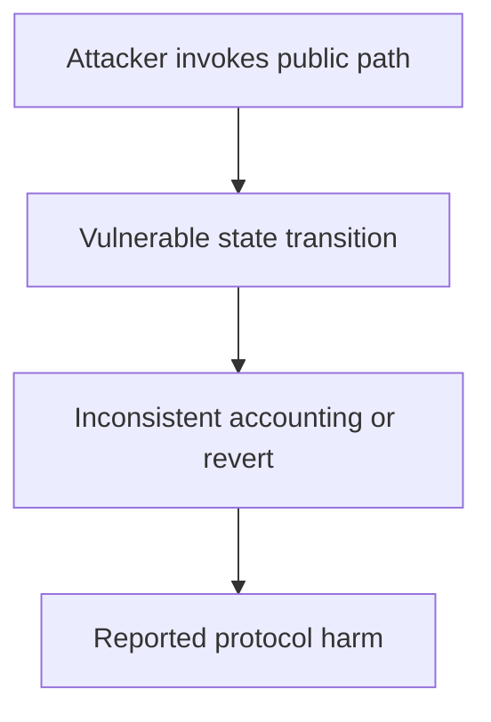

# Mass — low-level call to an empty account falsely succeeds

<!-- non-defihacklabs -->
<!-- source-auditvault: https://github.com/Auditware/AuditVault/blob/main/findings/29664-lack-of-contract-existence-checks-on-low-level-calls-trailof.md -->
<!-- date: 2023-02 -->

> **Vulnerability classes:** vuln/dependency/unsafe-external-call · vuln/input-validation/missing · vuln/logic/wrong-condition

> **Reproduction:** Fully local synthetic; run [forge test](.) and inspect [output.txt](output.txt). The Playground bundle replays the same 29664-low-level-call-missing-existence-check invariant.

## Key info

| Field | Value |
| --- | --- |
| Loss | A wallet can record successful execution while no implementation code ran |
| Vulnerable contract | CallHelper / Proxy (reconstructed) |
| Attacker EOA | 0x1111111111111111111111111111111111111111 (synthetic caller) |
| Attack contract | [Exploit](test/29664-low-level-call-missing-existence-check.sol) |
| Attack tx | Local `Exploit.run()` call (no historical transaction) |
| Chain · block · date | Ethereum · local stub 0x1181d03 · 2023-02 |
| Compiler | Solidity 0.8.35 (pragma ^0.8.24) |
| Bug class | vuln/dependency/unsafe-external-call · vuln/input-validation/missing · vuln/logic/wrong-condition |

## TL;DR

The helper accepts delegatecall success from an account with no code. EVM semantics return true for an empty destination, so the caller observes success without executing the requested payload.

## Background

AuditVault finding [29664-low-level-call-missing-existence-check](https://github.com/Auditware/AuditVault/blob/main/findings/29664-lack-of-contract-existence-checks-on-low-level-calls-trailof.md) is an audit-time issue rather than a historical exploit. This write-up reduces the report to one state transition and keeps the claimed harm assertion executable offline.

## The vulnerable code

The minimized source is explicitly marked **RECONSTRUCTED** and preserves the report's blamed operation with an `@> VULN` marker in [test/29664-low-level-call-missing-existence-check.sol](test/29664-low-level-call-missing-existence-check.sol). It is byte-identical to the Playground synthetic source. No verified production source was available in this local checkout.

## Root cause

functionDelegateCallUnverified omits an extcodesize/code.length check before accepting success.

## Preconditions

The affected protocol path is deployed; the attacker can reach the public operation described in the report. The synthetic removes unrelated integrations while preserving the state and authorization assumptions required for the finding.

## Attack walkthrough

1. delegatecall to 0xBEEF returns true, while code.length remains zero and no state change occurs.
2. The `run()` method requires the broken invariant and sets `confirmed`; the Forge trace records a passing test at [output.txt:355](output.txt).
3. The remediation is to validate the accounting/state transition before accepting the external call or to consume the one-time state.

## Diagrams



## Remediation

Validate external addresses and returned balances before updating state, and make each one-time transition explicit. Add invariant tests covering zero/deflationary/epoch-boundary inputs.

## How to reproduce

```bash
cd 29664-low-level-call-missing-existence-check_exp
forge test -vvv
```

The browser replay uses `scripts/poc-configs/29664-low-level-call-missing-existence-check.mjs` and the same local-deploy `Exploit` contract.

## Sources

- [AuditVault finding](https://github.com/Auditware/AuditVault/blob/main/findings/29664-lack-of-contract-existence-checks-on-low-level-calls-trailof.md)
- [Trail of Bits report](https://github.com/trailofbits/publications/blob/master/reviews/2023-02-nestedfinance-smartcontracts-securityreview.pdf)
- Reduced local source: [test/29664-low-level-call-missing-existence-check.sol](test/29664-low-level-call-missing-existence-check.sol)
- Forge regression: [test/29664-low-level-call-missing-existence-check_exp.sol](test/29664-low-level-call-missing-existence-check_exp.sol)

