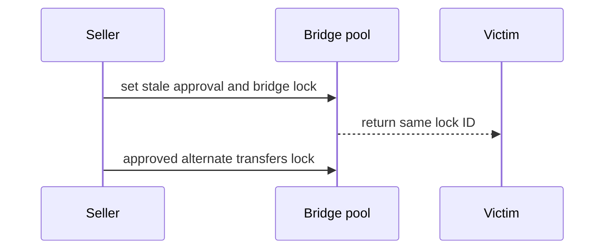

# Stake.Link reSDL bridge — stale approval steals returned lock
<!-- non-defihacklabs -->
<!-- source-auditvault: https://github.com/Auditware/AuditVault/blob/main/findings/29738-a-user-can-steal-an-already-transfered-and-bridged-resdl-loc.md -->
<!-- date: 2023-12 -->
> **Vulnerability classes:** vuln/access-control/missing-check · vuln/bridge/missing-validation
## Key info
| Field | Value |
|---|---|
| Loss | Bridged reSDL lock is stolen from its recipient |
| Chain | Local synthetic |
## TL;DR
`handleOutgoingRESDL` removes the lock owner but does not delete its transfer approval. When the same ID returns to a victim, the stale approved account transfers the lock away.
## The vulnerable code
```solidity
delete ownerOf[id]; /* FIX: delete tokenApprovals[id]; */ // @> VULN: bridge departure deletes owner but preserves stale transfer approval.
```
## Attack walkthrough
The seller pre-approves an alternate account, bridges the lock to a victim, and the alternate account calls `transferFrom` after the lock returns. The local PoC asserts that the attacker is final owner.
## Diagrams

## Remediation
Delete `tokenApprovals[lockId]` when outgoing bridging burns or removes lock ownership.
## Sources
- [AuditVault finding #29738](https://github.com/Auditware/AuditVault/blob/main/findings/29738-a-user-can-steal-an-already-transfered-and-bridged-resdl-loc.md)
- [Stake.Link audited source](https://github.com/Cyfrin/2023-12-stake-link/blob/main/contracts/core/sdlPool/SDLPoolPrimary.sol)
