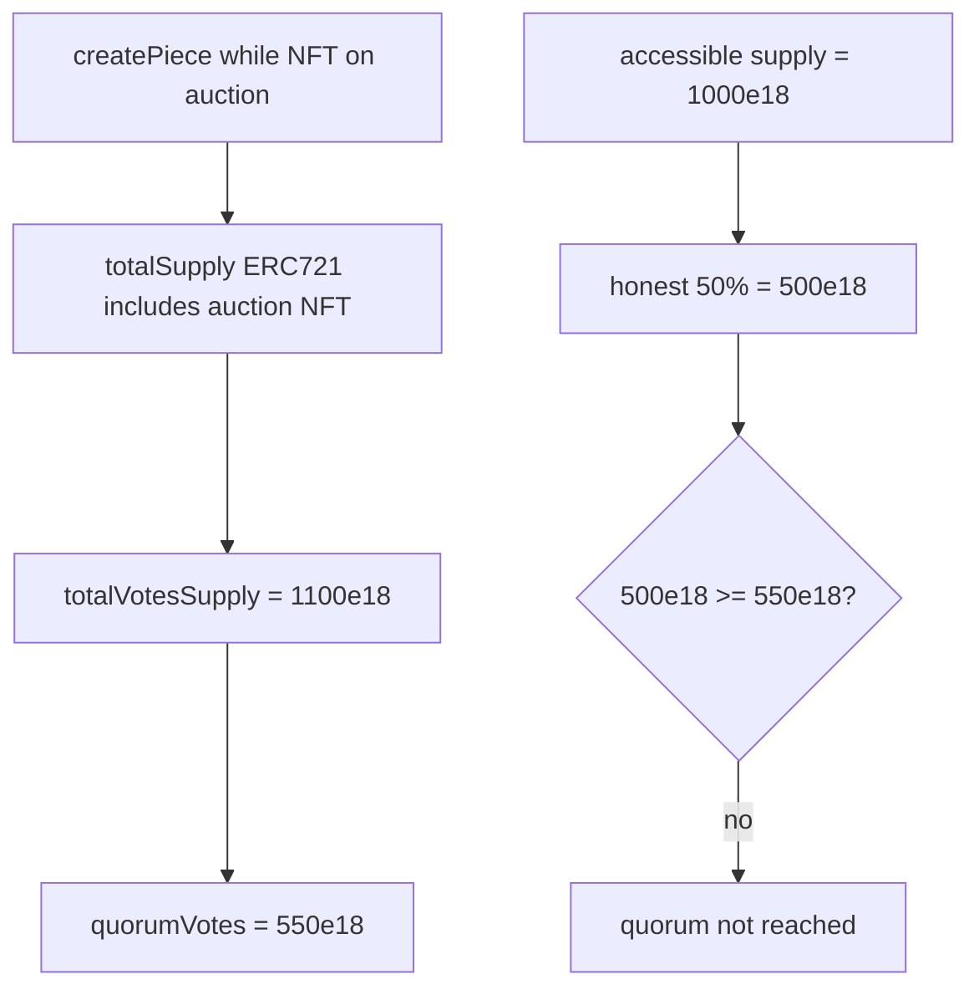

# Revolution / Collective — art-piece quorum inflated by auctioned ERC721 voting power

> **Vulnerability classes:** vuln/governance/quorum-manipulation · vuln/arithmetic/precision-loss · genome: precision-loss · locked-funds · quorum-supply-drift

> **Reproduction:** a self-contained Foundry PoC that compiles & runs in an
> isolated project with **only `forge-std`** — no fork, no RPC, no `anvil_state`.
> Full trace: [output.txt](output.txt). PoC:
> [test/30089-h-02-artpiecetotalvotessupply-and-artpiecequorumvotes-are-in_exp.sol](test/30089-h-02-artpiecetotalvotessupply-and-artpiecequorumvotes-are-in_exp.sol).

<!-- non-defihacklabs -->
<!-- source-auditvault: https://github.com/Auditware/AuditVault/blob/main/findings/30089-h-02-artpiecetotalvotessupply-and-artpiecequorumvotes-are-in.md -->
<!-- date: 2023-12 -->

**AuditVault taxonomy:** `lang/solidity` · `platform/code4rena` · `has/github` · `has/poc` · `severity/high` · `sector/governance` · `sector/nft` · `sector/token` · genome: `precision-loss` · `locked-funds` · `quorum-supply-drift`

---

## Key info

| | |
|---|---|
| **Impact** | **HIGH** — quorum for new art pieces is inflated by inaccessible auction NFT weight |
| **Protocol** | [Revolution Protocol / Collective](https://code4rena.com/reports/2023-12-revolutionprotocol) |
| **Vulnerable code** | `CultureIndex.createPiece` — `totalVotesSupply` / `quorumVotes` snapshot |
| **Bug class** | Quorum supply drift / inaccessible voting power counted |
| **Finding** | Code4rena 2023-12-revolutionprotocol · H-02 · #30089 |
| **Report** | [code4rena.com/reports/2023-12-revolutionprotocol](https://code4rena.com/reports/2023-12-revolutionprotocol) |
| **Source** | [AuditVault](https://github.com/Auditware/AuditVault/blob/main/findings/30089-h-02-artpiecetotalvotessupply-and-artpiecequorumvotes-are-in.md) |
| **Status** | Confirmed (sponsor). Reproduced as standalone local PoC. |
| **Compiler** | `^0.8.24` (PoC) |

---

## TL;DR

1. `createPiece` sets `totalVotesSupply` from `erc20.totalSupply()` + weighted `erc721.totalSupply()`.
2. The ERC721 currently held by `AuctionHouse` is included but **cannot vote** for that piece.
3. `quorumVotes` is computed from the inflated supply.
4. HARM: with 1000e18 accessible and weight-100 NFT on auction, honest 50% (500e18) fails the inflated 550e18 quorum (effective 55%).

---

## The vulnerable code

```solidity
newPiece.totalVotesSupply = _calculateVoteWeight(
    erc20VotingToken.totalSupply(),
    erc721VotingToken.totalSupply() // @> VULN: includes ERC721 on auction
);
newPiece.quorumVotes = (quorumVotesBPS * newPiece.totalVotesSupply) / 10_000; // @> VULN: inflated
```

**Fix:** subtract `erc721VotingToken.balanceOf(auctionHouse)` when snapshotting ERC721 supply.

---

## Root cause

Vote-supply snapshot ignores that the live auction NFT’s voting power is inaccessible: the auction house does not vote, and the eventual buyer is checkpoint-gated against pieces created before they held the token.

---

## Preconditions

- An ERC721 verbs token is mid-auction (balance sits in AuctionHouse) when a new piece is created.
- Impact is largest early (small ERC721 supply, high weight).

---

## Attack walkthrough

1. State: 1000e18 erc20, 1 NFT in AuctionHouse, weight=100, quorum BPS=5000.
2. `createPiece` → `totalVotesSupply=1100e18`, `quorumVotes=550e18`.
3. Accessible supply is still 1000e18.
4. Cast honest half (500e18) → **fails** inflated quorum.

---

## Diagrams



---

## Impact

Pieces created during an auction face a higher-than-configured quorum relative to votes that can actually be cast — unfair vs pieces created when no NFT is locked, and harder to advance to auction especially at launch.

---

## How to reproduce

```bash
cd evm-hack-registry/30089-h-02-artpiecetotalvotessupply-and-artpiecequorumvotes-are-in_exp
forge test -vvv
```

---

## Sources

- [AuditVault finding #30089](https://github.com/Auditware/AuditVault/blob/main/findings/30089-h-02-artpiecetotalvotessupply-and-artpiecequorumvotes-are-in.md)
- [Code4rena report 2023-12-revolutionprotocol](https://code4rena.com/reports/2023-12-revolutionprotocol)
- Reduced from [code-423n4/2023-12-revolutionprotocol@d42cc62b](https://github.com/code-423n4/2023-12-revolutionprotocol/blob/d42cc62b873a1b2b44f57310f9d4bbfdd875e8d6/packages/revolution/src/CultureIndex.sol) `createPiece`
