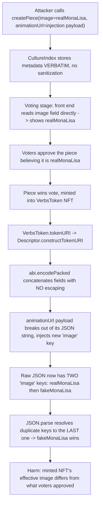
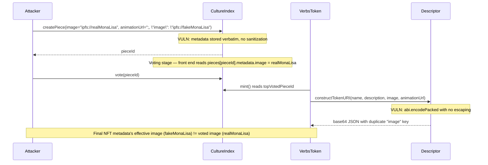

# Collective (Revolution Protocol) — `VerbsToken.tokenURI()` JSON injection via unsanitized `CultureIndex.createPiece()` metadata

> **Vulnerability classes:** vuln/injection/json-injection · vuln/logic/wrong-condition · vuln/nft/metadata-mutability

> **Reproduction:** a self-contained Foundry PoC that compiles & runs in an
> isolated project with **only `forge-std`** — no fork, no RPC, no `anvil_state`.
> Full trace: [output.txt](output.txt). PoC:
> [test/30090-h-03-verbstokentokenuri-is-vulnerable-to-json-injection-atta_exp.sol](test/30090-h-03-verbstokentokenuri-is-vulnerable-to-json-injection-atta_exp.sol).

<!-- non-defihacklabs -->
<!-- source-auditvault: https://github.com/Auditware/AuditVault/blob/main/findings/30090-h-03-verbstokentokenuri-is-vulnerable-to-json-injection-atta.md -->
<!-- date: 2023-12 -->

**AuditVault taxonomy:** `lang/solidity` · `platform/code4rena` · `has/github` · `has/poc` · `severity/high` · `sector/governance` · `sector/nft` · `sector/wallet` · genome: `wrong-condition` · `direct-drain` · `fot-slippage` · `governance-voting-power-snapshot` · `nft-metadata-mutability`

---

## Key info

| | |
|---|---|
| **Impact** | **HIGH** — an attacker submits an art piece whose `image` field is a legitimate IPFS link (so it passes voting review) but whose `animationUrl` field is a JSON-breakout payload; once minted into a `VerbsToken` NFT, the token's metadata resolves to a completely different, attacker-chosen image for any consumer that does a standard `JSON.parse()` |
| **Protocol** | [Collective / Revolution Protocol](https://code4rena.com/reports/2023-12-revolutionprotocol) — `CultureIndex` (art-piece submission/voting) + `VerbsToken`/`Descriptor` (NFT minting/metadata) |
| **Vulnerable code** | `CultureIndex.createPiece()` (no sanitization of `metadata.image`/`metadata.animationUrl`) feeding `Descriptor.constructTokenURI()` (unescaped `abi.encodePacked` JSON concatenation) |
| **Bug class** | JSON injection via unsanitized user input concatenated into a JSON string |
| **Finding** | Code4rena — Revolution Protocol, 2023-12 · #30090 (H-03) · reporter **ZanyBonzy** |
| **Report** | [2023-12-revolutionprotocol](https://code4rena.com/reports/2023-12-revolutionprotocol) |
| **Source** | [AuditVault](https://github.com/Auditware/AuditVault/blob/main/findings/30090-h-03-verbstokentokenuri-is-vulnerable-to-json-injection-atta.md) |
| **Status** | Audit finding — caught in review (not exploited on-chain). Reproduced here as a standalone local PoC. |
| **Compiler** | `^0.8.24` (PoC); real protocol pinned `0.8.22` |

This is an **audit finding**, not a historical on-chain incident. The real
`CultureIndex`/`Descriptor`/`VerbsToken` contracts are reduced to their metadata
submission and JSON-construction logic — everything else (heap-based voting
weight, ERC-20/ERC-721 vote weighting, media-type validation) is stripped since
it does not affect the bug.

---

## TL;DR

1. `CultureIndex.createPiece()` stores an art piece's `ArtPieceMetadata` —
   including `image` and `animationUrl` — **verbatim**, with no check for
   JSON-breaking characters (`"`, `:`, `,`).
2. `Descriptor.constructTokenURI()` concatenates `name`/`description`/`image`/
   `animation_url` directly into a JSON string with `abi.encodePacked` and
   **no escaping**.
3. An attacker submits a piece whose `image` is a real IPFS link (so voters see
   a legitimate piece) but whose `animationUrl` is the payload
   `", "image": "ipfs://fakeMonaLisa` — this breaks out of its own JSON string
   field and injects a brand-new `"image"` key.
4. Once the piece wins the vote and is minted into a `VerbsToken` NFT,
   `tokenURI()` returns a base64 JSON data URI whose raw JSON contains **two**
   `"image"` keys. A standard `JSON.parse()` resolves duplicate keys to the
   **last** occurrence — the attacker's fake image — so the final NFT metadata
   differs from what voters approved.
5. HARM in the PoC: the piece voters approved has `image = "ipfs://realMonaLisa"`;
   the minted NFT's raw JSON contains an injected `"image": "ipfs://fakeMonaLisa"`
   key that a standard JSON.parse would resolve to instead.

---

## The vulnerable code

`CultureIndex.createPiece()` (verbatim, reduced):

```solidity
function createPiece(ArtPieceMetadata calldata metadata, CreatorBps[] calldata creatorArray) public returns (uint256) {
    uint256 pieceId = _currentPieceId++;

    ArtPiece storage newPiece = pieces[pieceId];
    newPiece.pieceId = pieceId;
    // @> VULN: metadata.image / metadata.animationUrl are stored VERBATIM with
    // no check for JSON-breaking characters (", :, ,). CultureIndex.sol:L231.
    newPiece.metadata = metadata;
    newPiece.sponsor = msg.sender;
    ...
    return newPiece.pieceId;
}
```

`Descriptor.constructTokenURI()` (verbatim, reduced):

```solidity
return string(
    abi.encodePacked(
        '{"name":"', name,
        '", "description":"', description,
        '", "image": "', image,
        // @> VULN: animation_url is attacker-controlled and concatenated with
        // NO escaping — a value containing `", "image": "..."` breaks out of
        // its own field and injects a brand-new "image" key. Descriptor.sol:L106.
        '", "animation_url": "', animation_url,
        '"}'
    )
);
```

---

## Root cause

Two contracts each assume the other side handles validation:

- `CultureIndex.createPiece()` never validates `metadata.image` /
  `metadata.animationUrl` against JSON-special characters.
- `Descriptor.constructTokenURI()` never escapes its string inputs before
  concatenating them into a JSON literal.

Because JSON strings are quote-delimited, any unescaped `"` in a field lets an
attacker close the current key/value pair early and open a **new** key/value
pair — effectively injecting arbitrary JSON structure into the final document.
Since `JSON.parse()` (per the ECMA-262 spec, and every mainstream
implementation) resolves duplicate object keys to the **last** occurrence, an
injected `"image"` key placed after the real one silently wins.

## Preconditions

- Anyone can call `createPiece()` — no special role required.
- The attacker controls the full `ArtPieceMetadata` at submission time,
  including `animationUrl`, which is not displayed as prominently to voters as
  `image` (or the front end may not render it at all during voting).
- The piece must win enough votes to be minted (a purely social/economic
  precondition — not a code-level guard).

## Attack walkthrough

From [output.txt](output.txt):

1. Attacker calls `createPiece()` with `image = "ipfs://realMonaLisa"` (a real,
   verifiable art piece) and `animationUrl = '", "image": "ipfs://fakeMonaLisa'`
   (the injection payload).
2. During voting, the front end reads `image` directly from
   `CultureIndex.pieces[pieceId].metadata.image` — this correctly shows
   `ipfs://realMonaLisa`, so voters approve the piece they believe they are
   voting on.
3. The piece wins the vote and is minted into a `VerbsToken` NFT.
4. `VerbsToken.tokenURI()` calls `Descriptor.constructTokenURI()`, producing a
   base64 JSON data URI. The underlying raw JSON is:
   ```json
   {"name":"Mona Lisa", "description":"A renowned painting by Leonardo da Vinci", "image": "ipfs://realMonaLisa", "animation_url": "", "image": "ipfs://fakeMonaLisa"}
   ```
5. **HARM:** the raw JSON contains **two** `"image"` keys. Any consumer using
   standard `JSON.parse()` (which resolves duplicate keys to the last
   occurrence) reads `image = "ipfs://fakeMonaLisa"` — a completely different
   art piece from the one voters approved. A control test confirms an honest
   piece (no injection payload) round-trips cleanly with a single `"image"`
   key, isolating the missing sanitization/escaping as the defect.

## Diagrams





## Impact

- **Bait-and-switch on NFT metadata**: the art piece users vote on can differ
  from the art piece ultimately reflected in the minted NFT, undermining the
  core promise of the voting mechanism.
- **Reputational/legal risk**: the injected image/animation can point to
  arbitrary content (including illegal or offensive material) hosted outside
  the protocol's control, associated with a legitimately-voted-on NFT.
- **Front-end code-execution risk** (noted in the original report): if a
  front end naively `eval()`s or otherwise unsafely processes the decoded
  metadata rather than using `JSON.parse()`, this could enable further attacks
  against users' connected wallets. This PoC focuses on the metadata-integrity
  harm, which is exploitable regardless of front-end implementation.

## Remediation

Per the report: sanitize `image` / `animationUrl` (and any other
free-text metadata fields) using a JSON-safe sanitizer such as the
[OWASP JSON Sanitizer](https://github.com/OWASP/json-sanitizer) before
persisting them, or escape embedded quotes/backslashes when constructing the
JSON string in `Descriptor.constructTokenURI()`.

## How to reproduce

```bash
cd ~/RustroverProjects/audits/evm-hack-registry/30090-h-03-verbstokentokenuri-is-vulnerable-to-json-injection-atta_exp
forge test -vvv
# Fully local — no fork, no RPC, no anvil_state required.
# Expected: both tests PASS:
#   test_exploit                    (poisoned piece: injected fake image lands in minted NFT metadata)
#   test_honestPiece_noInjection    (control: an honest piece round-trips with no injection)
```

PoC source: [test/30090-h-03-verbstokentokenuri-is-vulnerable-to-json-injection-atta_exp.sol](test/30090-h-03-verbstokentokenuri-is-vulnerable-to-json-injection-atta_exp.sol)
— the verbatim vulnerable `createPiece()`/`constructTokenURI()` reductions,
plus the attacker orchestration and a control test.

> Note: `CultureIndex`'s vote-weight bookkeeping (ERC-20/ERC-721 snapshot,
> max-heap ordering) and `Descriptor`'s trait-rendering are stubbed/simplified
> because they do not affect the bug. The blamed lines — the unsanitized
> `metadata` write in `createPiece()` and the unescaped concatenation in
> `constructTokenURI()` — are faithful to the finding.

---

*Reference: finding **#30090 (H-03)** by **ZanyBonzy** in the [Code4rena Revolution Protocol review (Dec 2023)](https://code4rena.com/reports/2023-12-revolutionprotocol) · curated by [AuditVault](https://github.com/Auditware/AuditVault/blob/main/findings/30090-h-03-verbstokentokenuri-is-vulnerable-to-json-injection-atta.md)*
