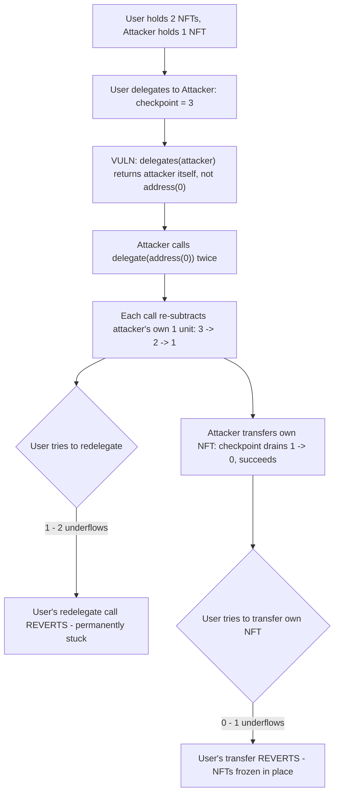
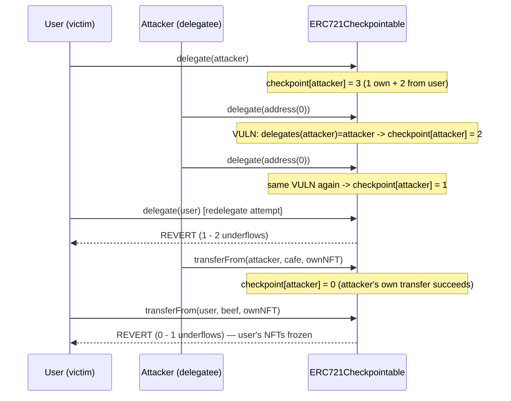

# Collective (Revolution Protocol) — malicious delegatees can permanently block delegators from redelegating or transferring their NFTs

> **Vulnerability classes:** vuln/logic/wrong-condition · vuln/governance/vote-delegation-loop · vuln/dos/permanent-freeze

> **Reproduction:** a self-contained Foundry PoC that compiles & runs in an
> isolated project with **only `forge-std`** — no fork, no RPC, no `anvil_state`.
> Full trace: [output.txt](output.txt). PoC:
> [test/30091-h-04-malicious-delegatees-can-block-delegators-from-redelega_exp.sol](test/30091-h-04-malicious-delegatees-can-block-delegators-from-redelega_exp.sol).

<!-- non-defihacklabs -->
<!-- source-auditvault: https://github.com/Auditware/AuditVault/blob/main/findings/30091-h-04-malicious-delegatees-can-block-delegators-from-redelega.md -->
<!-- date: 2023-12 -->

**AuditVault taxonomy:** `lang/solidity` · `platform/code4rena` · `has/github` · `has/poc` · `severity/high` · `sector/governance` · `sector/nft` · `sector/staking` · genome: `upgradeable-contract` · `variant` · `permanent` · `integer-bounds` · `upgrade-safety` · `vote-delegation-loop`

---

## Key info

| | |
|---|---|
| **Impact** | **HIGH** — if user X delegates their votes to Y, Y can call `delegate(address(0))` twice (at no cost to themselves) to permanently block X from redelegating their votes OR transferring their own NFTs, ever |
| **Protocol** | [Collective / Revolution Protocol](https://code4rena.com/reports/2023-12-revolutionprotocol) — `VotesUpgradeable` + `ERC721CheckpointableUpgradeable` (vote delegation) |
| **Vulnerable code** | `VotesUpgradeable.delegates()` (convenience change vs. upstream OpenZeppelin) combined with `VotesUpgradeable._moveDelegateVotes()` |
| **Bug class** | Logic error: a "convenience" behavior change breaks an implicit invariant the surrounding arithmetic depends on |
| **Finding** | Code4rena — Revolution Protocol, 2023-12 · #30091 (H-04) · reporter **0xDING99YA** |
| **Report** | [2023-12-revolutionprotocol](https://code4rena.com/reports/2023-12-revolutionprotocol) |
| **Source** | [AuditVault](https://github.com/Auditware/AuditVault/blob/main/findings/30091-h-04-malicious-delegatees-can-block-delegators-from-redelega.md) |
| **Status** | Audit finding — caught in review (not exploited on-chain); protocol shipped a fix. Reproduced here as a standalone local PoC. |
| **Compiler** | `^0.8.24` (PoC); real protocol pinned `0.8.22` |

This is an **audit finding**, not a historical on-chain incident. The real
`VotesUpgradeable`/`ERC721CheckpointableUpgradeable` contracts are reduced to a
minimal `Votes` base + `ERC721Checkpointable` token — checkpoint history
(array-based snapshots) is collapsed to a single current-value mapping, which
does not affect the bug.

---

## TL;DR

1. OpenZeppelin's original `Votes.delegates(account)` returns
   `$._delegatee[account]` verbatim — including `address(0)` when the account
   never delegated.
2. Revolution Protocol's `VotesUpgradeable.delegates()` instead returns
   `account` itself as a "convenience" so users don't have to self-delegate to
   vote:
   ```diff
   function delegates(address account) public view virtual returns (address) {
   -        return $._delegatee[account];
   +        return $._delegatee[account] == address(0) ? account : $._delegatee[account];
   ```
3. `_delegate(account, delegatee)` calls
   `_moveDelegateVotes(delegates(account), delegatee, units)`. In the original
   implementation, once an account's delegatee is `address(0)`, `delegates()`
   keeps returning `address(0)` forever, so repeated no-op delegations to
   `address(0)` are safely ignored.
4. With the patched `delegates()`, once `_delegatee[account] == address(0)`,
   `delegates(account)` returns `account` itself **every time** — so calling
   `delegate(address(0))` repeatedly keeps resolving `oldDelegate = account`
   and keeps subtracting `account`'s own voting units from its checkpoint on
   **every** call, even though nothing about the account's balance changed.
5. If someone else has delegated **to** that account, their votes live in the
   **same** checkpoint slot. Repeated no-op `delegate(address(0))` calls by the
   delegatee drain that shared slot and eventually underflow it — permanently
   blocking the original delegator from redelegating or transferring their own
   tokens (both operations revert with an arithmetic underflow).
6. HARM in the PoC: a user delegates 2 NFTs' worth of votes to an attacker; the
   attacker calls `delegate(address(0))` twice; the user's subsequent
   redelegation attempt AND NFT transfer attempt both revert, while the
   attacker moves their own NFT away freely and loses nothing.

---

## The vulnerable code

`VotesUpgradeable.delegates()` (verbatim, reduced):

```solidity
function delegates(address account) public view virtual returns (address) {
    // @> VULN: returns `account` itself (instead of address(0), the original
    // OpenZeppelin behavior) once the account has never explicitly delegated
    // OR has delegated to address(0). VotesUpgradeable.sol:L166.
    return _delegatee[account] == address(0) ? account : _delegatee[account];
}
```

`VotesUpgradeable._moveDelegateVotes()` (verbatim, reduced):

```solidity
function _moveDelegateVotes(address from, address to, uint256 amount) private {
    if (from != to && amount > 0) {
        if (from != address(0)) {
            uint256 oldValue = _delegateVotes[from];
            // @> VULN: unconditional subtraction. Safe ONLY if repeated no-op
            // delegations by the SAME account can never resolve `from` back to
            // that account more than once — which delegates() above violates.
            _delegateVotes[from] = oldValue - amount; // VotesUpgradeable.sol:L239
            ...
        }
        if (to != address(0)) { ... }
    }
}
```

---

## Root cause

The "convenience" change to `delegates()` breaks an invariant the surrounding
arithmetic implicitly depends on: **once an account's stored delegatee is
`address(0)`, calling `delegate(address(0))` again must be a true no-op.**

In OpenZeppelin's original code this holds because `delegates()` keeps
returning `address(0)`, and `_moveDelegateVotes` explicitly skips the `from`
side when it is `address(0)`. Revolution Protocol's patched `delegates()`
instead substitutes the account's own address, so every repeat
`delegate(address(0))` call is treated as "the account is moving its OWN
voting units away from itself" — subtracting them from its checkpoint again,
even though the account's balance never changed and it never gained new
units to justify a second subtraction.

Because the checkpoint slot is shared with anyone who delegated **to** that
account, this "free" repeated self-inflicted subtraction eventually drains —
and can underflow — votes that actually belong to someone else.

## Preconditions

- User X delegates their votes to Y (an ordinary, expected action — delegation
  is a core feature of the protocol).
- Y calls `delegate(address(0))` **twice** (or more) — a permissionless action
  costing only gas; Y does not need to hold anything beyond their own existing
  balance, and loses nothing by doing this.

## Attack walkthrough

From [output.txt](output.txt):

1. User holds 2 NFTs (2 voting units), attacker holds 1 NFT (1 voting unit).
2. User delegates to attacker: `getVotes(attacker) == 3` (1 own + 2 delegated),
   `getVotes(user) == 0`.
3. Attacker calls `delegate(address(0))` twice. Each call resolves
   `oldDelegate = attacker` (the VULN) and subtracts the attacker's own 1
   voting unit from the shared checkpoint again: `3 → 2 → 1`.
4. **HARM #1:** the user tries to redelegate (`delegate(user)`). This
   subtracts the user's 2 voting units from the drained checkpoint (currently
   1): `1 - 2` underflows → **reverts**. The user is now permanently stuck
   delegating to the attacker.
5. The attacker transfers their own NFT away — this only ever touches the
   attacker's own 1 voting unit, draining the checkpoint further to 0, and
   succeeds (the attacker loses nothing).
6. **HARM #2:** the user tries to transfer one of their own NFTs. The transfer
   hook runs the same `_moveDelegateVotes` logic, subtracting 1 from the
   now-zero checkpoint: `0 - 1` underflows → **reverts**. The user's NFTs are
   now frozen — they can neither redelegate their votes nor move their own
   tokens. A control test confirms that without a malicious delegatee spamming
   `delegate(address(0))`, a user can always freely redelegate and transfer.

## Diagrams





## Impact

- **Permanent, irrecoverable loss of control**: once trapped, the victim
  cannot redelegate their voting power away from the malicious delegatee, ever.
- **Frozen NFTs**: the victim also cannot transfer, sell, or otherwise move
  their own tokens — the same underflow blocks `transferFrom`.
- **Zero cost to the attacker**: the attacker spends only the gas for two
  `delegate(address(0))` calls and loses nothing — they keep their own tokens
  and can move them freely at any time.
- **Requires only that the victim delegate to the attacker once** — an
  ordinary, protocol-encouraged action. No approval, no funds transferred to
  the attacker, no special role.

## Remediation

Per the report (adopted by the protocol, see the
[fix commit](https://github.com/collectivexyz/revolution-protocol/commit/ef2a492e93e683f5d9d8c77cbcf3622bb936522a)):
do not allow users to delegate to `address(0)`.

## How to reproduce

```bash
cd ~/RustroverProjects/audits/evm-hack-registry/30091-h-04-malicious-delegatees-can-block-delegators-from-redelega_exp
forge test -vvv
# Fully local — no fork, no RPC, no anvil_state required.
# Expected: all three tests PASS:
#   test_exploit                                          (self-contained Exploit: user trapped, attacker free)
#   test_delegateeCanBlockDelegatorFromRedelegating_EOA   (EOA rebuild mirroring the finding's own PoC)
#   test_control_normalRedelegateWorks                    (control: without a malicious delegatee, redelegation/transfer both work)
```

PoC source: [test/30091-h-04-malicious-delegatees-can-block-delegators-from-redelega_exp.sol](test/30091-h-04-malicious-delegatees-can-block-delegators-from-redelega_exp.sol)
— the verbatim vulnerable `delegates()`/`_moveDelegateVotes()` reductions,
plus the user/attacker orchestration and a control test.

> Note: checkpoint history (the real contract stores an array of
> timestamped snapshots per account) is collapsed to a single current-value
> mapping — irrelevant to this bug, which is about the arithmetic performed on
> a SINGLE mutation, not about historical lookups. The blamed lines — the
> patched `delegates()` and the unconditional subtraction in
> `_moveDelegateVotes()` — are faithful to the finding.

---

*Reference: finding **#30091 (H-04)** by **0xDING99YA** in the [Code4rena Revolution Protocol review (Dec 2023)](https://code4rena.com/reports/2023-12-revolutionprotocol) · curated by [AuditVault](https://github.com/Auditware/AuditVault/blob/main/findings/30091-h-04-malicious-delegatees-can-block-delegators-from-redelega.md)*
