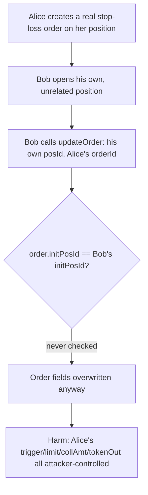
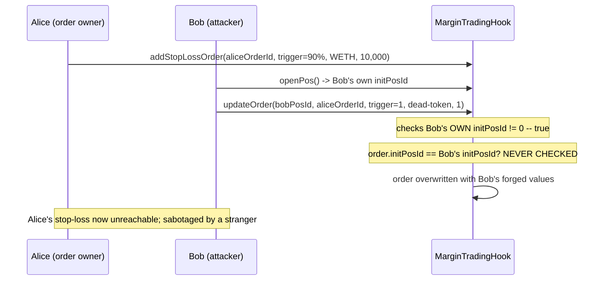

# INIT Capital — MarginTradingHook#updateOrder lacks access control

> **Vulnerability classes:** vuln/access-control/missing-modifier · vuln/logic/order-management · impact/griefing

> **Reproduction:** a self-contained Foundry PoC that compiles & runs in an
> isolated project with **only `forge-std`** — no fork, no RPC, no `anvil_state`.
> Full trace: [output.txt](output.txt). PoC:
> [test/30257-h-01-margintradinghookupdateorder-lacks-access-control-code4_exp.sol](test/30257-h-01-margintradinghookupdateorder-lacks-access-control-code4_exp.sol).

<!-- non-defihacklabs -->
<!-- source-auditvault: https://github.com/Auditware/AuditVault/blob/main/findings/30257-h-01-margintradinghookupdateorder-lacks-access-control-code4.md -->
<!-- date: 2024-01 -->

---

## Key info

| | |
|---|---|
| **Impact** | **HIGH** — any user who owns any position can rewrite the trigger price, limit price, collateral amount, and payout token of ANY other user's active stop-loss/take-profit order |
| **Protocol** | [INIT Capital](https://initcapital.finance) — margin trading hook (stop-loss / take-profit orders) |
| **Vulnerable code** | `MarginTradingHook.updateOrder` — missing `order.initPosId == initPosId` check |
| **Bug class** | Missing access control: a sibling function (`cancelOrder`) performs the exact check that `updateOrder` omits |
| **Finding** | code4rena — INIT Capital (invitational), 2024-01 · #30257 · reporter **sashik_eth** |
| **Report** | [2024-01-init-capital-invitational](https://code4rena.com/reports/2024-01-init-capital-invitational) |
| **Source** | [AuditVault](https://github.com/Auditware/AuditVault/blob/main/findings/30257-h-01-margintradinghookupdateorder-lacks-access-control-code4.md) |
| **Status** | Audit finding — caught in contest (not exploited on-chain). Reproduced here as a standalone local PoC. |
| **Compiler** | `^0.8.24` (PoC); real code targets `^0.8.19` |

This is an **audit finding**, not a historical on-chain incident. This is a
LATER, separate INIT Capital contest (2024-01, invitational) from a
different codebase/commit than #29589/#29590 above — the PoC reproduces
`MarginTradingHook.updateOrder` and its sibling `cancelOrder` verbatim in
spirit.

---

## TL;DR

1. `MarginTradingHook.updateOrder(_posId, _orderId, ...)` resolves the
   CALLER's own `initPosId` from `_posId` and checks only that it is
   non-zero (that the caller owns SOME position).
2. It never checks that `_orderId` actually belongs to that position
   (`order.initPosId == initPosId`) — unlike `cancelOrder`, which performs
   exactly this check.
3. Any user who owns ANY position — even one totally unrelated to the
   target order — can call `updateOrder` naming their own `_posId` and
   someone else's `_orderId`.
4. **HARM**: the caller silently rewrites the target order's trigger price,
   limit price, collateral amount, and payout token — e.g. setting an
   unreachable trigger so a victim's stop-loss protection never fires, or
   redirecting the payout to a worthless token.

---

## The vulnerable code

`MarginTradingHook.sol#updateOrder` (verbatim):

```solidity
function updateOrder(
    uint _posId,
    uint _orderId,
    uint _triggerPrice_e36,
    address _tokenOut,
    uint _limitPrice_e36,
    uint _collAmt
) external {
    _require(_collAmt != 0, Errors.ZERO_VALUE);
    Order storage order = __orders[_orderId];
    _require(order.status == OrderStatus.Active, Errors.INVALID_INPUT);
    uint initPosId = initPosIds[msg.sender][_posId];
    _require(initPosId != 0, Errors.POSITION_NOT_FOUND);
    // @> MISSING: _require(order.initPosId == initPosId, Errors.INVALID_INPUT);

    order.triggerPrice_e36 = _triggerPrice_e36;
    order.limitPrice_e36 = _limitPrice_e36;
    order.collAmt = _collAmt;
    order.tokenOut = _tokenOut;
    emit UpdateOrder(initPosId, _orderId, _tokenOut, _triggerPrice_e36, _limitPrice_e36, _collAmt);
}
```

Compare its sibling `cancelOrder`, which DOES have the check (verbatim):

```solidity
function cancelOrder(uint _posId, uint _orderId) external {
    uint initPosId = initPosIds[msg.sender][_posId];
    _require(initPosId != 0, Errors.POSITION_NOT_FOUND);
    Order storage order = __orders[_orderId];
    _require(order.initPosId == initPosId, Errors.INVALID_INPUT);   // @> the check updateOrder is missing
    _require(order.status == OrderStatus.Active, Errors.INVALID_INPUT);
    order.status = OrderStatus.Cancelled;
    emit CancelOrder(initPosId, _orderId);
}
```

---

## Root cause

`updateOrder` validates "does the caller own a position" but never
cross-checks that against "does the ORDER belong to that position." Since
`_orderId` is a global identifier unrelated to `_posId`, any caller who
passes the first (trivially satisfiable) check can act on ANY order in the
system.

## Preconditions

- Attacker owns at least one position of their own (any position, unrelated
  to the target).
- Target order is `Active` (not yet filled or cancelled).

## Attack walkthrough

From [output.txt](output.txt), reproducing the finding's own
`testUpdateNotOwnerOrder` PoC:

1. Alice opens her position and creates a real stop-loss order: trigger 90%
   of mark price, limit 89%, 10,000 collateral, payout in WETH.
2. Bob opens his OWN, completely unrelated position.
3. Bob calls `updateOrder(bobPosId, aliceOrderId, ...)` — his own `_posId`
   (which resolves to HIS OWN `initPosId`) together with Alice's `orderId`.
4. `updateOrder` checks only that Bob's own `initPosId != 0` — true — and
   never checks that Alice's order actually belongs to Bob's position.
5. **HARM**: Alice's order now has an unreachable trigger price (1 wei),
   a worthless payout token, and a collateral amount of 1 — her stop-loss
   protection is sabotaged, entirely by a stranger who never touched her
   position. A control test confirms `cancelOrder` correctly REJECTS the
   same cross-ownership attempt — proving the guard exists elsewhere in the
   very same contract and was simply omitted from `updateOrder`.

## Diagrams





## Remediation

Per the finding's own recommendation, mirror `cancelOrder`'s check:

```solidity
_require(order.initPosId == initPosId, Errors.INVALID_INPUT);
```

## How to reproduce

```bash
cd ~/RustroverProjects/audits/evm-hack-registry/30257-h-01-margintradinghookupdateorder-lacks-access-control-code4_exp
forge test -vvv
# Fully local — no fork, no RPC, no anvil_state required.
# Expected: both tests PASS:
#   test_control_cancelOrder_enforcesOwnership   (control: cancelOrder rejects cross-ownership)
#   test_updateOrder_lacksAccessControl          (attack: updateOrder allows it)
```

PoC source: [test/30257-h-01-margintradinghookupdateorder-lacks-access-control-code4_exp.sol](test/30257-h-01-margintradinghookupdateorder-lacks-access-control-code4_exp.sol)
— the verbatim vulnerable `updateOrder`, its sibling `cancelOrder` (control),
and two `UserWallet` helper contracts standing in for Alice and Bob.

---

*Reference: finding **#30257 [H-01]** by **sashik_eth** in the [code4rena INIT Capital invitational contest (Jan 2024)](https://code4rena.com/reports/2024-01-init-capital-invitational) · curated by [AuditVault](https://github.com/Auditware/AuditVault/blob/main/findings/30257-h-01-margintradinghookupdateorder-lacks-access-control-code4.md)*
