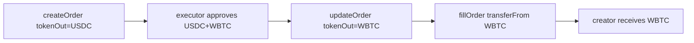

# INIT Capital — Order creator can update tokenOut to arbitrary token

> **Vulnerability classes:** vuln/logic/order-management · impact/mev/frontrun · impact/loss-of-funds/direct-drain

> **Reproduction:** a self-contained Foundry PoC that compiles & runs in an
> isolated project with **only `forge-std`** — no fork, no RPC, no `anvil_state`.
> Full trace: [output.txt](output.txt). PoC:
> [test/30258-h-02-orders-creator-can-update-tokenout-to-arbitrary-token-c_exp.sol](test/30258-h-02-orders-creator-can-update-tokenout-to-arbitrary-token-c_exp.sol).

<!-- non-defihacklabs -->
<!-- source-auditvault: https://github.com/Auditware/AuditVault/blob/main/findings/30258-h-02-orders-creator-can-update-tokenout-to-arbitrary-token-c.md -->
<!-- date: 2024-01 -->

---

## Key info

| | |
|---|---|
| **Impact** | **HIGH** — order creator can front-run fillOrder and rewrite `tokenOut` to any high-value token the executor has approved the hook to spend |
| **Protocol** | [INIT Capital](https://initcapital.finance) — MarginTradingHook stop-loss / take-profit orders |
| **Vulnerable code** | `MarginTradingHook.updateOrder` — assigns `order.tokenOut = _tokenOut` with no base/quote validation |
| **Bug class** | Missing invariant re-check on update that exists at create time |
| **Finding** | code4rena — INIT Capital invitational, 2024-01 · #30258 · reporter **said** |
| **Report** | [2024-01-init-capital-invitational](https://code4rena.com/reports/2024-01-init-capital-invitational) |
| **Source** | [AuditVault](https://github.com/Auditware/AuditVault/blob/main/findings/30258-h-02-orders-creator-can-update-tokenout-to-arbitrary-token-c.md) |
| **Status** | Audit finding — confirmed by INIT. Reproduced as a standalone local PoC. |
| **Compiler** | `^0.8.24` (PoC) |

Sibling finding from the same invitational: #30257 (updateOrder access control), #30259 (limitPrice front-run).

---

## TL;DR

1. `createOrder` enforces `tokenOut ∈ {baseAsset, quoteAsset}`.
2. `updateOrder` rewrites `order.tokenOut` with **no** such check.
3. Executors commonly pre-approve the hook for many tokens to fill diverse orders.
4. **HARM**: creator front-runs fillOrder, sets tokenOut to a high-value approved token,
   fillOrder `transferFrom`s that token from the executor to the creator.

---

## The vulnerable code

```solidity
function updateOrder(
    uint _posId,
    uint _orderId,
    uint _triggerPrice_e36,
    address _tokenOut,
    uint _limitPrice_e36,
    uint _collAmt
) external {
    _require(_collAmt != 0, Errors.ZERO_VALUE);
    Order storage order = __orders[_orderId];
    _require(order.status == OrderStatus.Active, Errors.INVALID_INPUT);
    uint initPosId = initPosIds[msg.sender][_posId];
    _require(initPosId != 0, Errors.POSITION_NOT_FOUND);
    MarginPos memory marginPos = __marginPositions[initPosId];
    uint collAmt = IPosManager(POS_MANAGER).getCollAmt(initPosId, marginPos.collPool);
    _require(_collAmt <= collAmt, Errors.INPUT_TOO_HIGH);
    // @> MISSING: _require(_tokenOut == marginPos.baseAsset || _tokenOut == marginPos.quoteAsset, ...);

    order.triggerPrice_e36 = _triggerPrice_e36;
    order.limitPrice_e36 = _limitPrice_e36;
    order.collAmt = _collAmt;
    order.tokenOut = _tokenOut; // @> VULN
}
```

**Fix:**

```diff
+       _require(_tokenOut == marginPos.baseAsset || _tokenOut == marginPos.quoteAsset, Errors.INVALID_INPUT);
        order.tokenOut = _tokenOut;
```

---

## Root cause

Create-time invariants on order shape are not re-enforced on update. `tokenOut` is
trusted by fillOrder as the asset the executor must pay; mutating it after creation
changes which approved allowance is burned.

---

## Preconditions

- Executor has approved the hook for a high-value token outside the position's pair
  (common for multi-order bots).
- Order is Active and creator can call updateOrder (own position).
- fillOrder is pending in the mempool (or creator can time the rewrite).

---

## Attack walkthrough

1. Creator opens a WETH/USDC position and creates a valid order with `tokenOut = USDC`.
2. Executor holds and approves both USDC and WBTC to the hook.
3. Creator front-runs: `updateOrder(..., tokenOut = WBTC, ...)`.
4. Executor's fillOrder pulls `amtOut` of **WBTC** to the creator.
5. Executor's USDC is untouched; WBTC is stolen.

---

## Diagrams



---

## Impact

Direct theft of executor inventory whenever the hook holds multi-token approvals.
Severity raised to High in contest: multi-token executor approvals are common practice.

---

## Taxonomy

- `severity/high`
- `impact/mev/frontrun`
- `genome: wrong-condition`, `frontrun`, `specific-token-type`, `variant`, `frontrun-exposure`
- `sector/lending`
- `platform/code4rena`

---

## Sources

- AuditVault finding: https://github.com/Auditware/AuditVault/blob/main/findings/30258-h-02-orders-creator-can-update-tokenout-to-arbitrary-token-c.md
- Report: https://code4rena.com/reports/2024-01-init-capital-invitational
- Vulnerable source: `code-423n4/2024-01-init-capital-invitational` @ main —
  `contracts/hook/MarginTradingHook.sol#updateOrder` (L504–L526)
