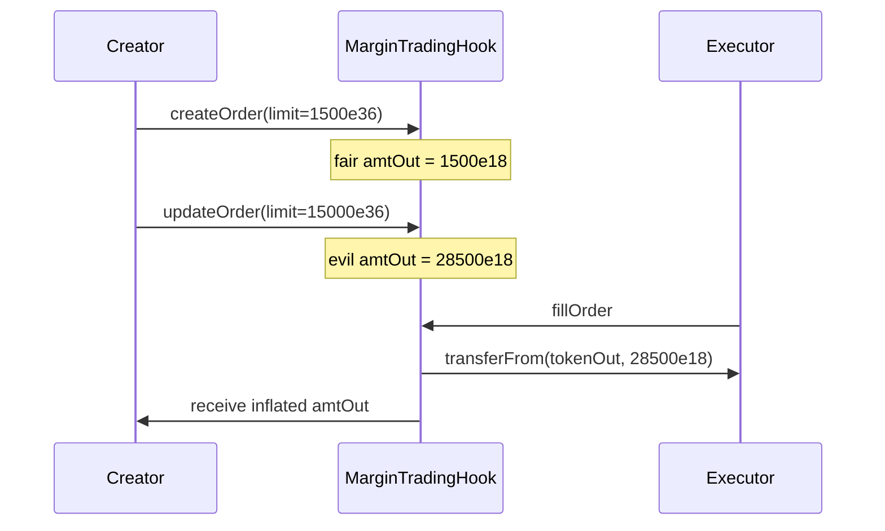

# INIT Capital — fillOrder executor front-run via limitPrice_e36

> **Vulnerability classes:** vuln/logic/order-management · impact/mev/frontrun · impact/loss-of-funds/direct-drain

> **Reproduction:** a self-contained Foundry PoC that compiles & runs in an
> isolated project with **only `forge-std`** — no fork, no RPC, no `anvil_state`.
> Full trace: [output.txt](output.txt). PoC:
> [test/30259-h-03-fillorder-executor-can-be-front-run-by-the-order-creato_exp.sol](test/30259-h-03-fillorder-executor-can-be-front-run-by-the-order-creato_exp.sol).

<!-- non-defihacklabs -->
<!-- source-auditvault: https://github.com/Auditware/AuditVault/blob/main/findings/30259-h-03-fillorder-executor-can-be-front-run-by-the-order-creato.md -->
<!-- date: 2024-01 -->

---

## Key info

| | |
|---|---|
| **Impact** | **HIGH** — order creator can inflate `limitPrice_e36` right before fillOrder so `amtOut` balloons and the executor overpays (theft) |
| **Protocol** | [INIT Capital](https://initcapital.finance) — MarginTradingHook fillOrder |
| **Vulnerable code** | `MarginTradingHook._calculateFillOrderInfo` — amtOut depends on mutable `limitPrice_e36` with no executor-side bound |
| **Bug class** | Slippage protection is one-sided (creator only); updateOrder mutates the price used at fill |
| **Finding** | code4rena — INIT Capital invitational, 2024-01 · #30259 · reporter **said** |
| **Report** | [2024-01-init-capital-invitational](https://code4rena.com/reports/2024-01-init-capital-invitational) |
| **Source** | [AuditVault](https://github.com/Auditware/AuditVault/blob/main/findings/30259-h-03-fillorder-executor-can-be-front-run-by-the-order-creato.md) |
| **Status** | Audit finding — INIT confirmed; mitigation is cancel+recreate instead of in-place update. |
| **Compiler** | `^0.8.24` (PoC) |

---

## TL;DR

1. `fillOrder` computes `amtOut` from `order.limitPrice_e36` (creator's slippage param).
2. On the "long base, coll ≠ tokenOut" branch, `amtOut = ceil(coll * limit / 1e36) - repay`.
3. Creator can `updateOrder` to raise `limitPrice_e36` immediately before fill.
4. **HARM**: executor pays a ballooned `amtOut` of `tokenOut` — pure theft of the delta.

---

## The vulnerable code

```solidity
function _calculateFillOrderInfo(Order memory _order, MarginPos memory _marginPos, address _collToken)
    internal
    returns (uint amtOut, uint repayShares, uint repayAmt)
{
    (repayShares, repayAmt) = _calculateRepaySize(_order, _marginPos);
    uint collTokenAmt = ILendingPool(_marginPos.collPool).toAmtCurrent(_order.collAmt);
    if (_collToken == _order.tokenOut) {
        // ...
    } else {
        if (_marginPos.isLongBaseAsset) {
            // long eth hold usdc
            // @> VULN: amtOut scales with limitPrice_e36
            amtOut = (collTokenAmt * _order.limitPrice_e36).ceilDiv(ONE_E36) - repayAmt;
        } else {
            amtOut = (collTokenAmt * ONE_E36).ceilDiv(_order.limitPrice_e36) - repayAmt;
        }
    }
}
```

**Fix (per finding / INIT):** fillOrder should take min/max limit bounds from the
executor; or `updateOrder` should cancel and create a new order (INIT team's plan).

---

## Root cause

`limitPrice_e36` is treated as immutable intent for the fill math, but
`updateOrder` can rewrite it on a live Active order. The executor has no
on-chain way to pin the price they observed off-chain.

---

## Preconditions

- Active order with creator able to call updateOrder.
- fillOrder pending; executor has approved sufficient tokenOut.
- Position path hits a branch where higher (or lower) limitPrice increases amtOut.

---

## Attack walkthrough

1. Creator opens long-base position; fair `limitPrice_e36 = 1500e36` → fair `amtOut = 1500e18`.
2. Executor prepares to fill at that quote.
3. Creator front-runs: sets `limitPrice_e36 = 15000e36` (10×).
4. fillOrder computes `amtOut = 28500e18` and pulls that from the executor.
5. Creator receives the inflated amount; delta over fair is pure theft.

---

## Diagrams



---

## Impact

Direct drain of executor capital proportional to how far limitPrice can be moved.
INIT acknowledged and planned to replace in-place update with cancel+recreate.

---

## Taxonomy

- `severity/high`
- `impact/loss-of-funds/direct-drain`
- `impact/mev/frontrun`
- `genome: spot-price`, `direct-drain`, `frontrun`, `fot-slippage`, `frontrun-exposure`
- `sector/lending`
- `platform/code4rena`

---

## Sources

- AuditVault finding: https://github.com/Auditware/AuditVault/blob/main/findings/30259-h-03-fillorder-executor-can-be-front-run-by-the-order-creato.md
- Report: https://code4rena.com/reports/2024-01-init-capital-invitational
- Vulnerable source: `code-423n4/2024-01-init-capital-invitational` @ main —
  `contracts/hook/MarginTradingHook.sol#_calculateFillOrderInfo` (L539–L563), `updateOrder`, `fillOrder`
