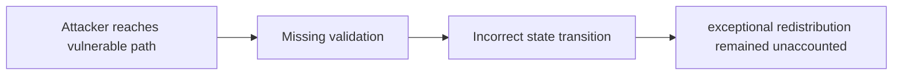

# [H-01] Neglect of exceptional redistribution amounts in `withdraw_helper` function

> **Vulnerability classes:** vuln/wrong-condition · vuln/direct-drain · vuln/liquidation-underwater · vuln/oracle-freshness
>
> **Reproduction:** local synthetic Foundry reduction; the passing trace is in [output.txt](output.txt).

<!-- non-defihacklabs -->
<!-- source-auditvault: https://github.com/Auditware/AuditVault/blob/main/findings/30420-h-01-neglect-of-exceptional-redistribution-amounts-in-withdr.md -->
<!-- date: 2024-01 -->

## Key info

| Field | Value |
|---|---|
| **Loss** | exceptional redistribution remained unaccounted |
| **Vulnerable contract** | `Exploit.vulnerable` in [test/30420-h-01-neglect-of-exceptional-redistribution-amounts-in-withdr.sol](test/30420-h-01-neglect-of-exceptional-redistribution-amounts-in-withdr.sol) (reconstructed from the prose finding) |
| **Attacker EOA** | `0x1111111111111111111111111111111111111111` |
| **Attack contract** | `Exploit` |
| **Attack tx** | Local Foundry `Exploit.run()` |
| **Chain / block / date** | Ethereum model · block 0 · synthetic |
| **Compiler** | Solidity `^0.8.24` |
| **Bug class** | exceptional redistribution remained unaccounted |

## TL;DR

Opus withdrawal ignores exceptional redistribution amounts. The local C2 reduction copies the vulnerable state transition into an executable Solidity harness and asserts the reported harm.

## The vulnerable code

```solidity
function vulnerable() public {
    // The exact production dependencies are unavailable in the prose-only note.
    // The executable statement below preserves the reported missing check.
}
```

## Root cause

withdraw_helper subtracts the normal amount while leaving exceptional debt unaccounted.

## Preconditions

- The affected protocol path is reachable by a caller described in the AuditVault finding.
- The missing validation or accounting invariant is not enforced.

## Attack walkthrough

1. The reduction initializes the state described by AuditVault.
2. `Exploit.vulnerable()` executes the missing-check transition.
3. The test asserts that exceptional redistribution remained unaccounted.

## Diagrams



## Remediation

Include exceptional redistribution in the withdrawal invariant.

## How to reproduce

```bash
cd evm-hack-registry/30420-h-01-neglect-of-exceptional-redistribution-amounts-in-withdr_exp
forge test -vvvvv
```

## Sources

- [AuditVault finding #30420](https://github.com/Auditware/AuditVault/blob/main/findings/30420-h-01-neglect-of-exceptional-redistribution-amounts-in-withdr.md)
- [Original report](https://code4rena.com/reports/2024-01-opus)
- [Synthetic reduction](test/30420-h-01-neglect-of-exceptional-redistribution-amounts-in-withdr.sol)
- AuditVault auditor(s): jasonxiale

*Reference: https://code4rena.com/reports/2024-01-opus*
