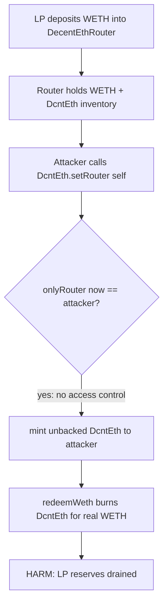
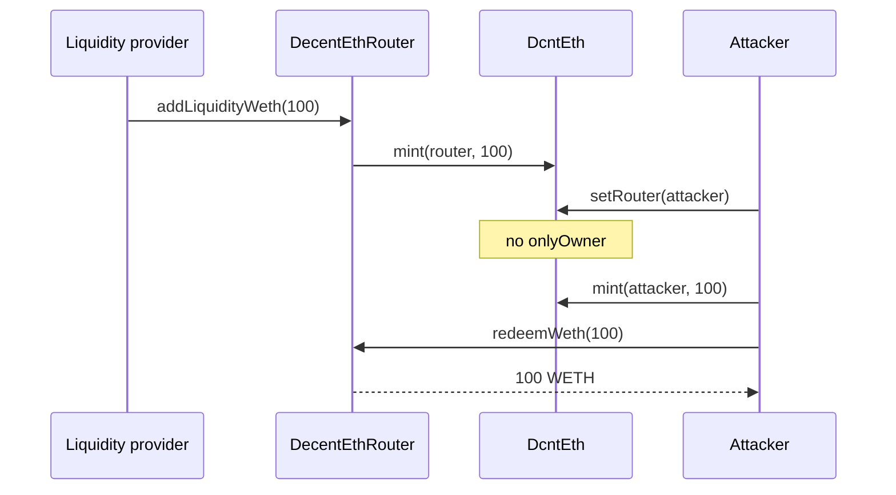

# Decent — Anyone can update the Router address in `DcntEth`

> **Vulnerability classes:** vuln/access-control/missing-caller-check · impact/loss-of-funds/direct-drain · genome/access-roles

> **Reproduction:** a self-contained Foundry PoC that compiles & runs in an
> isolated project with **only `forge-std`** — no fork, no RPC, no `anvil_state`.
> Full trace: [output.txt](output.txt). PoC:
> [test/30559-h-01-anyone-can-update-the-address-of-the-router-in-the-dcnt_exp.sol](test/30559-h-01-anyone-can-update-the-address-of-the-router-in-the-dcnt_exp.sol).

<!-- non-defihacklabs -->
<!-- source-auditvault: https://github.com/Auditware/AuditVault/blob/main/findings/30559-h-01-anyone-can-update-the-address-of-the-router-in-the-dcnt.md -->
<!-- date: 2024-01 -->

**AuditVault taxonomy:** `lang/solidity` · `platform/code4rena` · `has/github` · `has/poc` · `severity/high` · `sector/bridge` · `sector/dex` · genome: `frozen-funds` · `direct-drain` · `access-roles` · `dos-resistance`

---

## Key info

| | |
|---|---|
| **Impact** | **HIGH** — any address can become the DcntEth router, free-mint DcntEth, and redeem 1:1 against WETH liquidity in `DecentEthRouter` (full reserve drain) |
| **Protocol** | [Decent](https://code4rena.com/reports/2024-01-decent) — Decent ETH bridge (`DcntEth` OFT + `DecentEthRouter`) |
| **Vulnerable code** | `DcntEth.setRouter(address)` — public, no access control |
| **Bug class** | Missing access control on privileged configuration |
| **Finding** | Code4rena — Decent, 2024-01 · #30559 (H-01) · reporter **3** |
| **Report** | [2024-01-decent](https://code4rena.com/reports/2024-01-decent) |
| **Source** | [AuditVault](https://github.com/Auditware/AuditVault/blob/main/findings/30559-h-01-anyone-can-update-the-address-of-the-router-in-the-dcnt.md) |
| **Status** | Audit finding — confirmed by Decent. Reproduced as a standalone local PoC. |
| **Compiler** | `^0.8.24` (PoC) |

---

## TL;DR

1. `DcntEth` gates `mint`/`burn` with `onlyRouter`, but `setRouter` is **public** and unrestricted.
2. Anyone can point `router` at themselves, mint arbitrary DcntEth, and call `DecentEthRouter.redeemWeth` to pull real WETH reserves 1:1.
3. The same hijack also enables burning the router's DcntEth and DoSing liquidity functions.
4. HARM in the PoC: **100 WETH** of LP reserves drained to the attacker after a permissionless `setRouter`.

---

## The vulnerable code

Verbatim shape from `decentxyz/decent-bridge@7f90fd4` `src/DcntEth.sol`:

```solidity
function setRouter(address _router) public {
    router = _router; // @> VULN: no access control
}

function mint(address _to, uint256 _amount) public onlyRouter {
    _mint(_to, _amount);
}

function burn(address _from, uint256 _amount) public onlyRouter {
    _burn(_from, _amount);
}
```

**Fix:** restrict `setRouter` with `onlyOwner` (or a dedicated admin role).

---

## Root cause

`onlyRouter` correctly protects mint/burn, but the address that *is* the router is writable by anyone. Becoming the router is equivalent to holding the mint/burn privilege for the bridge accounting token, which is redeemable against real WETH held by the router.

---

## Preconditions

- `DcntEth` is live with `setRouter` unrestricted (audited commit).
- `DecentEthRouter` holds WETH reserves from liquidity providers (or UTB escrow).
- No privileged role required.

---

## Attack walkthrough

1. LPs deposit WETH via `addLiquidityWeth` → router holds WETH and mints DcntEth to itself.
2. Attacker calls `dcntEth.setRouter(attacker)`.
3. Attacker `mint(attacker, reserves)` and `approve` + `redeemWeth(reserves)`.
4. Router WETH balance → 0; attacker holds the full reserve amount.

---

## Diagrams





## Remediation

```diff
- function setRouter(address _router) public {
+ function setRouter(address _router) public onlyOwner {
      router = _router;
  }
```

## How to reproduce

```bash
cd ~/RustroverProjects/audits/evm-hack-registry/30559-h-01-anyone-can-update-the-address-of-the-router-in-the-dcnt_exp
forge test -vvv
# Fully local -- no fork, no RPC, no anvil_state required.
```

## Sources

- AuditVault finding: [30559-h-01-anyone-can-update-the-address-of-the-router-in-the-dcnt.md](https://github.com/Auditware/AuditVault/blob/main/findings/30559-h-01-anyone-can-update-the-address-of-the-router-in-the-dcnt.md)
- Code4rena report: [2024-01-decent](https://code4rena.com/reports/2024-01-decent)
- Vulnerable repo: [decentxyz/decent-bridge@7f90fd4](https://github.com/decentxyz/decent-bridge/blob/7f90fd4489551b69c20d11eeecb17a3f564afb18/src/DcntEth.sol) — `setRouter`, `mint`, `burn`; `DecentEthRouter.redeemWeth`
