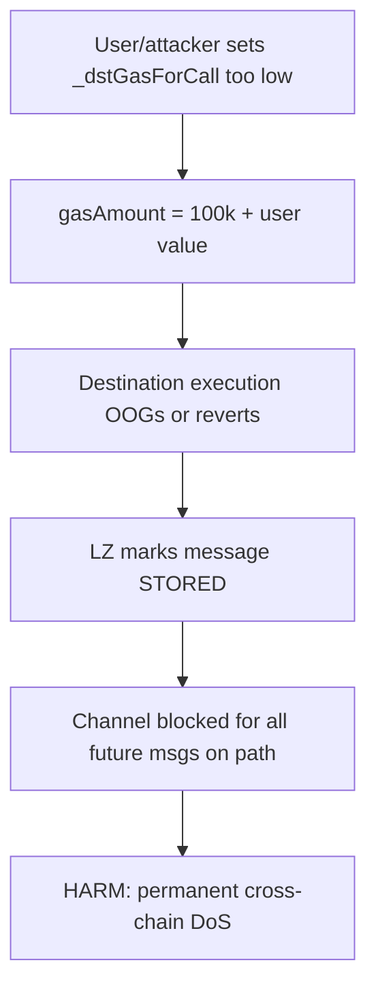
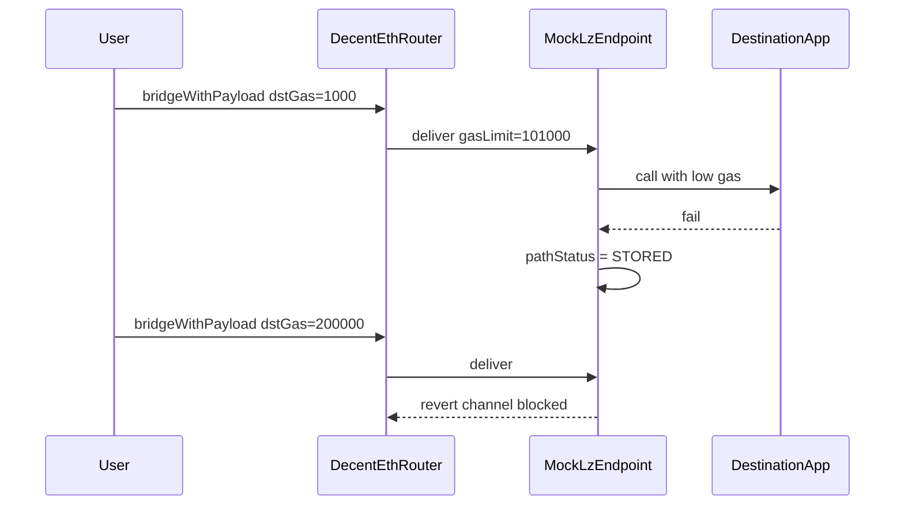

# Decent — Missing min-gas checks permanently block the LayerZero channel

> **Vulnerability classes:** vuln/dos/unbounded-loop · impact/dos · genome/unbounded-loop · dos-resistance

> **Reproduction:** a self-contained Foundry PoC that compiles & runs in an
> isolated project with **only `forge-std`** — no fork, no RPC, no `anvil_state`.
> Full trace: [output.txt](output.txt). PoC:
> [test/30560-h-02-due-to-missing-checks-on-minimum-gas-passed-through-lay_exp.sol](test/30560-h-02-due-to-missing-checks-on-minimum-gas-passed-through-lay_exp.sol).

<!-- non-defihacklabs -->
<!-- source-auditvault: https://github.com/Auditware/AuditVault/blob/main/findings/30560-h-02-due-to-missing-checks-on-minimum-gas-passed-through-lay.md -->
<!-- date: 2024-01 -->

**AuditVault taxonomy:** `lang/solidity` · `platform/code4rena` · `has/github` · `has/poc` · `severity/high` · `sector/bridge` · `vuln/dos/unbounded-loop` · `novelty/known-pattern` · genome: `unbounded-loop` · `known-pattern` · `permanent` · `dos-resistance`

---

## Key info

| | |
|---|---|
| **Impact** | **HIGH** — underfunded `_dstGasForCall` causes destination failure; LayerZero STORES the message and **permanently blocks** the source→dest channel for all future messages |
| **Protocol** | [Decent](https://code4rena.com/reports/2024-01-decent) — `DecentEthRouter` LayerZero OFT bridge |
| **Vulnerable code** | `DecentEthRouter._getCallParams` — `gasAmount = GAS_FOR_RELAY + _dstGasForCall` with no minimum |
| **Bug class** | Missing input validation on cross-chain gas budget |
| **Finding** | Code4rena — Decent, 2024-01 · #30560 (H-02) · reporter **iamandreiski** |
| **Report** | [2024-01-decent](https://code4rena.com/reports/2024-01-decent) |
| **Source** | [AuditVault](https://github.com/Auditware/AuditVault/blob/main/findings/30560-h-02-due-to-missing-checks-on-minimum-gas-passed-through-lay.md) |
| **Status** | Audit finding — acknowledged; team moved to LZ v2. Reproduced as local synthetic with mock LZ STORED semantics. |
| **Compiler** | `^0.8.24` (PoC) |

---

## TL;DR

1. Adapter gas is `100_000 + _dstGasForCall` with **no floor** on the user parameter.
2. A malicious or mistaken user can pass ~1000 → destination OOGs / fails.
3. LayerZero treats uncaught failures as **STORED**, blocking the entire path until cleared.
4. HARM in the PoC: underfunded bridge STORES the path; a later well-funded honest message cannot deliver.

---

## The vulnerable code

From `decentxyz/decent-bridge@7f90fd4` `src/DecentEthRouter.sol`:

```solidity
uint256 GAS_FOR_RELAY = 100000;
gasAmount = GAS_FOR_RELAY + _dstGasForCall; // @> VULN: no minimum on _dstGasForCall
adapterParams = abi.encodePacked(PT_SEND_AND_CALL, gasAmount);
```

**Fix (judge):** enforce a **minimum** at the source transaction level **and** a **maximum gas consumed** at the executor so a failure can still be stored without OOG'ing the store path.

---

## Root cause

Cross-chain gas is a safety-critical parameter left to the caller. LayerZero's path-level STORED semantics turn a single underfunded message into a permanent channel DoS — not a one-off failed transfer.

---

## Preconditions

- User (or attacker) can call `bridge` / `bridgeWithPayload` with arbitrary `_dstGasForCall`.
- Destination work needs more gas than `100_000 + underfunded` (especially Arbitrum / payload calls).

---

## Attack walkthrough

1. Attacker bridges with `_dstGasForCall = 1000` → total gas 101_000.
2. Destination app requires ≥150k for its work → execution fails.
3. Mock LZ marks path STORED (mirrors LZ INFLIGHT→STORED on uncaught errors).
4. Subsequent honest, well-funded bridge on the same path is blocked.

---

## Diagrams





## Remediation

```diff
  uint256 GAS_FOR_RELAY = 100000;
+ require(_dstGasForCall >= MIN_DST_GAS_FOR_CALL, "dst gas too low");
  gasAmount = GAS_FOR_RELAY + _dstGasForCall;
  // plus executor-side max gas so failures remain storable
```

## How to reproduce

```bash
cd ~/RustroverProjects/audits/evm-hack-registry/30560-h-02-due-to-missing-checks-on-minimum-gas-passed-through-lay_exp
forge test -vvv
# Fully local -- mock LZ STORED channel, no fork.
```

## Sources

- AuditVault finding: [30560-h-02-due-to-missing-checks-on-minimum-gas-passed-through-lay.md](https://github.com/Auditware/AuditVault/blob/main/findings/30560-h-02-due-to-missing-checks-on-minimum-gas-passed-through-lay.md)
- Code4rena report: [2024-01-decent](https://code4rena.com/reports/2024-01-decent)
- Vulnerable repo: [decentxyz/decent-bridge@7f90fd4](https://github.com/decentxyz/decent-bridge/blob/7f90fd4489551b69c20d11eeecb17a3f564afb18/src/DecentEthRouter.sol) — `_getCallParams`
- LayerZero messaging properties: STORED blocks subsequent messages on the path
