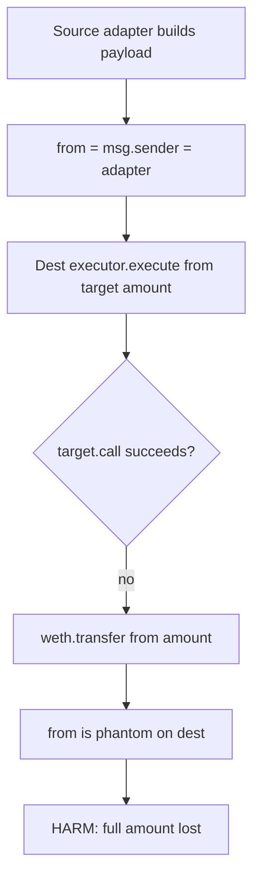
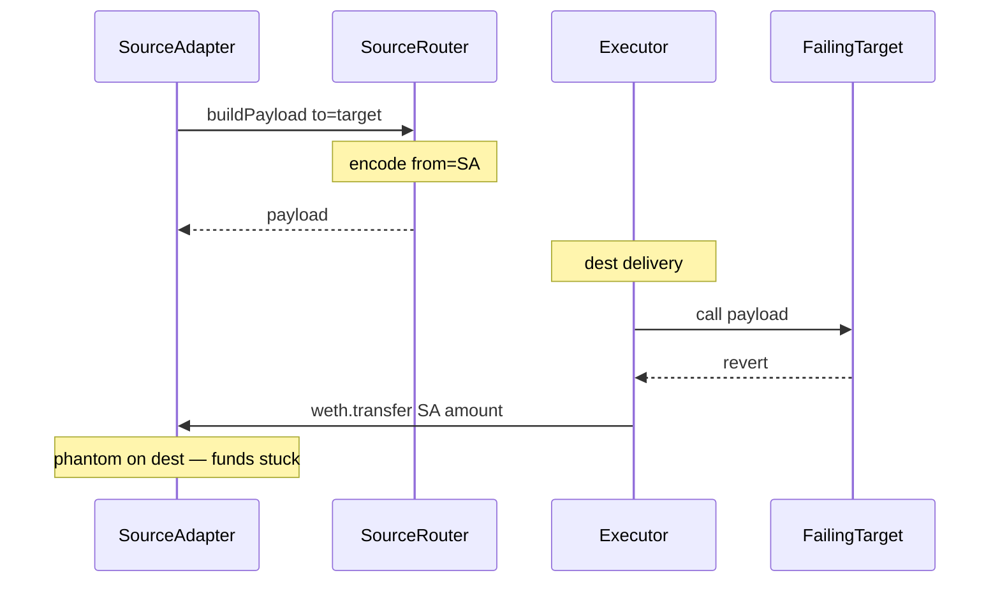

# Decent — Failed `execute` refunds a phantom source-adapter address

> **Vulnerability classes:** vuln/wrong-condition · impact/loss-of-funds/direct-drain · genome/bridge-message-validation

> **Reproduction:** a self-contained Foundry PoC that compiles & runs in an
> isolated project with **only `forge-std`** — no fork, no RPC, no `anvil_state`.
> Full trace: [output.txt](output.txt). PoC:
> [test/30561-h-03-when-decentbridgeexecutorexecute-fails-funds-will-be-se_exp.sol](test/30561-h-03-when-decentbridgeexecutorexecute-fails-funds-will-be-se_exp.sol).

<!-- non-defihacklabs -->
<!-- source-auditvault: https://github.com/Auditware/AuditVault/blob/main/findings/30561-h-03-when-decentbridgeexecutorexecute-fails-funds-will-be-se.md -->
<!-- date: 2024-01 -->

**AuditVault taxonomy:** `lang/solidity` · `platform/code4rena` · `has/github` · `has/poc` · `severity/high` · `sector/bridge` · genome: `wrong-condition` · `direct-drain` · `bridge-message-validation`

---

## Key info

| | |
|---|---|
| **Impact** | **HIGH** — when the destination target call fails, the full bridged amount is refunded to the **source-chain adapter address** (not the user), which is not a contract on the destination → permanent fund loss |
| **Protocol** | [Decent](https://code4rena.com/reports/2024-01-decent) — `DecentEthRouter` + `DecentBridgeExecutor` |
| **Vulnerable code** | `_getCallParams` encodes `msg.sender` as `from`; `_executeWeth`/`_executeEth` refund `from` on failure |
| **Bug class** | Wrong refund recipient in cross-chain failure path |
| **Finding** | Code4rena — Decent, 2024-01 · #30561 (H-03) · reporter **ZdravkoHr** |
| **Report** | [2024-01-decent](https://code4rena.com/reports/2024-01-decent) |
| **Source** | [AuditVault](https://github.com/Auditware/AuditVault/blob/main/findings/30561-h-03-when-decentbridgeexecutorexecute-fails-funds-will-be-se.md) |
| **Status** | Audit finding — confirmed by Decent. Local synthetic reproduces the misdirected refund. |
| **Compiler** | `^0.8.24` (PoC) |

---

## TL;DR

1. Source `DecentBridgeAdapter` calls the router; `_getCallParams` packs **`msg.sender` (the adapter)** as `from`.
2. Destination `onOFTReceived` → `executor.execute(_from, _to, ...)`.
3. If the target call fails, `_executeWeth` does `weth.transfer(from, amount)`.
4. Adapters are **not CREATE2-aligned** across chains → `from` is a phantom address on dest.
5. HARM in the PoC: **10 WETH** refunded to the source-adapter address; user gets nothing.

---

## The vulnerable code

```solidity
// _getCallParams (source)
payload = abi.encode(
    msgType,
    msg.sender, // @> VULN: source adapter as refund `from`
    _toAddress,
    deliverEth,
    additionalPayload
);

// _executeWeth (destination) on failure
if (!success) {
    weth.transfer(from, amount); // @> VULN: refunds wrong chain's address
    return;
}
```

**Fix:** pass / refund the real user (e.g. destination recipient or an explicit refund address), never the source adapter.

---

## Root cause

The payload's `from` was intended as "original user" but is actually the immediate `msg.sender` on the source (the adapter). The failure refund path trusts that field without translating it to a destination-valid user address. Non-CREATE2 deployments make same-address recovery impossible.

---

## Preconditions

- Cross-chain transfer with payload (UTB / adapter path) so `from` is the adapter.
- Destination target call fails (revert / OOG / bad calldata).
- Adapter addresses differ across chains (true for audited deploy scripts).

---

## Attack walkthrough

1. Source adapter builds payload → `from = sourceAdapter`.
2. Destination credits WETH and calls `execute(from, failingTarget, amount, ...)`.
3. Target reverts → executor refunds WETH to `from`.
4. WETH sits on a phantom address; user cannot recover it.

---

## Diagrams





## Remediation

```diff
- executor.execute(_from, _to, deliverEth, _amount, callPayload);
+ executor.execute(_to /* or explicit user refund */, _to, deliverEth, _amount, callPayload);
```

And/or stop encoding the adapter as `from` in `_getCallParams`.

## How to reproduce

```bash
cd ~/RustroverProjects/audits/evm-hack-registry/30561-h-03-when-decentbridgeexecutorexecute-fails-funds-will-be-se_exp
forge test -vvv
```

## Sources

- AuditVault finding: [30561-h-03-when-decentbridgeexecutorexecute-fails-funds-will-be-se.md](https://github.com/Auditware/AuditVault/blob/main/findings/30561-h-03-when-decentbridgeexecutorexecute-fails-funds-will-be-se.md)
- Code4rena report: [2024-01-decent](https://code4rena.com/reports/2024-01-decent)
- Vulnerable repo: [decentxyz/decent-bridge@7f90fd4](https://github.com/decentxyz/decent-bridge/blob/7f90fd4489551b69c20d11eeecb17a3f564afb18/src/DecentBridgeExecutor.sol) — `_executeWeth`/`_executeEth`; `DecentEthRouter._getCallParams`
