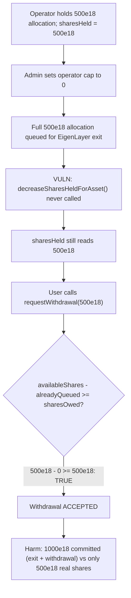
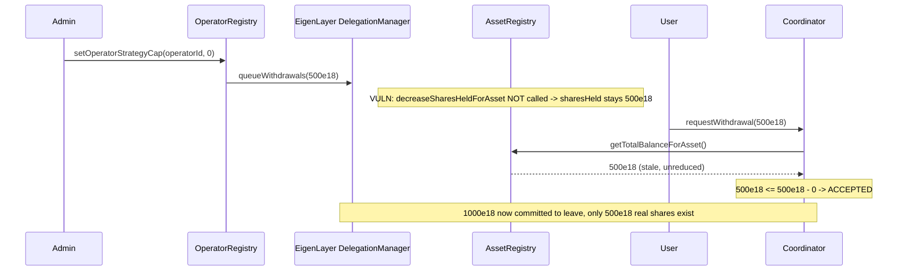

# Rio Network — setting the strategy cap to 0 does not update total shares held or the withdrawal queue

> **Vulnerability classes:** vuln/accounting/missing-decrement · vuln/logic/wrong-condition · vuln/liquid-staking/double-counted-shares

> **Reproduction:** a self-contained Foundry PoC that compiles & runs in an
> isolated project with **only `forge-std`** — no fork, no RPC, no `anvil_state`.
> Full trace: [output.txt](output.txt). PoC:
> [test/30897-h-2-setting-the-strategy-cap-to-0-does-not-update-the-total_exp.sol](test/30897-h-2-setting-the-strategy-cap-to-0-does-not-update-the-total_exp.sol).

<!-- non-defihacklabs -->
<!-- source-auditvault: https://github.com/Auditware/AuditVault/blob/main/findings/30897-h-2-setting-the-strategy-cap-to-0-does-not-update-the-total.md -->
<!-- date: 2024-02 -->

**AuditVault taxonomy:** `lang/solidity` · `platform/sherlock` · `has/github` · `has/poc` · `severity/high` · `sector/liquid-staking` · `sector/restaking` · `sector/staking` · genome: `wrong-condition` · `locked-funds` · `vote-delegation-loop`

---

## Key info

| | |
|---|---|
| **Impact** | **HIGH** — removing an operator (or zeroing its strategy cap) forces a full EigenLayer exit for its allocation but never reduces the asset registry's `sharesHeld` ledger, so a user can request a withdrawal for the SAME shares that are already committed to leaving — double-counting them |
| **Protocol** | [Rio Network](https://github.com/sherlock-audit/2024-02-rio-network-core-protocol-judging) — `OperatorRegistryV1Admin` (operator cap management) + `RioLRTCoordinator` (deposits/withdrawals) + `RioLRTAssetRegistry` (share accounting) |
| **Vulnerable code** | `OperatorRegistryV1Admin.setOperatorStrategyCap()` — missing `decreaseSharesHeldForAsset()` call when forcing an operator's exit |
| **Bug class** | Accounting: a state-removing admin action fails to update a downstream ledger another function relies on |
| **Finding** | Sherlock — Rio Network Core Protocol, 2024-02 · #30897 (H-2) · reporter **kennedy1030** (also found by Aymen0909, KupiaSec, g, hash) |
| **Report** | [2024-02-rio-network-core-protocol-judging #10](https://github.com/sherlock-audit/2024-02-rio-network-core-protocol-judging/issues/10) |
| **Source** | [AuditVault](https://github.com/Auditware/AuditVault/blob/main/findings/30897-h-2-setting-the-strategy-cap-to-0-does-not-update-the-total.md) |
| **Status** | Audit finding — caught in review; the protocol team fixed the linked duplicate ([rio-org/rio-sherlock-audit#14](https://github.com/rio-org/rio-sherlock-audit/pull/14)). Reproduced here as a standalone local PoC. |
| **Compiler** | `^0.8.24` (PoC); real protocol pinned `0.8.23` |

This is an **audit finding**, not a historical on-chain incident. The real
`OperatorRegistryV1Admin`/`RioLRTCoordinator`/`RioLRTAssetRegistry` contracts
are reduced to a minimal single-asset, single-operator, 1:1 share:asset model
— the utilization heap, EigenLayer strategy exchange rate, and multi-asset
support are all stripped since none of them affect this bug (which is about a
**missing decrement**, not the surrounding bookkeeping).

---

## TL;DR

1. `OperatorRegistryV1Admin.setOperatorStrategyCap(operatorId, 0)` — used both
   directly and when deactivating/removing an operator — queues the
   operator's **full allocation** for an EigenLayer exit via the operator's
   delegator.
2. It also removes the operator from the utilization heap and updates its
   stored `cap` — but it **never calls** `RioLRTAssetRegistry.decreaseSharesHeldForAsset()`
   for the shares just queued for exit.
3. `RioLRTCoordinator.requestWithdrawal()` computes `availableShares` from
   `assetRegistry().getTotalBalanceForAsset()`, which is driven by that same
   (unreduced) `sharesHeld` ledger.
4. Because `sharesHeld` never dropped, a user can request a withdrawal for
   shares that are **already** queued for exit by the admin — the two
   commitments both draw on the same underlying shares without either side
   knowing about the other.
5. HARM in the PoC: after the admin zeroes an operator's cap (queuing a
   500e18 EigenLayer exit), a user successfully requests a withdrawal for the
   SAME 500e18 shares — 1000e18 is now committed to leaving the protocol
   against only 500e18 of real backing shares.

---

## The vulnerable code

`OperatorRegistryV1Admin.setOperatorStrategyCap()` (verbatim, reduced):

```solidity
function setOperatorStrategyCap(uint8 operatorId, uint256 newCap) external {
    OperatorShareDetails storage currentShareDetails = shareDetails[operatorId];
    if (currentShareDetails.cap == newCap) return;

    if (currentShareDetails.cap > 0 && newCap == 0) {
        if (currentShareDetails.allocation > 0) {
            _queueOperatorStrategyExit(operatorId, currentShareDetails.allocation);
        }
        // (utilizationHeap.removeByID — omitted)
    } else if (...) { ... } else { ... }

    // @> VULN: the operator's EigenLayer exit is queued above, but
    // assetRegistry.decreaseSharesHeldForAsset() is NEVER called for the
    // shares just queued for exit.
    currentShareDetails.cap = newCap;
}
```

`RioLRTCoordinator.requestWithdrawal()` (verbatim, reduced):

```solidity
function requestWithdrawal(uint256 sharesOwed) external returns (uint256) {
    uint256 availableShares = assetRegistry.getTotalBalanceForAsset();

    // @> VULN: `availableShares` was never reduced by shares the admin
    // already queued for exit via setOperatorStrategyCap(0).
    if (sharesOwed > availableShares - sharesAlreadyQueuedThisEpoch) {
        revert("INSUFFICIENT_SHARES_FOR_WITHDRAWAL");
    }
    sharesAlreadyQueuedThisEpoch += sharesOwed;
    return sharesOwed;
}
```

---

## Root cause

Two separate withdrawal paths exist for the same underlying EigenLayer
shares: (1) an **admin-forced exit** when an operator's allocation is removed,
and (2) an **ordinary user withdrawal** processed through the coordinator.
Both paths ultimately compete for the same pool of `sharesHeld`. Path (1) is
implemented as a "fire and forget" call into EigenLayer that never
communicates back to the asset registry's ledger — so path (2)'s solvency
check (`availableShares - alreadyQueued`) has no way of knowing that some of
those "available" shares are already spoken for.

## Preconditions

- The registry admin (or protocol automation) sets an operator's strategy
  cap to 0 — an ordinary, expected administrative action (used for operator
  removal, deactivation, or rebalancing away from a misbehaving operator).
- A user requests a withdrawal for the affected asset before the epoch is
  settled — an ordinary, expected user action.

## Attack walkthrough

From [output.txt](output.txt):

1. An operator holds a 500e18 strategy allocation; `sharesHeld == 500e18`.
2. The admin sets the operator's cap to 0. This queues the full 500e18
   allocation for an EigenLayer exit — confirmed by the delegation manager's
   `totalQueuedForWithdrawal == 500e18` — but `sharesHeld` remains `500e18`
   (unchanged).
3. **HARM:** a user calls `requestWithdrawal(500e18)`. The check
   `sharesOwed > availableShares - alreadyQueued` evaluates
   `500e18 > 500e18 - 0`, which is `false`, so the withdrawal is **accepted**.
4. Total shares now committed to leaving the protocol: the admin's forced
   EigenLayer exit (500e18) **plus** the user's withdrawal request (500e18) =
   **1000e18** — double the 500e18 that actually backs the LRT. A control
   test confirms that a non-zero cap change (no forced exit) does not trigger
   this double counting, and that a second withdrawal request correctly
   fails once real capacity is exhausted.

## Diagrams





## Impact

- **Double-committed shares**: the admin's forced EigenLayer exit and a
  user's ordinary withdrawal request both draw on the same underlying shares
  without either side's accounting reflecting the other.
- **Stuck withdrawal flow**: when the epoch is later settled, only half the
  promised shares actually exist, so the withdrawal cannot be fully honored —
  in the live system this surfaces as a share-count mismatch that blocks
  settlement (`INCORRECT_NUMBER_OF_SHARES_QUEUED`-class failure), freezing
  legitimate user withdrawals.
- **Triggerable by ordinary operations**: no malicious actor is required —
  routine operator management (removal, cap-to-zero, deactivation) combined
  with routine user withdrawal requests is sufficient.

## Remediation

Per the report: update the withdrawal queue / decrease the asset registry's
`sharesHeld` ledger whenever the operator registry admin removes an
operator's EigenLayer shares — whether by setting its strategy cap to 0 or by
removing the operator outright.

## How to reproduce

```bash
cd ~/RustroverProjects/audits/evm-hack-registry/30897-h-2-setting-the-strategy-cap-to-0-does-not-update-the-total_exp
forge test -vvv
# Fully local — no fork, no RPC, no anvil_state required.
# Expected: both tests PASS:
#   test_exploit                                     (self-contained Exploit: 500e18 double-committed)
#   test_control_nonZeroCapChangeDoesNotDoubleCount  (control: no forced exit, no double counting)
```

PoC source: [test/30897-h-2-setting-the-strategy-cap-to-0-does-not-update-the-total_exp.sol](test/30897-h-2-setting-the-strategy-cap-to-0-does-not-update-the-total_exp.sol)
— the verbatim vulnerable `setOperatorStrategyCap()`/`requestWithdrawal()`
reductions, plus the admin/user orchestration and a control test.

> Note: the utilization heap, EigenLayer strategy exchange rate, and
> multi-asset support are stubbed/simplified because they do not affect the
> bug (a 1:1 share:asset ratio and single asset/operator are sufficient to
> demonstrate the missing decrement). The blamed lines — the missing
> `decreaseSharesHeldForAsset` call and the stale `availableShares` read — are
> faithful to the finding.

---

*Reference: finding **#30897 (H-2)** by **kennedy1030** in the [Sherlock Rio Network Core Protocol review (Feb 2024)](https://github.com/sherlock-audit/2024-02-rio-network-core-protocol-judging/issues/10) · curated by [AuditVault](https://github.com/Auditware/AuditVault/blob/main/findings/30897-h-2-setting-the-strategy-cap-to-0-does-not-update-the-total.md)*
