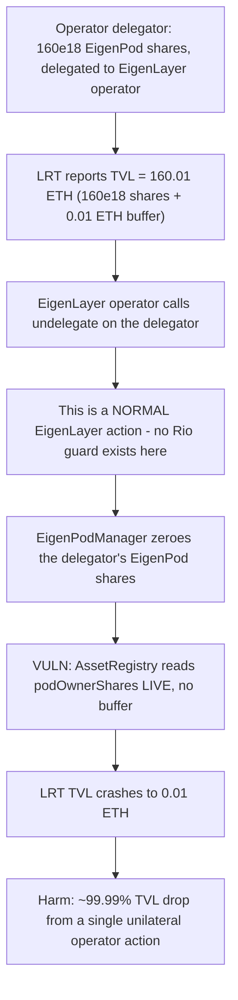
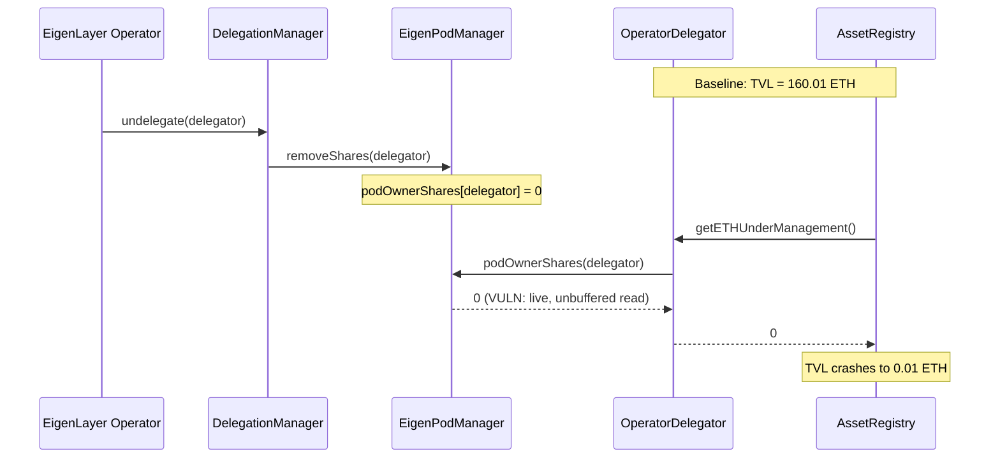

# Rio Network — malicious operators can `undelegate` theirselves to manipulate the LRT exchange rate

> **Vulnerability classes:** vuln/oracle/live-external-read · vuln/economic/tvl-manipulation · vuln/trust/semi-trusted-operator

> **Reproduction:** a self-contained Foundry PoC that compiles & runs in an
> isolated project with **only `forge-std`** — no fork, no RPC, no `anvil_state`.
> Full trace: [output.txt](output.txt). PoC:
> [test/30898-h-3-malicious-operators-can-undelegate-theirselves-to-manipu_exp.sol](test/30898-h-3-malicious-operators-can-undelegate-theirselves-to-manipu_exp.sol).

<!-- non-defihacklabs -->
<!-- source-auditvault: https://github.com/Auditware/AuditVault/blob/main/findings/30898-h-3-malicious-operators-can-undelegate-theirselves-to-manipu.md -->
<!-- date: 2024-02 -->

**AuditVault taxonomy:** `lang/solidity` · `platform/sherlock` · `has/github` · `has/poc` · `severity/high` · `sector/restaking` · `sector/staking` · genome: `frozen-funds` · `locked-funds` · `vote-delegation-loop`

---

## Key info

| | |
|---|---|
| **Impact** | **HIGH** — any EigenLayer operator that a Rio operator delegator is delegated to can forcibly `undelegate` it (a completely normal EigenLayer action), instantly zeroing that delegator's EigenPod shares and crashing the LRT's reported ETH TVL and exchange rate |
| **Protocol** | [Rio Network](https://github.com/sherlock-audit/2024-02-rio-network-core-protocol-judging) — `RioLRTOperatorDelegator` + `RioLRTAssetRegistry` (ETH TVL aggregation) interacting with EigenLayer's `DelegationManager`/`EigenPodManager` |
| **Vulnerable code** | `RioLRTAssetRegistry.getETHBalanceInEigenLayer()` — unbuffered live sum of each delegator's EigenPod shares |
| **Bug class** | Trusting a live external value with no buffer, snapshot, or sanity bound against a semi-trusted counterparty's unilateral action |
| **Finding** | Sherlock — Rio Network Core Protocol, 2024-02 · #30898 (H-3) · reporter **g** (also giraffe, hash, mstpr-brainbot, zzykxx) |
| **Report** | [2024-02-rio-network-core-protocol-judging #53](https://github.com/sherlock-audit/2024-02-rio-network-core-protocol-judging/issues/53) |
| **Source** | [AuditVault](https://github.com/Auditware/AuditVault/blob/main/findings/30898-h-3-malicious-operators-can-undelegate-theirselves-to-manipu.md) |
| **Status** | Audit finding — caught in review; judged High severity because operators are not fully trusted in Rio's threat model. Reproduced here as a standalone local PoC. |
| **Compiler** | `^0.8.24` (PoC); real protocol pinned `0.8.23` |

This is an **audit finding**, not a historical on-chain incident. EigenLayer's
`DelegationManager`/`EigenPodManager` are reduced to minimal mocks that
preserve exactly the behavior the bug needs: a live, queryable EigenPod share
balance, and a forced-undelegation path that zeroes it. `RioLRTOperatorDelegator`
and `RioLRTAssetRegistry` are reduced to their EigenPod-share pass-through and
TVL-aggregation logic.

---

## TL;DR

1. `RioLRTOperatorDelegator.getEigenPodShares()` is a direct, live
   pass-through read of EigenLayer's `EigenPodManager.podOwnerShares()` for
   the delegator's own EigenPod — no caching, no buffering.
2. `RioLRTAssetRegistry.getETHBalanceInEigenLayer()` sums this live value
   across every operator delegator to compute the LRT's reported ETH TVL —
   again, with no buffering or sanity bound.
3. EigenLayer's `DelegationManager` allows an operator to forcibly
   `undelegate` any staker delegated to it — a completely **normal**,
   always-available EigenLayer action, not a bug in EigenLayer itself.
4. For a Rio operator delegator (the "staker"), forced undelegation
   immediately removes its EigenPod shares at the source, since EigenPod
   shares cannot simply be "withdrawn to" an arbitrary address the way
   strategy shares can.
5. Rio's operator delegator has **no logic** to detect or recover from a
   forced undelegation — the withdrawer for the strategy-share leg must be
   the delegator itself as `msg.sender`, which EigenLayer's forced flow does
   not satisfy — so the loss is immediate and unrecoverable from Rio's side.
6. HARM in the PoC: an operator delegator holding 160e18 (5 validators × 32
   ETH) of EigenPod shares is forcibly undelegated by its EigenLayer
   operator. The LRT's reported ETH TVL crashes from 160.01 ETH to 0.01
   ETH — a single unilateral action by a semi-trusted operator, with **no**
   Rio-side check catching it.

---

## The vulnerable code

`RioLRTOperatorDelegator.getEigenPodShares()` (verbatim, reduced):

```solidity
function getEigenPodShares() public view returns (int256) {
    return eigenPodManager.podOwnerShares(address(this));
}
```

`RioLRTAssetRegistry.getETHBalanceInEigenLayer()` (verbatim, reduced):

```solidity
function getETHBalanceInEigenLayer() public view returns (uint256 balance) {
    balance = ethBalanceInUnverifiedValidators;
    for (uint256 i = 0; i < delegators.length; i++) {
        // @> VULN: sums each delegator's LIVE getETHUnderManagement() (a
        // live pass-through to EigenPodManager.podOwnerShares), with no
        // buffering, snapshotting, or protection against a delegator's
        // EigenPod shares being unilaterally zeroed by a forced
        // undelegation.
        balance += delegators[i].getETHUnderManagement();
    }
}
```

---

## Root cause

`getETHBalanceInEigenLayer()` treats a value it does not control — a live
read from EigenLayer's own state — as if it were an internally-tracked,
Rio-controlled ledger entry. But that value can move at any moment, for a
reason entirely outside Rio's protocol: the EigenLayer operator a delegator
happens to be delegated to has a standing, permissionless right to
`undelegate` that delegator whenever it wants. Rio's threat model treats
operators as **semi-trusted** (not fully trusted), yet the TVL calculation
gives an operator's unilateral EigenLayer-level action the same unquestioned
authority as Rio's own internal accounting.

## Preconditions

- An operator delegator is delegated to some EigenLayer operator and has
  verified EigenPod shares (validators deposited and verified) — the
  ordinary running state of the protocol.
- That operator calls EigenLayer's `undelegate()` against the delegator —
  a standing capability every EigenLayer operator has over every staker
  delegated to it, requiring no special exploit or precondition beyond
  being the delegated operator.

## Attack walkthrough

From [output.txt](output.txt), mirroring the report's own coded PoC
(`test_UndelegateRemovesEigenPodShares`) exactly:

1. An operator delegator holds `32 * 5 * 1e18` (160e18) of EigenPod shares,
   delegated to an EigenLayer operator. The LRT's reported ETH TVL is
   `160010000000000000000` (160.01 ETH — the 160 ETH of EigenPod shares
   plus a 0.01 ETH deposit-pool buffer).
2. **HARM:** the EigenLayer operator calls `undelegate(delegator)`. This is
   a completely normal EigenLayer action — no Rio guard is bypassed, because
   none exists for this path.
3. The delegator's EigenPod shares are immediately zeroed:
   `getEigenPodShares() == 0`.
4. The LRT's reported ETH TVL crashes to `10000000000000000` (0.01 ETH) — a
   ~99.99% drop, instantly, with no warning. A control test confirms that an
   unrelated third party (not the staker or its delegated operator) cannot
   trigger this — the authorization boundary that DOES exist is exercised
   correctly; the missing protection is specifically against the DELEGATED
   OPERATOR's own standing EigenLayer authority.

## Diagrams





## Impact

- **Instant, unrecoverable TVL/exchange-rate crash**: the reported value of
  the LRT drops dramatically with no on-chain warning, affecting every
  holder's redemption value and any downstream integration pricing the LRT
  off this TVL.
- **Requires only standing EigenLayer authority**: no exploit of Rio's own
  code is needed — the operator uses a capability EigenLayer grants by
  design. Rio's threat model explicitly does not fully trust operators, so
  this is squarely in scope.
- **Stuck funds compounding the damage**: per the report, the strategy-share
  leg of a forced undelegation is also queued for withdrawal to an address
  the operator delegator cannot claim from (the withdrawer must be
  `msg.sender`), meaning ETH/LST can become permanently stuck in addition to
  the TVL crash.

## Remediation

Per the report: implement withdrawal-completion handling in the operator
delegator for forced undelegation, and/or track EigenPod shares in an
internally-controlled ledger with sanity bounds rather than trusting a live
external read unconditionally.

## How to reproduce

```bash
cd ~/RustroverProjects/audits/evm-hack-registry/30898-h-3-malicious-operators-can-undelegate-theirselves-to-manipu_exp
forge test -vvv
# Fully local — no fork, no RPC, no anvil_state required.
# Expected: all three tests PASS:
#   test_exploit                                   (self-contained Exploit: TVL crashes 160.01 -> 0.01 ETH)
#   test_UndelegateRemovesEigenPodShares_EOA        (EOA rebuild mirroring the finding's own PoC numbers exactly)
#   test_control_unauthorizedCallerCannotUndelegate (control: an unrelated third party cannot trigger this)
```

PoC source: [test/30898-h-3-malicious-operators-can-undelegate-theirselves-to-manipu_exp.sol](test/30898-h-3-malicious-operators-can-undelegate-theirselves-to-manipu_exp.sol)
— the verbatim vulnerable `getEigenPodShares()`/`getETHBalanceInEigenLayer()`
reductions, plus the EigenLayer mock orchestration and a control test.

> Note: EigenLayer's `DelegationManager`/`EigenPodManager` are reduced to
> minimal mocks preserving exactly the forced-undelegation behavior the bug
> needs (a live share balance, zeroed on forced undelegation) — the full
> strategy-share withdrawal queue, beacon-chain proof verification, and
> multi-strategy support are stripped since they do not affect this bug. The
> blamed lines — the live, unbuffered EigenPod share read and its
> unconditional summation into TVL — are faithful to the finding.

---

*Reference: finding **#30898 (H-3)** by **g** in the [Sherlock Rio Network Core Protocol review (Feb 2024)](https://github.com/sherlock-audit/2024-02-rio-network-core-protocol-judging/issues/53) · curated by [AuditVault](https://github.com/Auditware/AuditVault/blob/main/findings/30898-h-3-malicious-operators-can-undelegate-theirselves-to-manipu.md)*
