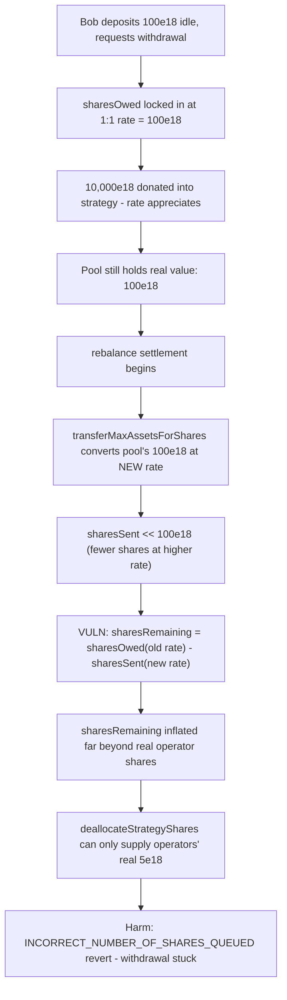
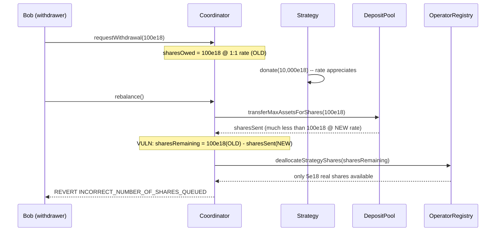

# Rio Network — requested withdrawal can be impossible to settle due to EigenLayer share value appreciation

> **Vulnerability classes:** vuln/accounting/rate-mismatch · vuln/dos/liveness-freeze · vuln/liquid-staking/withdrawal-stuck

> **Reproduction:** a self-contained Foundry PoC that compiles & runs in an
> isolated project with **only `forge-std`** — no fork, no RPC, no `anvil_state`.
> Full trace: [output.txt](output.txt). PoC:
> [test/30901-h-6-requested-withdrawal-can-be-impossible-to-settle-due-to_exp.sol](test/30901-h-6-requested-withdrawal-can-be-impossible-to-settle-due-to_exp.sol).

<!-- non-defihacklabs -->
<!-- source-auditvault: https://github.com/Auditware/AuditVault/blob/main/findings/30901-h-6-requested-withdrawal-can-be-impossible-to-settle-due-to.md -->
<!-- date: 2024-02 -->

**AuditVault taxonomy:** `lang/solidity` · `platform/sherlock` · `has/github` · `has/poc` · `severity/high` · `sector/liquid-staking` · `sector/restaking` · `sector/staking` · `sector/token` · `sector/vault` · genome: `frozen-funds` · `locked-funds` · `vote-delegation-loop`

---

## Key info

| | |
|---|---|
| **Impact** | **HIGH** — a requested withdrawal locks in a fixed EigenLayer share count at the CURRENT exchange rate; if that rate appreciates before settlement (an ordinary, expected event), settlement can revert even though the deposit pool objectively holds enough dollar value to cover it |
| **Protocol** | [Rio Network](https://github.com/sherlock-audit/2024-02-rio-network-core-protocol-judging) — `RioLRTCoordinator` (deposits/withdrawals/rebalancing) + `RioLRTDepositPool` (idle-asset settlement) |
| **Vulnerable code** | `RioLRTCoordinator.requestWithdrawal()`/`rebalance()` combined with `RioLRTDepositPool.transferMaxAssetsForShares()` |
| **Bug class** | Accounting: a share count locked in at one exchange rate is later compared against a share count computed at a different exchange rate |
| **Finding** | Sherlock — Rio Network Core Protocol, 2024-02 · #30901 (H-6) · reporter **mstpr-brainbot** (also g, zzykxx) |
| **Report** | [2024-02-rio-network-core-protocol-judging #109](https://github.com/sherlock-audit/2024-02-rio-network-core-protocol-judging/issues/109) |
| **Source** | [AuditVault](https://github.com/Auditware/AuditVault/blob/main/findings/30901-h-6-requested-withdrawal-can-be-impossible-to-settle-due-to.md) |
| **Status** | Audit finding — caught in review; the protocol team fixed it ([rio-org/rio-sherlock-audit#13](https://github.com/rio-org/rio-sherlock-audit/pull/13)). Reproduced here as a standalone local PoC. |
| **Compiler** | `^0.8.24` (PoC); real protocol pinned `0.8.23` |

This is an **audit finding**, not a historical on-chain incident. The real
`RioLRTCoordinator`/`RioLRTDepositPool`/`RioLRTOperatorRegistry`/
`RioLRTAssetRegistry` contracts are reduced to a minimal single-asset,
single-operator model with an ERC4626-like strategy exchange rate — the
utilization heap, multi-operator distribution, and restaking-token mint/burn
accounting are all stripped since none of them affect this bug.

---

## TL;DR

1. `RioLRTCoordinator.requestWithdrawal()` converts the withdrawal amount to
   a **fixed number of EigenLayer shares**, using the exchange rate **at
   request time**, and records that count as owed for the current epoch.
2. At settlement, `rebalance()` first asks `RioLRTDepositPool.transferMaxAssetsForShares()`
   to cover as many of those shares as possible from the pool's **idle asset
   balance** — but that function converts the idle balance to shares using
   the **current** (possibly different) exchange rate.
3. EigenLayer strategy shares are ERC4626-like and are expected to
   **appreciate** over time (or can be pushed up faster by a direct
   donation). If the rate rose between request and settlement, the same
   idle dollar amount now converts to **fewer** shares.
4. `sharesRemaining = sharesOwed - sharesSent` therefore subtracts a
   NEW-rate quantity from an OLD-rate quantity, inflating the apparent
   shortfall beyond what operators' REAL held shares can supply.
5. `OperatorOperations.queueTokenWithdrawalFromOperatorsForUserSettlement()`
   reverts with `INCORRECT_NUMBER_OF_SHARES_QUEUED()`, and the **entire
   withdrawal epoch gets stuck** — even though the deposit pool objectively
   holds more than enough dollar value to honor the withdrawal.
6. HARM in the PoC: after a user requests a withdrawal fully covered by
   100e18 of idle pool assets, a 10,000e18 donation into the strategy
   appreciates the rate, and settlement (`rebalance()`) reverts even though
   the pool still holds the full 100e18.

---

## The vulnerable code

`RioLRTCoordinator.requestWithdrawal()` (verbatim, reduced):

```solidity
function requestWithdrawal(uint256 assetAmount) external returns (uint256 sharesOwed) {
    // The withdrawal is locked in as a FIXED share count, valued at the
    // CURRENT exchange rate, at request time.
    sharesOwed = assetRegistry.convertToSharesFromAsset(assetAmount);
    sharesOwedCurrentEpoch += sharesOwed;
}
```

`RioLRTDepositPool.transferMaxAssetsForShares()` (verbatim, reduced):

```solidity
if (poolBalanceShareValue >= sharesRequested) { ... }

// @> VULN: the pool cannot cover `sharesRequested`, so it sends its ENTIRE
// idle balance and reports back `poolBalanceShareValue` shares "sent" —
// computed at the CURRENT (possibly appreciated) exchange rate.
poolBalance = 0;
return (poolBal, poolBalanceShareValue);
```

`RioLRTCoordinator.rebalance()`'s settlement math (verbatim, reduced):

```solidity
(, uint256 sharesSent) = depositPool.transferMaxAssetsForShares(sharesOwed);
// @> VULN: sharesRemaining mixes OLD-rate sharesOwed with NEW-rate sharesSent.
uint256 sharesRemaining = sharesOwed - sharesSent;

uint256 sharesQueued = operatorRegistry.deallocateStrategyShares(sharesRemaining);
if (sharesRemaining != sharesQueued) revert INCORRECT_NUMBER_OF_SHARES_QUEUED();
```

---

## Root cause

The withdrawal accounting treats "shares owed" as a single, stable quantity
across two points in time that can use **different exchange rates**: the
moment of `requestWithdrawal()` and the moment of settlement. Shares aren't
a stable unit of value once the underlying strategy's exchange rate can
move — subtracting a share count computed at one rate from a share count
computed at another silently produces a number with no coherent real-world
meaning, even though every individual computation along the way is
"correct" in isolation.

## Preconditions

- A user (or the protocol) has idle assets sitting in the deposit pool
  (an ordinary, expected state before a rebalance pushes funds into
  EigenLayer).
- A withdrawal is requested against those idle assets — an ordinary user
  action.
- The strategy's exchange rate appreciates before settlement — an ORDINARY,
  EXPECTED event for a yield-bearing EigenLayer strategy (and can be
  accelerated by anyone donating directly to the strategy).
- Operators do not hold spare real shares beyond what's already accounted
  for — the routine state whenever most protocol funds are already deployed.

## Attack walkthrough

From [output.txt](output.txt):

1. Alice's 5e18 is deposited and pushed into EigenLayer via an operator
   (5e18 real shares, 1:1 rate).
2. Bob deposits 100e18, kept idle in the pool, and immediately requests its
   full withdrawal: `sharesOwed = 100e18` at the current 1:1 rate.
3. 10,000e18 is donated directly into the strategy, appreciating its
   exchange rate — an ordinary event, not an attack. The pool still holds
   the full 100e18 of real dollar value.
4. **HARM:** `rebalance()` (settlement) is called. The pool's 100e18 now
   converts to far fewer than 100e18 shares at the new rate, so
   `sharesRemaining` balloons far beyond the 5e18 of real shares operators
   hold. Settlement **reverts** with `INCORRECT_NUMBER_OF_SHARES_QUEUED()`,
   and Bob's withdrawal remains stuck. A control test confirms that without
   the rate appreciating between request and settlement, the identical
   withdrawal settles cleanly.

## Diagrams





## Impact

- **Withdrawal permanently stuck**: the epoch cannot settle, blocking Bob's
  (and any other pending) withdrawal in that epoch indefinitely until
  someone intervenes (e.g. manual operator top-up or a protocol fix).
- **Triggered by ordinary protocol behavior**: no attacker action is
  required — normal strategy yield appreciation (or anyone donating to the
  strategy) is sufficient.
- **Value is not actually missing**: the pool genuinely holds enough dollar
  value to cover the withdrawal; the failure is a pure accounting/unit
  mismatch, making it especially insidious (it will not show up in a
  balance-sheet review, only in the withdrawal flow itself).

## Remediation

Per the report: the protocol team's fix
([rio-org/rio-sherlock-audit#13](https://github.com/rio-org/rio-sherlock-audit/pull/13))
addressed this. In general, share-count accounting locked in at request time
must be reconciled against exchange-rate changes at settlement time rather
than treated as a directly comparable, time-invariant quantity.

## How to reproduce

```bash
cd ~/RustroverProjects/audits/evm-hack-registry/30901-h-6-requested-withdrawal-can-be-impossible-to-settle-due-to_exp
forge test -vvv
# Fully local — no fork, no RPC, no anvil_state required.
# Expected: both tests PASS:
#   test_exploit                            (self-contained Exploit: settlement stuck after rate appreciation)
#   test_control_noAppreciationSettlesCleanly  (control: same withdrawal settles fine without appreciation)
```

PoC source: [test/30901-h-6-requested-withdrawal-can-be-impossible-to-settle-due-to_exp.sol](test/30901-h-6-requested-withdrawal-can-be-impossible-to-settle-due-to_exp.sol)
— the verbatim vulnerable `requestWithdrawal()`/`rebalance()`/
`transferMaxAssetsForShares()` reductions, plus the orchestration and a
control test.

> Note: the multi-operator utilization heap, restaking-token mint/burn
> accounting, and ETH-vs-token branching are stubbed/simplified because they
> do not affect this bug — a single strategy with an ERC4626-like exchange
> rate, a single idle-pool balance, and a single pool of real operator
> shares are sufficient to demonstrate the rate-mismatch. The blamed
> lines — the fixed share-count lock-in and the mismatched-rate subtraction
> — are faithful to the finding.

---

*Reference: finding **#30901 (H-6)** by **mstpr-brainbot** in the [Sherlock Rio Network Core Protocol review (Feb 2024)](https://github.com/sherlock-audit/2024-02-rio-network-core-protocol-judging/issues/109) · curated by [AuditVault](https://github.com/Auditware/AuditVault/blob/main/findings/30901-h-6-requested-withdrawal-can-be-impossible-to-settle-due-to.md)*
