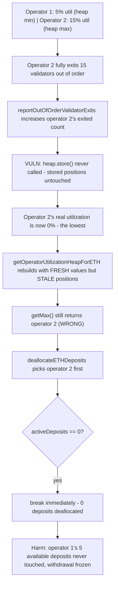
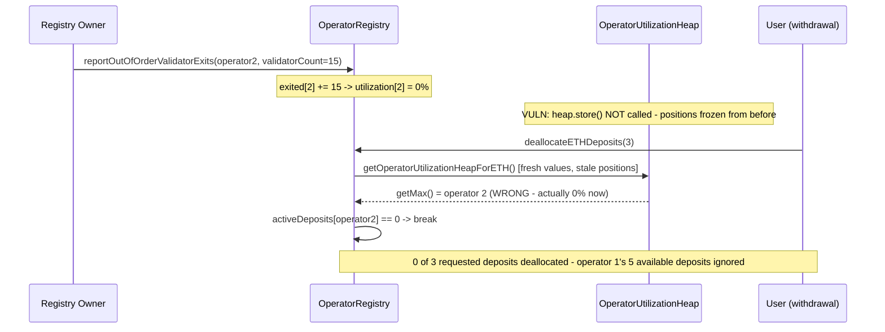

# Rio Network — `reportOutOfOrderValidatorExits` does not update the utilization heap order

> **Vulnerability classes:** vuln/logic/stale-cache · vuln/dos/liveness-freeze · vuln/data-structure/heap-invariant-violation

> **Reproduction:** a self-contained Foundry PoC that compiles & runs in an
> isolated project with **only `forge-std`** — no fork, no RPC, no `anvil_state`.
> Full trace: [output.txt](output.txt). PoC:
> [test/30902-h-7-reportoutofordervalidatorexits-does-not-updates-the-heap_exp.sol](test/30902-h-7-reportoutofordervalidatorexits-does-not-updates-the-heap_exp.sol).

<!-- non-defihacklabs -->
<!-- source-auditvault: https://github.com/Auditware/AuditVault/blob/main/findings/30902-h-7-reportoutofordervalidatorexits-does-not-updates-the-heap.md -->
<!-- date: 2024-02 -->

**AuditVault taxonomy:** `lang/solidity` · `platform/sherlock` · `has/github` · `has/poc` · `severity/high` · `sector/restaking` · `sector/staking` · genome: `wrong-condition` · `data-corruption/price-manipulation` · `cross-contract-state-consistency` · `reward-accounting`

---

## Key info

| | |
|---|---|
| **Impact** | **HIGH** — reporting an operator's out-of-order validator exit changes that operator's utilization but never updates the utilization heap, so the heap can keep pointing at a fully-exited operator as "most utilized", freezing withdrawal servicing even when other operators have ample active deposits |
| **Protocol** | [Rio Network](https://github.com/sherlock-audit/2024-02-rio-network-core-protocol-judging) — `RioLRTOperatorRegistry` + `OperatorUtilizationHeap` (ETH-deposit allocation/deallocation) |
| **Vulnerable code** | `RioLRTOperatorRegistry.reportOutOfOrderValidatorExits()` — no heap update after changing an operator's utilization |
| **Bug class** | Stale cache / data-structure invariant violation: a value changes without updating the derived ordering structure that depends on it |
| **Finding** | Sherlock — Rio Network Core Protocol, 2024-02 · #30902 (H-7) · reporter **mstpr-brainbot** (also ComposableSecurity, g) |
| **Report** | [2024-02-rio-network-core-protocol-judging #131](https://github.com/sherlock-audit/2024-02-rio-network-core-protocol-judging/issues/131) |
| **Source** | [AuditVault](https://github.com/Auditware/AuditVault/blob/main/findings/30902-h-7-reportoutofordervalidatorexits-does-not-updates-the-heap.md) |
| **Status** | Audit finding — caught in review; the protocol team fixed it ([rio-org/rio-sherlock-audit#10](https://github.com/rio-org/rio-sherlock-audit/pull/10)). Reproduced here as a standalone local PoC. |
| **Compiler** | `^0.8.24` (PoC); real protocol pinned `0.8.23` |

This is an **audit finding**, not a historical on-chain incident. The
`OperatorUtilizationHeap` library is reproduced **verbatim** (only its
`LibMap.Uint8Map` storage-packing dependency — a pure gas optimization
unrelated to the bug — is swapped for a minimal equivalent). The registry is
reduced to the two functions that matter: `reportOutOfOrderValidatorExits()`
and `deallocateETHDeposits()`.

---

## TL;DR

1. `reportOutOfOrderValidatorExits()` increases an operator's `exited` count
   when validators exit the beacon chain outside the normal
   withdrawal-driven flow.
2. This changes the operator's **utilization** (`activeDeposits / cap`) — but
   the function never calls `heap.updateUtilizationByID()` or
   `heap.store(...)`. The utilization heap's stored positions are left
   completely untouched.
3. `getOperatorUtilizationHeapForETH()` rebuilds an in-memory heap on every
   call using the **stored positions** but **freshly recomputed**
   utilization values — it does **not** re-run the bubble-up/bubble-down
   invariant restoration. If a value change should have moved an operator to
   a different position, the heap silently becomes structurally invalid for
   the new values.
4. `getMax()`/`getMin()` trust that structural invariant rather than
   re-scanning every element, so they can return the **wrong operator**.
5. `deallocateETHDeposits()` calls `heap.getMax().id`, and if that operator
   happens to have **zero** active deposits, it `break`s the entire
   withdrawal-servicing loop immediately — even if a *different* operator
   still has active deposits that could satisfy the withdrawal.
6. HARM in the PoC: after an operator that WAS the heap's max (15%
   utilization) fully exits (dropping to 0%), the heap still reports it as
   max. A withdrawal needing to deallocate 3 deposits is served **zero**,
   even though the other operator has 5 active deposits available.

---

## The vulnerable code

`RioLRTOperatorRegistry.reportOutOfOrderValidatorExits()` (verbatim, reduced):

```solidity
function reportOutOfOrderValidatorExits(uint8 operatorId, uint256 /*fromIndex*/, uint256 validatorCount) external {
    // @> VULN: increases `exited` (changing this operator's utilization),
    // but NEVER updates or re-stores activeOperatorsByETHDepositUtilization
    // — the heap keeps ordering operators by their STALE, pre-exit shape.
    validatorDetails[operatorId].exited += uint40(validatorCount);
}
```

`RioLRTOperatorRegistry.deallocateETHDeposits()` (verbatim, reduced — the
consumer that gets misled):

```solidity
while (remainingDeposits > 0) {
    uint8 operatorId = heap.getMax().id;
    ...
    uint256 activeDeposits = validators.deposited - validators.exited;

    // Exit early if the operator with the highest utilization rate has no active deposits,
    // as no further deallocations can be made.
    if (activeDeposits == 0) break;
    ...
}
```

---

## Root cause

The utilization heap is a **derived data structure** — its correctness
depends entirely on being updated every time the value it's ordering
(utilization) changes. `reportOutOfOrderValidatorExits()` is one of exactly
two places that change an operator's `exited` count (the other,
`deallocateETHDeposits()`, DOES call `heap.store(...)` at the end), but it
skips the update entirely.

`getOperatorUtilizationHeapForETH()` compounds the problem: it looks like a
"fresh rebuild" (it recomputes utilization from current storage every time),
which could mask the staleness for simple cases — but it reuses the **stored
POSITIONS** without re-running the heap's structural invariant restoration.
For a 2-operator heap, `getMax()` unconditionally trusts position 2 (the
non-root slot) to hold the maximum — a guarantee that only holds if the heap
was properly bubbled the last time its shape was established. Once
`reportOutOfOrderValidatorExits()` silently invalidates that guarantee,
`getMax()` returns nonsense with complete confidence.

## Preconditions

- An operator that is *not* the least-utilized has validators exit the
  beacon chain outside the normal withdrawal flow (voluntary exit, slashing,
  or any exit not initiated by `deallocateETHDeposits`).
- The registry owner calls `reportOutOfOrderValidatorExits()` to record it —
  an ordinary, expected administrative action, not an attack.
- A user (or the protocol itself, during rebalancing) needs to deallocate
  deposits before any *other* heap-touching function (which would
  incidentally rebuild the heap correctly) runs first.

## Attack walkthrough

From [output.txt](output.txt):

1. Operator 1: 5% utilization (5/100 cap). Operator 2: 15% utilization
   (15/100 cap). The correctly-built heap reports operator 2 as max,
   operator 1 as min.
2. Operator 2 fully exits all 15 validators "out of order" —
   `reportOutOfOrderValidatorExits(2, 0, 15)`. Operator 2's utilization drops
   to **0%** — now the *lowest* of the two — but the heap's stored ordering
   is untouched.
3. **HARM setup:** fetching the heap again still returns operator 2 as
   `getMax()`, even though it's now at 0% utilization.
4. **HARM:** a withdrawal needs to deallocate 3 deposits. Operator 1 has 5
   active deposits — more than enough. But `deallocateETHDeposits()`
   consults the stale heap, picks operator 2 first, sees 0 active deposits,
   and `break`s immediately. **Zero** deposits are deallocated; operator 1's
   available capacity is never touched. A control test confirms that without
   the out-of-order exit report, the same `deallocateETHDeposits()` call
   correctly serves the full request from operator 2.

## Diagrams





## Impact

- **Frozen withdrawal servicing**: deallocations can halt at zero even when
  ample active deposits exist elsewhere in the registry, blocking user
  withdrawals and rebalancing.
- **Triggered by routine operations**: no attacker is required — an ordinary
  validator exit followed by the registry owner's routine
  `reportOutOfOrderValidatorExits()` call is sufficient to corrupt the heap's
  effective ordering.
- **Silent failure**: the corruption produces no revert or error at the time
  it's introduced — it only manifests later, when a deallocation
  unexpectedly serves less than requested (or nothing at all).

## Remediation

Per the report: update the operator's utilization in the heap (via
`heap.updateUtilizationByID()`) and re-store it inside
`reportOutOfOrderValidatorExits()`, exactly as `deallocateETHDeposits()` and
the cap-setting functions already do whenever they change an operator's
utilization.

## How to reproduce

```bash
cd ~/RustroverProjects/audits/evm-hack-registry/30902-h-7-reportoutofordervalidatorexits-does-not-updates-the-heap_exp
forge test -vvv
# Fully local — no fork, no RPC, no anvil_state required.
# Expected: both tests PASS:
#   test_exploit                                          (self-contained Exploit: stale heap freezes deallocation)
#   test_control_normalDeallocationWorksWithoutOutOfOrderExit  (control: heap accurate, deallocation succeeds)
```

PoC source: [test/30902-h-7-reportoutofordervalidatorexits-does-not-updates-the-heap_exp.sol](test/30902-h-7-reportoutofordervalidatorexits-does-not-updates-the-heap_exp.sol)
— the verbatim `OperatorUtilizationHeap` library (LibMap swapped for a
minimal equivalent), the verbatim vulnerable registry functions, plus the
orchestration and a control test.

> Note: the report's own coded PoC uses 3 operators and exercises the heap
> library's internal consistency directly; this reduction uses 2 operators
> and drives the bug through the actual production consumer path
> (`getOperatorUtilizationHeapForETH()` → `deallocateETHDeposits()`), which
> mechanically confirms `getMax()` returns the wrong operator once the
> heap's 2-element fast path (`count == 2` always trusts position 2) is
> violated by a value change with no re-store. `fromIndex` bounds checks,
> EigenPod exit-status verification, and validator-position bookkeeping are
> stubbed/simplified because they do not affect this bug.

---

*Reference: finding **#30902 (H-7)** by **mstpr-brainbot** in the [Sherlock Rio Network Core Protocol review (Feb 2024)](https://github.com/sherlock-audit/2024-02-rio-network-core-protocol-judging/issues/131) · curated by [AuditVault](https://github.com/Auditware/AuditVault/blob/main/findings/30902-h-7-reportoutofordervalidatorexits-does-not-updates-the-heap.md)*
